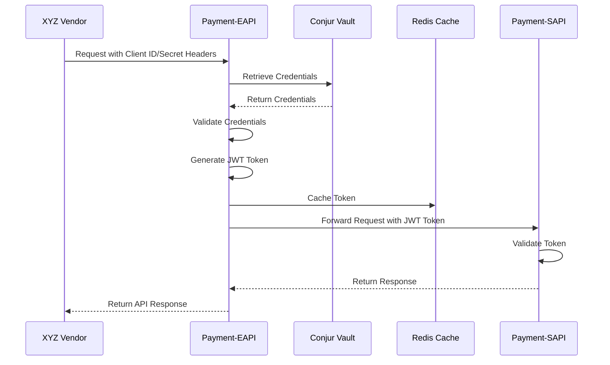

# Payment API Security Enhancement

A comprehensive solution for enhancing the security of payment API authentication mechanisms while maintaining backward compatibility with existing vendor integrations.

## Introduction

The Payment API Security Enhancement project aims to strengthen the security of the existing payment processing system by implementing more secure authentication mechanisms while maintaining backward compatibility with current vendor integrations. The project leverages Conjur vault for credential management to replace the current header-based Client ID and Client Secret authentication method for internal service communication.

## Key Features

- **Secure Credential Storage**: Implementation of secure credential storage using Conjur vault for Payment API authentication credentials
- **Token-based Authentication**: Implementation of token-based authentication for internal service communication
- **Backward Compatibility**: Maintenance of existing API contract with XYZ Vendor while implementing enhanced security internally
- **Credential Rotation**: Ability to rotate credentials without service disruption
- **Comprehensive Monitoring**: Monitoring and observability for security events and system health

## Architecture

The system follows a layered architecture with clear separation between external-facing and internal components:

### Core Components

- **Payment-Eapi**: External-facing API that authenticates vendor requests using Client ID/Secret headers and forwards them to internal services using JWT tokens
- **Payment-Sapi**: Internal service that processes payment transactions with token-based authentication
- **Conjur Vault**: Secure storage for authentication credentials
- **Redis Cache**: Caching service for authentication tokens
- **Credential Rotation**: Service for managing secure credential rotation without disrupting existing integrations
- **Monitoring**: Service for monitoring, metrics collection, and alerting

### Authentication Flow



## Project Structure

The project is organized as a multi-module Maven project with the following components:

### Modules

- **common**: Shared utilities, models, and services for authentication, token handling, security, and monitoring
- **payment-eapi**: External-facing API service that implements backward compatibility with existing vendor integrations
- **payment-sapi**: Internal service that processes payment transactions with token-based authentication
- **credential-rotation**: Service for managing secure credential rotation
- **monitoring**: Service for monitoring, metrics collection, and alerting

### Directory Structure

```
├── docs/                   # Comprehensive documentation
│   ├── architecture/       # Architecture documentation
│   ├── api/                # API specifications
│   ├── development/        # Development guides
│   └── operations/         # Operations guides
├── infrastructure/         # Infrastructure configuration
│   ├── conjur/             # Conjur vault configuration
│   ├── elk/                # Logging infrastructure
│   ├── grafana/            # Monitoring dashboards
│   └── prometheus/         # Metrics collection
├── src/                    # Source code
│   ├── backend/            # Backend implementation
│   └── scripts/            # Utility scripts
└── .github/                # GitHub workflows and templates
```

## Prerequisites

- Java 11 or later
- Maven 3.8.x or later
- Docker and Docker Compose
- Kubernetes (for production deployment)
- Conjur vault instance
- Redis instance
- PostgreSQL database

## Getting Started

Follow these steps to set up and run the project locally:

### Clone the Repository

```bash
# Clone the repository
git clone <repository-url>
cd payment-api-security
```

### Build the Project

```bash
# Navigate to the backend directory
cd src/backend

# Build the project
./mvnw clean package
```

### Run with Docker Compose

```bash
# Start all services
docker-compose up -d

# Check service status
docker-compose ps

# View logs
docker-compose logs -f

# Stop all services
docker-compose down
```

### Detailed Setup

For detailed setup instructions, including Conjur vault configuration, database setup, and more, refer to the [Backend README](src/backend/README.md).

## Configuration

The application uses Spring Boot's configuration system with environment-specific profiles:

### Environment Profiles

- **dev**: Development environment configuration
- **test**: Testing environment configuration
- **staging**: Staging environment configuration
- **prod**: Production environment configuration

### Key Configuration Properties

Key configuration properties include Conjur vault connection settings, token configuration, Redis cache settings, and more. See the [Backend README](src/backend/README.md) for detailed configuration information.

## Documentation

Comprehensive documentation is available in the `docs` directory:

### Architecture Documentation

- [High-Level Architecture](docs/architecture/high-level-architecture.md)
- [Authentication Flow](docs/architecture/authentication-flow.md)
- [Credential Rotation](docs/architecture/credential-rotation.md)
- [Network Security](docs/architecture/network-security.md)
- [System Boundaries](docs/architecture/system-boundaries.md)

### API Documentation

- [Payment-EAPI](docs/api/payment-eapi.yaml): OpenAPI specification for the external-facing API
- [Payment-SAPI](docs/api/payment-sapi.yaml): OpenAPI specification for the internal service API

### Development Documentation

- [Getting Started](docs/development/getting-started.md): Guide for setting up the development environment
- [Code Standards](docs/development/code-standards.md): Coding standards and best practices
- [Testing Guide](docs/development/testing-guide.md): Guide for testing the system
- [Security Guidelines](docs/development/security-guidelines.md): Security guidelines for development

### Operations Documentation

- [Deployment Guide](docs/operations/deployment-guide.md): Guide for deploying the system
- [Monitoring Guide](docs/operations/monitoring-guide.md): Guide for monitoring the system
- [Incident Response](docs/operations/incident-response.md): Procedures for responding to incidents
- [Credential Rotation Runbook](docs/operations/credential-rotation-runbook.md): Runbook for credential rotation
- [Disaster Recovery](docs/operations/disaster-recovery.md): Disaster recovery procedures

## Testing

The project includes comprehensive test coverage using JUnit 5, Mockito, and TestContainers:

### Running Tests

```bash
# Run all tests
cd src/backend
./mvnw test

# Run tests for a specific module
./mvnw test -pl payment-eapi

# Run tests with coverage report
./mvnw test jacoco:report
```

### Test Categories

- **Unit Tests**: Test individual components in isolation
- **Integration Tests**: Test interactions between components
- **End-to-End Tests**: Test complete workflows across all components

## Deployment

The application can be deployed using Docker and Kubernetes:

### Docker Deployment

Docker Compose is provided for local development and testing. For production deployment, Kubernetes is recommended.

### Kubernetes Deployment

Kubernetes configuration files are provided in the `src/backend/kubernetes` directory. See the [Deployment Guide](docs/operations/deployment-guide.md) for detailed deployment instructions.

## Security Considerations

The application implements several security measures:

### Authentication

- **External**: Client ID/Secret in headers for backward compatibility
- **Internal**: JWT tokens for secure service-to-service communication
- **Vault**: Certificate-based authentication to Conjur vault

### Encryption

- **Data in Transit**: TLS 1.2+ for all communications
- **Tokens**: HMAC SHA-256 signatures for JWT tokens
- **Sensitive Data**: Field-level encryption for sensitive data

### Credential Management

- **Storage**: Secure storage in Conjur vault
- **Rotation**: Zero-downtime credential rotation
- **Access Control**: Policy-based access control for credentials

## Contributing

Contributions to the project are welcome. Please follow these guidelines:

### Development Workflow

1. Create a feature branch from `develop`
2. Implement your changes with appropriate tests
3. Ensure all tests pass and code quality checks succeed
4. Submit a pull request for review

### Code Standards

- Follow Java code conventions
- Maintain test coverage above 85%
- Document public APIs with Javadoc
- Use meaningful commit messages

## License

This project is licensed under the terms specified in the [LICENSE](LICENSE) file.

## Contact

For questions or support, please contact the project maintainers:

### Development Team

- Email: dev@example.com
- Slack: #payment-api-dev

### Operations Team

- Email: ops@example.com
- Slack: #ops-support