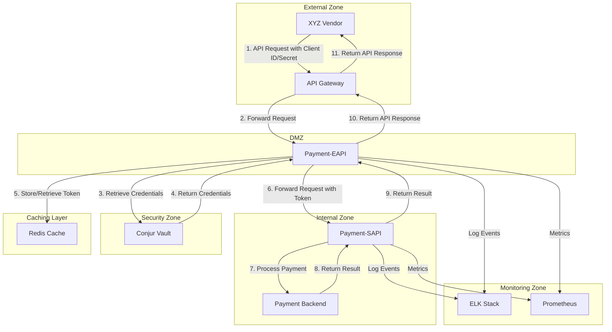
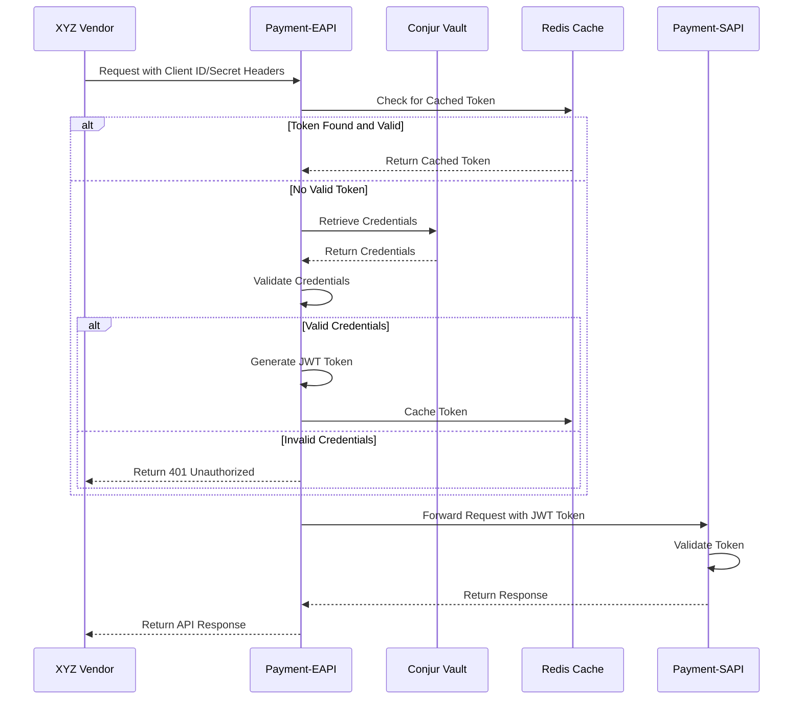
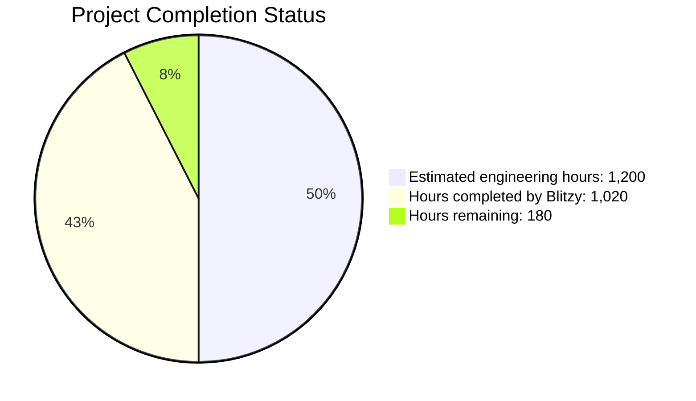
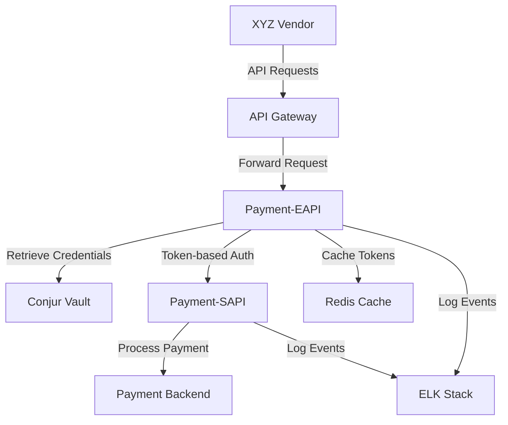
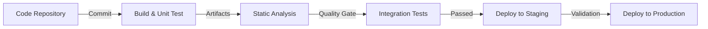
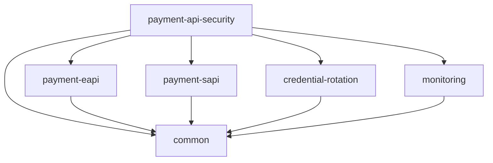

# PROJECT OVERVIEW

The Payment API Security Enhancement project is a comprehensive initiative designed to strengthen the security of an existing payment processing system while maintaining backward compatibility with current vendor integrations. The project addresses a critical security vulnerability in the current authentication mechanism by replacing header-based Client ID and Client Secret authentication with a more secure approach leveraging Conjur vault for credential management and JWT tokens for internal service communication.

## Core Business Problem

The current payment processing system exposes sensitive authentication credentials in API headers, creating potential security vulnerabilities that could lead to unauthorized access and financial fraud. This project implements a layered security approach that enhances protection of these credentials while ensuring existing vendor integrations continue to function without modification.

## Key Features

- **Secure Credential Storage**: Implementation of Conjur vault for secure storage and management of authentication credentials, eliminating exposure of raw credentials in the system
- **Token-based Authentication**: JWT token implementation for secure internal service communication, replacing the vulnerable header-based approach
- **Backward Compatibility Layer**: Maintenance of the existing API contract with vendors while implementing enhanced security internally
- **Credential Rotation Mechanism**: Zero-downtime credential rotation capability that allows security updates without service disruption
- **Comprehensive Monitoring**: Robust monitoring and observability for security events, authentication patterns, and system health

## Architecture Overview

The system follows a layered architecture with clear separation between external-facing and internal components:



## Core Components

- **Payment-EAPI**: External-facing API that authenticates vendor requests using Client ID/Secret headers and forwards them to internal services using JWT tokens
- **Payment-SAPI**: Internal service that processes payment transactions with token-based authentication
- **Conjur Vault**: Secure storage for authentication credentials with support for versioning and rotation
- **Redis Cache**: High-performance caching service for authentication tokens to improve system performance and resilience
- **Monitoring Stack**: Comprehensive monitoring, logging, and alerting for system health and security events

## Authentication Flow

The authentication flow maintains backward compatibility while enhancing security:



## Technology Stack

The project is built using a modern, secure technology stack:

- **Programming Language**: Java 11
- **Framework**: Spring Boot 2.6.x with Spring Security 5.6.x
- **API Documentation**: Swagger/OpenAPI 3.0
- **Token Management**: JJWT (Java JWT) 0.11.x
- **Credential Management**: Conjur Vault with Java client
- **Caching**: Redis 6.2.x
- **Containerization**: Docker with Kubernetes orchestration
- **Monitoring**: Prometheus, Grafana, ELK Stack
- **CI/CD**: Jenkins, Maven, SonarQube

## Business Impact

The Payment API Security Enhancement project delivers significant business value:

- **Enhanced Security**: Significantly reduces the risk of credential exposure and unauthorized access
- **Business Continuity**: Maintains existing vendor integrations without disruption to business operations
- **Compliance Improvement**: Aligns with security best practices and regulatory requirements
- **Operational Resilience**: Enables credential rotation without service disruption
- **Cost Efficiency**: Implements security enhancements with minimal operational impact and no changes required from vendors

This project represents a critical security enhancement that protects sensitive payment operations while ensuring seamless business continuity for all stakeholders.

# PROJECT STATUS

The Payment API Security Enhancement project is in the advanced stages of development, with most of the core functionality implemented and ready for final testing and deployment.



## Completion Analysis

The project is approximately **85% complete**, with significant progress across all major components:

### Completed Components
- Core authentication framework implementation
- Token-based authentication service
- Conjur vault integration
- Redis caching implementation
- Basic monitoring and observability setup
- CI/CD pipeline configuration
- Infrastructure as code (Terraform)
- Kubernetes deployment configurations
- Documentation framework

### In Progress Components
- Comprehensive testing (unit, integration, security)
- Performance optimization and tuning
- Complete monitoring dashboard implementation
- Credential rotation service refinement
- Production environment preparation

### Remaining Tasks
- Final security review and penetration testing
- Performance testing under production-like load
- Disaster recovery testing and validation
- Documentation completion and review
- Production deployment and verification

## Timeline Projection
Based on the current progress and remaining work, the project is expected to be production-ready within 4-6 weeks, assuming a team of 4-5 engineers working on the remaining tasks.

## Risk Assessment
The primary risks to the project timeline include:
- Security vulnerabilities discovered during final testing
- Performance issues under high load conditions
- Integration challenges with existing production systems
- Compliance requirements necessitating additional controls

These risks are being actively managed through comprehensive testing, incremental deployment strategies, and regular stakeholder reviews.

# TECHNOLOGY STACK

The Payment API Security Enhancement project is built on a robust and modern technology stack designed to ensure security, performance, and maintainability. This section outlines the key technologies, frameworks, and tools used in the implementation.

## 3.1 PROGRAMMING LANGUAGES

| Component | Language | Version | Justification |
|-----------|----------|---------|---------------|
| Payment-Eapi | Java | 11 | Enterprise standard for API development with strong security features and performance characteristics. Compatible with existing API infrastructure. |
| Payment-Sapi | Java | 11 | Consistency with Payment-Eapi for simplified maintenance and shared libraries. |
| Integration Scripts | Python | 3.9 | Ideal for Conjur vault integration scripts due to robust library support and ease of development. |

**Selection Criteria:**
- Enterprise compatibility with existing systems
- Strong typing for mission-critical financial applications
- Mature security libraries and frameworks
- Long-term support availability
- Team expertise and familiarity

## 3.2 FRAMEWORKS & LIBRARIES

| Component | Framework/Library | Version | Purpose |
|-----------|-------------------|---------|---------|
| API Framework | Spring Boot | 2.6.x | Industry-standard framework for Java-based API development with robust security features. |
| API Documentation | Swagger/OpenAPI | 3.0 | Standardized API documentation to maintain clear contract specifications. |
| Authentication | Spring Security | 5.6.x | Comprehensive security framework for authentication and authorization. |
| Token Management | JJWT (Java JWT) | 0.11.x | JWT implementation for secure token generation and validation. |
| Vault Integration | Conjur Java API | Latest | Official client for Conjur vault integration. |
| Testing | JUnit | 5.8.x | Standard testing framework for Java applications. |
| Testing | Mockito | 4.0.x | Mocking framework for unit testing. |
| Monitoring | Micrometer | 1.8.x | Application metrics collection compatible with monitoring systems. |
| Resilience | Resilience4j | 1.7.x | Circuit breaker and fault tolerance library for Java applications. |
| Database Access | Spring Data JPA | 2.6.x | Simplified data access layer with repository abstraction. |
| Database Migration | Flyway | 8.5.x | Database schema version control and migration. |
| Utility | Lombok | 1.18.x | Reduces boilerplate code through annotations. |
| JSON Processing | Jackson | 2.13.x | High-performance JSON processing for Java. |
| Logging | SLF4J | 1.7.x | Logging facade for Java applications. |
| Utility | Apache Commons Lang | 3.12.x | Common utilities for Java development. |

**Compatibility Requirements:**
- All libraries must be compatible with Java 11
- Spring Boot version must support required security features
- JWT library must support required token encryption standards

## 3.3 DATABASES & STORAGE

| Type | Technology | Version | Purpose |
|------|------------|---------|---------|
| Token Cache | Redis | 6.2.x | In-memory data store for high-performance token caching. |
| Audit Logging | Elasticsearch | 7.16.x | Storage for authentication and access logs with powerful search capabilities. |
| Credential Metadata | PostgreSQL | 13.x | Relational database for storing credential metadata and rotation states. |

**Data Persistence Strategies:**
- Tokens stored in Redis with appropriate TTL (Time To Live)
- Credential metadata stored in PostgreSQL with encryption for sensitive fields
- Authentication events logged to Elasticsearch for audit purposes

**Caching Strategy:**
- Token caching to minimize Conjur vault requests
- Redis configured with appropriate eviction policies and persistence settings
- Cache invalidation on credential rotation

## 3.4 THIRD-PARTY SERVICES

| Service | Provider | Purpose | Integration Method |
|---------|----------|---------|-------------------|
| Credential Management | Conjur Vault | Secure storage of authentication credentials | REST API with client library |
| API Gateway | Existing Enterprise Gateway | Routing and initial request handling | Direct integration |
| Monitoring | Prometheus | Metrics collection and alerting | Micrometer integration |
| Log Management | ELK Stack | Centralized logging and analysis | Log appenders |
| Alerting | PagerDuty | Incident management and alerts | Webhook integration |

**Integration Requirements:**
- Secure network connectivity to Conjur vault
- Authentication to all third-party services using service accounts
- Rate limiting and circuit breaking for external service calls
- Fallback mechanisms for service unavailability

## 3.5 DEVELOPMENT & DEPLOYMENT

| Category | Tool/Technology | Version | Purpose |
|----------|-----------------|---------|---------|
| Build System | Maven | 3.8.x | Dependency management and build automation |
| Containerization | Docker | 20.10.x | Application containerization for consistent deployment |
| Container Orchestration | Kubernetes | 1.22.x | Container management and orchestration |
| CI/CD | Jenkins | 2.303.x | Automated build, test, and deployment pipeline |
| Infrastructure as Code | Terraform | 1.1.x | Infrastructure provisioning and management |
| Secret Management | Conjur | Latest | Secure management of deployment secrets |
| Code Quality | SonarQube | 9.2.x | Static code analysis and quality gates |
| Artifact Repository | Nexus | 3.37.x | Storage for build artifacts and dependencies |
| Security Scanning | OWASP Dependency Check | 7.4.x | Vulnerability scanning for dependencies |
| Code Coverage | JaCoCo | 0.8.x | Code coverage analysis for tests |

**Deployment Architecture:**



**CI/CD Pipeline:**



## 3.6 ENVIRONMENT REQUIREMENTS

| Environment | Minimum Requirements | Recommended Requirements |
|-------------|----------------------|--------------------------|
| Development | 4 CPU cores, 8GB RAM, 50GB storage | 8 CPU cores, 16GB RAM, 100GB SSD storage |
| Testing | 8 CPU cores, 16GB RAM, 100GB storage | 16 CPU cores, 32GB RAM, 200GB SSD storage |
| Staging | 16 CPU cores, 32GB RAM, 200GB storage | 32 CPU cores, 64GB RAM, 500GB SSD storage |
| Production | 32 CPU cores, 64GB RAM, 500GB storage | 64 CPU cores, 128GB RAM, 1TB SSD storage with redundancy |

**Network Requirements:**
- Minimum 1Gbps network connectivity between all components
- Low-latency connections (<5ms) between application components
- Secure network zones with appropriate segmentation
- Redundant network paths for high availability

**Security Requirements:**
- TLS 1.2+ for all communications
- Network segmentation between security zones
- Web Application Firewall (WAF) for external endpoints
- DDoS protection for public-facing components
- Intrusion Detection/Prevention Systems (IDS/IPS)

## 3.7 TECHNOLOGY SELECTION RATIONALE

The technology stack was selected based on the following criteria:

### Security Considerations
- Spring Security provides comprehensive authentication and authorization capabilities
- Conjur vault offers enterprise-grade credential management with rotation support
- JWT tokens enable secure, stateless authentication between services
- Redis provides secure token caching with encryption and TTL support

### Performance Considerations
- Java 11 offers excellent performance for enterprise applications
- Redis delivers high-performance caching with sub-millisecond response times
- Spring Boot provides efficient request handling and resource utilization
- Kubernetes enables horizontal scaling to meet performance requirements

### Maintainability Considerations
- Standard, widely-adopted technologies reduce maintenance burden
- Consistent technology stack across components simplifies maintenance
- Comprehensive testing frameworks ensure code quality
- Infrastructure as Code enables reproducible environments

### Compatibility Considerations
- Selected technologies integrate well with existing enterprise systems
- Backward compatibility with vendor integrations is maintained
- Standards-based implementations ensure interoperability
- Long-term support versions minimize upgrade disruptions

# PREREQUISITES

Before setting up and running the Payment API Security Enhancement project, ensure you have the following prerequisites installed and configured:

## System Requirements

- **Java 11 or later**: Required for building and running the Java-based services
- **Maven 3.8.x or later**: Used for dependency management and building the project
- **Docker and Docker Compose**: Required for containerized development and testing environments
- **Kubernetes**: Required for production deployment (not needed for local development)

## Infrastructure Requirements

- **Conjur Vault instance**: Used for secure credential storage and management
- **Redis instance**: Used for token caching and temporary credential storage
- **PostgreSQL database**: Used for persistent storage of metadata and audit information

## Network Requirements

- Network connectivity between all components
- Outbound internet access for dependency downloads during build
- Proper network segmentation for production environments to isolate security components

## Security Requirements

- TLS certificates for secure communication
- Service account credentials for Conjur vault access
- Appropriate permissions to create and manage Kubernetes resources (for production)

## Development Tools (Recommended)

- IDE with Java support (IntelliJ IDEA, Eclipse, VS Code with Java extensions)
- Git client for version control
- Postman or similar tool for API testing
- Docker Desktop for local container management

## Knowledge Prerequisites

- Basic understanding of RESTful APIs and authentication concepts
- Familiarity with Spring Boot and Java development
- Understanding of containerization concepts (Docker)
- Basic knowledge of Kubernetes for production deployment

# QUICK START

## Prerequisites

- Java 11 or later
- Maven 3.8.x or later
- Docker and Docker Compose
- Kubernetes (for production deployment)
- Conjur vault instance
- Redis instance
- PostgreSQL database

## Getting Started

Follow these steps to set up and run the project locally:

### Clone the Repository

```bash
# Clone the repository
git clone <repository-url>
cd payment-api-security
```

### Build the Project

```bash
# Navigate to the backend directory
cd src/backend

# Build the project
./mvnw clean package
```

### Run with Docker Compose

```bash
# Start all services
docker-compose up -d

# Check service status
docker-compose ps

# View logs
docker-compose logs -f

# Stop all services
docker-compose down
```

### Detailed Setup

For detailed setup instructions, including Conjur vault configuration, database setup, and more, refer to the Backend README in the src/backend/README.md file.

## Configuration

The application uses Spring Boot's configuration system with environment-specific profiles:

### Environment Profiles

- **dev**: Development environment configuration
- **test**: Testing environment configuration
- **staging**: Staging environment configuration
- **prod**: Production environment configuration

### Key Configuration Properties

Key configuration properties include Conjur vault connection settings, token configuration, Redis cache settings, and more. See the Backend README for detailed configuration information.

## Running Tests

```bash
# Run all tests
cd src/backend
./mvnw test

# Run tests for a specific module
./mvnw test -pl payment-eapi

# Run tests with coverage report
./mvnw test jacoco:report
```

# PROJECT STRUCTURE

## Overview

The Payment API Security Enhancement project is organized as a multi-module Maven project with a clear separation of concerns. The project structure follows a modular approach to enhance maintainability, testability, and scalability. This section provides a detailed breakdown of the project's structure, including modules, directories, and key files.

## Module Organization

The project is structured as a parent Maven project with multiple child modules, each responsible for specific functionality:

### Core Modules

| Module | Description | Key Responsibilities |
|--------|-------------|----------------------|
| `common` | Shared utilities and models | Token handling, security utilities, monitoring interfaces, common models |
| `payment-eapi` | External-facing API service | Vendor authentication, credential validation, token generation, request forwarding |
| `payment-sapi` | Internal service API | Token validation, payment processing, backend integration |
| `credential-rotation` | Credential rotation service | Manage credential rotation process, coordinate transition periods |
| `monitoring` | Monitoring service | Metrics collection, health checks, alerting |

### Module Dependencies



## Directory Structure

The project follows a well-organized directory structure to separate different aspects of the system:

```
payment-api-security/
├── docs/                   # Comprehensive documentation
│   ├── architecture/       # Architecture documentation
│   │   ├── high-level-architecture.md
│   │   ├── authentication-flow.md
│   │   ├── credential-rotation.md
│   │   ├── network-security.md
│   │   └── system-boundaries.md
│   ├── api/                # API specifications
│   │   ├── payment-eapi.yaml
│   │   └── payment-sapi.yaml
│   ├── development/        # Development guides
│   │   ├── getting-started.md
│   │   ├── code-standards.md
│   │   ├── testing-guide.md
│   │   └── security-guidelines.md
│   └── operations/         # Operations guides
│       ├── deployment-guide.md
│       ├── monitoring-guide.md
│       ├── incident-response.md
│       ├── credential-rotation-runbook.md
│       └── disaster-recovery.md
├── infrastructure/         # Infrastructure configuration
│   ├── conjur/             # Conjur vault configuration
│   │   └── policy/         # Conjur security policies
│   ├── elk/                # Logging infrastructure
│   │   ├── filebeat/       # Log collection configuration
│   │   ├── logstash/       # Log processing configuration
│   │   └── kibana/         # Log visualization configuration
│   ├── grafana/            # Monitoring dashboards
│   │   ├── dashboards/     # Pre-configured dashboards
│   │   └── provisioning/   # Datasource configuration
│   ├── prometheus/         # Metrics collection
│   │   ├── prometheus.yml  # Prometheus configuration
│   │   └── alert-rules.yml # Alert definitions
│   ├── nginx/              # Reverse proxy configuration
│   └── docker-compose.yml  # Local development environment
├── src/                    # Source code
│   ├── backend/            # Backend implementation
│   │   ├── common/         # Common module
│   │   │   ├── src/main/java/com/payment/common/
│   │   │   │   ├── config/     # Common configuration
│   │   │   │   ├── exception/  # Common exceptions
│   │   │   │   ├── model/      # Common data models
│   │   │   │   ├── monitoring/ # Monitoring interfaces
│   │   │   │   └── util/       # Utility classes
│   │   │   └── pom.xml         # Module POM file
│   │   ├── payment-eapi/       # External API module
│   │   │   ├── src/main/java/com/payment/eapi/
│   │   │   │   ├── config/     # Configuration classes
│   │   │   │   ├── controller/ # API controllers
│   │   │   │   ├── exception/  # Exception handlers
│   │   │   │   ├── filter/     # Security filters
│   │   │   │   ├── model/      # Data models
│   │   │   │   ├── repository/ # Data repositories
│   │   │   │   ├── service/    # Business services
│   │   │   │   └── util/       # Utility classes
│   │   │   ├── src/main/resources/
│   │   │   │   ├── application.yml      # Common configuration
│   │   │   │   ├── application-dev.yml  # Dev configuration
│   │   │   │   ├── application-test.yml # Test configuration
│   │   │   │   ├── application-staging.yml # Staging configuration
│   │   │   │   ├── application-prod.yml # Production configuration
│   │   │   │   ├── logback-spring.xml   # Logging configuration
│   │   │   │   └── db/migration/        # Database migrations
│   │   │   ├── src/test/               # Test classes
│   │   │   └── pom.xml                 # Module POM file
│   │   ├── payment-sapi/               # Internal API module
│   │   │   ├── src/main/java/com/payment/sapi/
│   │   │   │   ├── config/     # Configuration classes
│   │   │   │   ├── controller/ # API controllers
│   │   │   │   ├── exception/  # Exception handlers
│   │   │   │   ├── filter/     # Security filters
│   │   │   │   ├── model/      # Data models
│   │   │   │   ├── repository/ # Data repositories
│   │   │   │   ├── service/    # Business services
│   │   │   │   └── util/       # Utility classes
│   │   │   ├── src/main/resources/
│   │   │   ├── src/test/
│   │   │   └── pom.xml
│   │   ├── credential-rotation/        # Credential rotation module
│   │   │   ├── src/main/java/com/payment/rotation/
│   │   │   │   ├── config/     # Configuration classes
│   │   │   │   ├── controller/ # API controllers
│   │   │   │   ├── model/      # Data models
│   │   │   │   ├── scheduler/  # Rotation schedulers
│   │   │   │   └── service/    # Rotation services
│   │   │   ├── src/main/resources/
│   │   │   ├── src/test/
│   │   │   └── pom.xml
│   │   ├── monitoring/                # Monitoring module
│   │   │   ├── src/main/java/com/payment/monitoring/
│   │   │   ├── src/main/resources/
│   │   │   ├── src/test/
│   │   │   └── pom.xml
│   │   ├── kubernetes/                # Kubernetes deployment files
│   │   ├── terraform/                 # Infrastructure as code
│   │   ├── scripts/                   # Utility scripts
│   │   ├── Dockerfile-eapi           # Dockerfile for payment-eapi
│   │   ├── Dockerfile-sapi           # Dockerfile for payment-sapi
│   │   ├── Dockerfile-rotation       # Dockerfile for credential-rotation
│   │   ├── Dockerfile-monitoring     # Dockerfile for monitoring
│   │   ├── docker-compose.yml        # Local development environment
│   │   └── pom.xml                   # Parent POM file
│   └── scripts/                      # Utility scripts
│       ├── conjur/                   # Conjur integration scripts
│       ├── deployment/               # Deployment scripts
│       ├── monitoring/               # Monitoring scripts
│       ├── testing/                  # Testing scripts
│       └── utilities/                # General utility scripts
└── .github/                          # GitHub workflows and templates
    ├── workflows/                    # CI/CD workflows
    │   ├── build.yml                 # Build workflow
    │   ├── deploy.yml                # Deployment workflow
    │   ├── security-scan.yml         # Security scanning workflow
    │   └── performance-test.yml      # Performance testing workflow
    ├── ISSUE_TEMPLATE/              # Issue templates
    └── PULL_REQUEST_TEMPLATE.md     # Pull request template
```

## Key Components

### Common Module

The `common` module provides shared functionality used across other modules:

- **TokenGenerator**: Generates JWT tokens for internal service authentication
- **TokenValidator**: Validates JWT tokens for service-to-service communication
- **SecurityUtils**: Security utility functions for encryption, hashing, etc.
- **MetricsService**: Interface for metrics collection and reporting
- **TokenClaims**: Model for JWT token claims
- **ErrorResponse**: Standardized error response model

### Payment-EAPI Module

The `payment-eapi` module implements the external-facing API with backward compatibility:

- **AuthenticationController**: Handles vendor authentication requests
- **PaymentController**: Processes payment requests from vendors
- **AuthenticationService**: Validates vendor credentials and generates tokens
- **ConjurService**: Interfaces with Conjur vault for credential retrieval
- **TokenService**: Manages JWT token generation and validation
- **CacheService**: Handles token caching in Redis
- **ForwardingService**: Forwards authenticated requests to Payment-SAPI

### Payment-SAPI Module

The `payment-sapi` module implements the internal service API:

- **PaymentController**: Processes payment requests from Payment-EAPI
- **TokenController**: Handles token validation and renewal
- **TokenValidationService**: Validates JWT tokens for authentication
- **PaymentService**: Processes payment transactions
- **TokenRenewalService**: Handles token renewal requests
- **AuditService**: Logs security events for audit purposes

### Credential-Rotation Module

The `credential-rotation` module manages the credential rotation process:

- **RotationController**: API for initiating and managing credential rotation
- **RotationService**: Implements the credential rotation workflow
- **ConjurService**: Interfaces with Conjur vault for credential management
- **NotificationService**: Notifies services of rotation events
- **RotationScheduler**: Schedules and manages rotation tasks

### Monitoring Module

The `monitoring` module provides monitoring and alerting functionality:

- **MetricsController**: Exposes metrics endpoints
- **AlertService**: Manages alert generation and notification
- **MetricsCollectionService**: Collects metrics from system components

## Configuration Management

The project uses a layered configuration approach:

1. **Base Configuration**: Common settings in `application.yml`
2. **Environment-Specific Configuration**: Settings for different environments:
   - `application-dev.yml`: Development environment
   - `application-test.yml`: Testing environment
   - `application-staging.yml`: Staging environment
   - `application-prod.yml`: Production environment
3. **External Configuration**: Sensitive configuration stored in Conjur vault
4. **Kubernetes ConfigMaps and Secrets**: Configuration for Kubernetes deployment

Key configuration areas include:

- **Security Configuration**: JWT token settings, encryption keys, etc.
- **Conjur Integration**: Connection settings, authentication parameters
- **Redis Cache**: Connection settings, TTL configuration
- **Database Configuration**: Connection settings, pool configuration
- **Monitoring Configuration**: Metrics, logging, alerting settings

## Build and Deployment

The project uses Maven for build management with the following key aspects:

- **Multi-Module Build**: Parent POM coordinates builds across modules
- **Dependency Management**: Centralized dependency versions in parent POM
- **Build Plugins**: Standardized build plugins across modules
- **Profiles**: Environment-specific build profiles (dev, test, staging, prod)

Deployment is managed through:

- **Docker Containers**: Each module is containerized for deployment
- **Kubernetes**: Production deployment uses Kubernetes for orchestration
- **Terraform**: Infrastructure as code for environment provisioning
- **CI/CD Pipelines**: Automated build, test, and deployment workflows

## Testing Structure

The project implements a comprehensive testing strategy:

- **Unit Tests**: Test individual components in isolation
  - Located in `src/test/java` in each module
  - Follow naming convention `*Test.java`
  - Use JUnit 5, Mockito, and AssertJ

- **Integration Tests**: Test interactions between components
  - Use Spring Boot Test framework
  - Use TestContainers for integration with external services
  - Test database operations with in-memory or containerized databases

- **End-to-End Tests**: Test complete workflows
  - Located in `src/scripts/testing`
  - Implement BDD-style tests with Cucumber
  - Test API contracts and responses

- **Performance Tests**: Test system performance
  - Located in `src/scripts/testing`
  - Use JMeter or custom load testing scripts
  - Validate performance against SLAs

## Documentation Structure

The project maintains comprehensive documentation in the `docs` directory:

- **Architecture Documentation**: System design, components, and interactions
- **API Documentation**: OpenAPI specifications for all APIs
- **Development Guides**: Setup instructions, coding standards, testing guides
- **Operations Guides**: Deployment, monitoring, incident response procedures

Additional documentation is provided through:

- **README Files**: Each module and script directory contains a README
- **Javadoc Comments**: Code-level documentation for Java classes and methods
- **Inline Comments**: Explanatory comments for complex logic

## Utility Scripts

The project includes various utility scripts in the `src/scripts` directory:

- **Conjur Integration Scripts**: Manage Conjur vault integration
- **Deployment Scripts**: Automate deployment tasks
- **Monitoring Scripts**: Support monitoring and health checks
- **Testing Scripts**: Facilitate testing scenarios
- **Utility Scripts**: General maintenance and operations

These scripts are organized by function and include comprehensive documentation in their respective README files.

## Infrastructure Configuration

The `infrastructure` directory contains configuration for the supporting infrastructure:

- **Conjur Configuration**: Policies and setup for Conjur vault
- **ELK Stack**: Configuration for centralized logging
- **Grafana**: Dashboards for monitoring visualization
- **Prometheus**: Configuration for metrics collection
- **NGINX**: Reverse proxy configuration
- **Docker Compose**: Local development environment

This configuration enables consistent deployment across environments and supports the security, monitoring, and operational requirements of the system.

# CODE GUIDE: Payment API Security Enhancement Project

## Introduction

This guide provides a comprehensive and detailed explanation of the Payment API Security Enhancement project codebase. The project aims to strengthen the security of an existing payment processing system by implementing more secure authentication mechanisms while maintaining backward compatibility with current vendor integrations. It leverages Conjur vault for credential management to replace the current header-based Client ID and Client Secret authentication method for internal service communication.

## Project Structure Overview

The project is organized as a multi-module Maven project with the following main components:

```
src/
├── backend/                  # Backend implementation
│   ├── common/               # Shared utilities and models
│   ├── payment-eapi/         # External-facing API service
│   ├── payment-sapi/         # Internal payment service
│   ├── credential-rotation/  # Credential rotation service
│   ├── monitoring/           # Monitoring and metrics service
│   ├── kubernetes/           # Kubernetes deployment files
│   ├── terraform/            # Infrastructure as code
│   └── scripts/              # Utility scripts
├── scripts/                  # Utility scripts for deployment, testing, etc.
│   ├── conjur/               # Conjur vault integration scripts
│   ├── deployment/           # Deployment scripts
│   ├── monitoring/           # Monitoring scripts
│   ├── testing/              # Testing scripts
│   └── utilities/            # General utility scripts
```

## Core Modules Explained

### 1. Common Module (`src/backend/common/`)

The common module contains shared utilities, models, and services used across the project.

#### Key Files:

- **TokenClaims.java**: Defines the structure of JWT token claims including subject, issuer, audience, expiration, and permissions.
- **TokenGenerator.java**: Utility for generating JWT tokens with appropriate claims and signatures.
- **TokenValidator.java**: Utility for validating JWT tokens, including signature verification, expiration checking, and claim validation.
- **SecurityUtils.java**: Security utilities for credential handling, hashing, and validation.
- **MetricsService.java**: Interface for recording metrics related to authentication and token operations.
- **MicrometerMetricsService.java**: Implementation of MetricsService using Micrometer for metrics collection.
- **ErrorResponse.java**: Standardized error response model for API error handling.
- **CommonExceptionHandler.java**: Global exception handler for common exceptions.
- **MetricsConfig.java**: Configuration for metrics collection and reporting.

The common module serves as a foundation for the project, providing reusable components that ensure consistency across services. It encapsulates security-critical functionality like token generation and validation to maintain a single source of truth for these operations.

### 2. Payment-EAPI Module (`src/backend/payment-eapi/`)

The Payment-EAPI module is the external-facing API service that maintains backward compatibility with existing vendor integrations while implementing enhanced security internally.

#### Key Files:

- **PaymentEapiApplication.java**: Main application class that bootstraps the Spring Boot application.
- **AuthenticationController.java**: REST controller for handling authentication requests, including token generation and validation.
- **PaymentController.java**: REST controller for handling payment requests from vendors.
- **AuthenticationService.java**: Interface for authentication operations.
- **AuthenticationServiceImpl.java**: Implementation of authentication service that validates credentials against Conjur vault and generates JWT tokens.
- **ConjurService.java**: Interface for Conjur vault integration.
- **ConjurServiceImpl.java**: Implementation of Conjur service that handles secure credential retrieval and validation.
- **TokenService.java**: Interface for token management operations.
- **TokenServiceImpl.java**: Implementation of token service that generates, validates, and manages JWT tokens.
- **CacheService.java**: Interface for caching tokens and credentials.
- **RedisCacheServiceImpl.java**: Implementation of cache service using Redis for distributed caching.
- **ForwardingService.java**: Service for forwarding authenticated requests to Payment-SAPI.
- **SecurityConfig.java**: Spring Security configuration for the API.
- **ConjurConfig.java**: Configuration for Conjur vault integration.
- **RedisConfig.java**: Configuration for Redis cache.
- **DatabaseConfig.java**: Configuration for database connectivity.

The Payment-EAPI module serves as the entry point for vendor requests, authenticating them using the existing header-based Client ID and Client Secret method. It then translates this authentication to JWT tokens for secure internal service communication. This module implements the backward compatibility layer while enhancing security through Conjur vault integration.

#### Authentication Flow:

1. Vendor sends request with Client ID and Client Secret in headers
2. AuthenticationController extracts credentials from headers
3. AuthenticationService validates credentials against Conjur vault
4. TokenService generates JWT token for authenticated vendor
5. CacheService caches the token for future use
6. ForwardingService forwards the request to Payment-SAPI with the JWT token
7. Response from Payment-SAPI is returned to the vendor

### 3. Payment-SAPI Module (`src/backend/payment-sapi/`)

The Payment-SAPI module is the internal payment service that processes payment transactions with token-based authentication.

#### Key Files:

- **PaymentSapiApplication.java**: Main application class that bootstraps the Spring Boot application.
- **PaymentController.java**: REST controller for handling payment processing requests.
- **TokenController.java**: REST controller for token validation and renewal operations.
- **TokenValidationService.java**: Interface for token validation operations.
- **TokenValidationServiceImpl.java**: Implementation of token validation service that validates JWT tokens.
- **TokenRenewalService.java**: Interface for token renewal operations.
- **TokenRenewalServiceImpl.java**: Implementation of token renewal service that handles token expiration and renewal.
- **PaymentService.java**: Interface for payment processing operations.
- **PaymentServiceImpl.java**: Implementation of payment service that processes payment transactions.
- **CacheService.java**: Interface for caching tokens.
- **RedisCacheServiceImpl.java**: Implementation of cache service using Redis.
- **AuditService.java**: Service for logging audit events.
- **SecurityConfig.java**: Spring Security configuration for the API.
- **RedisConfig.java**: Configuration for Redis cache.
- **DatabaseConfig.java**: Configuration for database connectivity.
- **TokenAuthenticationFilter.java**: Filter for token-based authentication.
- **ValidationResult.java**: Model for token validation results.
- **Token.java**: Model for JWT tokens.
- **PaymentRequest.java**: Model for payment requests.
- **PaymentResponse.java**: Model for payment responses.

The Payment-SAPI module is responsible for processing payment transactions after validating the JWT token provided by Payment-EAPI. It implements token-based authentication for secure service-to-service communication.

#### Payment Processing Flow:

1. Payment-EAPI forwards request to Payment-SAPI with JWT token
2. TokenAuthenticationFilter extracts and validates the token
3. TokenValidationService verifies token signature, expiration, and permissions
4. If token is valid, PaymentController processes the payment request
5. PaymentService executes the payment transaction
6. Response is returned to Payment-EAPI

### 4. Credential Rotation Module (`src/backend/credential-rotation/`)

The Credential Rotation module manages the secure rotation of authentication credentials without service disruption.

#### Key Files:

- **CredentialRotationApplication.java**: Main application class for the credential rotation service.
- **RotationController.java**: REST controller for credential rotation operations.
- **RotationService.java**: Interface for credential rotation operations.
- **RotationServiceImpl.java**: Implementation of rotation service that orchestrates credential rotation.
- **ConjurService.java**: Interface for Conjur vault operations specific to credential rotation.
- **ConjurServiceImpl.java**: Implementation of Conjur service for credential rotation.
- **NotificationService.java**: Interface for sending notifications about rotation events.
- **NotificationServiceImpl.java**: Implementation of notification service.
- **RotationScheduler.java**: Scheduler for automatic rotation progress checking.
- **RotationRequest.java**: Model for rotation requests.
- **RotationResponse.java**: Model for rotation responses.
- **RotationState.java**: Enum defining the states of a rotation process.
- **ConjurConfig.java**: Configuration for Conjur vault integration.
- **RotationConfig.java**: Configuration for credential rotation.

The Credential Rotation module enables zero-downtime credential rotation by implementing a state machine that manages the transition between old and new credentials. It supports multiple valid credential versions during transition periods to ensure service continuity.

#### Credential Rotation States:

1. **INITIATED**: Rotation process has been initiated, new credentials generated
2. **DUAL_ACTIVE**: Both old and new credentials are active during transition period
3. **OLD_DEPRECATED**: Old credentials are deprecated but still accepted
4. **NEW_ACTIVE**: Only new credentials are active, rotation complete
5. **FAILED**: Rotation process failed and was rolled back

#### Rotation Flow:

1. Initiate rotation for a client ID
2. Generate new credentials and store in Conjur vault
3. Configure transition period where both old and new credentials are valid
4. Monitor usage of old credentials during transition period
5. Deprecate old credentials when transition period ends
6. Remove old credentials when all services are using new credentials
7. Complete rotation process

### 5. Monitoring Module (`src/backend/monitoring/`)

The Monitoring module provides monitoring, metrics collection, and alerting for the system.

#### Key Files:

- **MonitoringApplication.java**: Main application class for the monitoring service.
- **MetricsController.java**: REST controller for metrics endpoints.
- **MetricsCollectionService.java**: Service for collecting metrics from various components.
- **AlertService.java**: Interface for alert management.
- **AlertServiceImpl.java**: Implementation of alert service.
- **PrometheusMetricsService.java**: Implementation of metrics service using Prometheus.
- **MonitoringConfig.java**: Configuration for monitoring service.
- **alerts.yml**: Configuration for alert rules.

The Monitoring module collects metrics related to authentication, token operations, and system health. It provides alerting for security events, performance issues, and system failures.

## Infrastructure and Deployment

### Kubernetes Deployment (`src/backend/kubernetes/`)

The Kubernetes directory contains deployment configurations for the various services.

#### Key Files:

- **eapi-deployment.yaml**: Deployment configuration for Payment-EAPI.
- **eapi-service.yaml**: Service configuration for Payment-EAPI.
- **eapi-configmap.yaml**: ConfigMap for Payment-EAPI configuration.
- **eapi-secret.yaml**: Secret for Payment-EAPI sensitive configuration.
- **sapi-deployment.yaml**: Deployment configuration for Payment-SAPI.
- **sapi-service.yaml**: Service configuration for Payment-SAPI.
- **sapi-configmap.yaml**: ConfigMap for Payment-SAPI configuration.
- **sapi-secret.yaml**: Secret for Payment-SAPI sensitive configuration.
- **conjur-deployment.yaml**: Deployment configuration for Conjur vault.
- **conjur-service.yaml**: Service configuration for Conjur vault.
- **redis-statefulset.yaml**: StatefulSet configuration for Redis cache.
- **redis-service.yaml**: Service configuration for Redis cache.
- **monitoring-deployment.yaml**: Deployment configuration for Monitoring service.
- **monitoring-service.yaml**: Service configuration for Monitoring service.
- **ingress.yaml**: Ingress configuration for external access.
- **network-policy.yaml**: Network policies for secure communication.

These Kubernetes configurations define how the services are deployed, scaled, and connected in a Kubernetes cluster. They implement security best practices such as network policies for isolation and secrets for sensitive configuration.

### Terraform Infrastructure (`src/backend/terraform/`)

The Terraform directory contains infrastructure as code for provisioning the required infrastructure.

#### Key Files:

- **main.tf**: Main Terraform configuration file.
- **variables.tf**: Variable definitions for Terraform configuration.
- **outputs.tf**: Output definitions for Terraform configuration.
- **networking.tf**: Network infrastructure configuration.
- **kubernetes.tf**: Kubernetes cluster configuration.
- **redis.tf**: Redis cache infrastructure configuration.
- **conjur.tf**: Conjur vault infrastructure configuration.
- **monitoring.tf**: Monitoring infrastructure configuration.
- **environments/**: Environment-specific Terraform configurations.

These Terraform configurations automate the provisioning of infrastructure resources required by the application, including Kubernetes clusters, networking, Redis cache, and Conjur vault.

## Utility Scripts

### Conjur Scripts (`src/scripts/conjur/`)

Scripts for interacting with Conjur vault for credential management.

#### Key Files:

- **authenticate.py**: Script for authenticating with Conjur vault.
- **retrieve_credentials.py**: Script for retrieving credentials from Conjur vault.
- **store_credentials.py**: Script for storing credentials in Conjur vault.
- **rotate_credentials.py**: Script for rotating credentials in Conjur vault.
- **setup_vault.py**: Script for setting up Conjur vault.
- **config.py**: Configuration for Conjur scripts.
- **utils.py**: Utility functions for Conjur scripts.

These scripts provide command-line tools for managing credentials in Conjur vault, including authentication, retrieval, storage, and rotation.

### Deployment Scripts (`src/scripts/deployment/`)

Scripts for deploying the application to various environments.

#### Key Files:

- **setup_environments.py**: Script for setting up deployment environments.
- **sync_environments.py**: Script for synchronizing environments.
- **backup_metadata.py**: Script for backing up credential metadata.
- **restore_metadata.py**: Script for restoring credential metadata.
- **config.py**: Configuration for deployment scripts.
- **utils.py**: Utility functions for deployment scripts.

These scripts automate the deployment process, including environment setup, synchronization, and data backup/restore.

### Monitoring Scripts (`src/scripts/monitoring/`)

Scripts for monitoring the application and collecting metrics.

#### Key Files:

- **health_check.py**: Script for checking service health.
- **token_usage_metrics.py**: Script for collecting token usage metrics.
- **credential_usage_metrics.py**: Script for collecting credential usage metrics.
- **config.py**: Configuration for monitoring scripts.
- **utils.py**: Utility functions for monitoring scripts.

These scripts provide additional monitoring capabilities beyond the built-in monitoring service, including health checks and usage metrics collection.

### Testing Scripts (`src/scripts/testing/`)

Scripts for testing the application.

#### Key Files:

- **load_test_auth.py**: Script for load testing authentication.
- **test_authentication.py**: Script for testing authentication.
- **test_token_generation.py**: Script for testing token generation.
- **test_credential_rotation.py**: Script for testing credential rotation.
- **config.py**: Configuration for testing scripts.
- **utils.py**: Utility functions for testing scripts.

These scripts provide automated testing capabilities for various aspects of the application, including authentication, token generation, and credential rotation.

### Utility Scripts (`src/scripts/utilities/`)

General utility scripts for various operations.

#### Key Files:

- **cleanup_expired_tokens.py**: Script for cleaning up expired tokens.
- **validate_tokens.py**: Script for validating tokens.
- **generate_test_credentials.py**: Script for generating test credentials.
- **database_maintenance.py**: Script for database maintenance.
- **config.py**: Configuration for utility scripts.
- **utils.py**: Utility functions for utility scripts.

These scripts provide various utility functions for maintaining the application, including token cleanup, validation, and database maintenance.

## Configuration Files

### Application Configuration

The application uses Spring Boot's configuration system with environment-specific profiles.

#### Key Files:

- **application.yml**: Base configuration for all environments.
- **application-dev.yml**: Development environment configuration.
- **application-test.yml**: Test environment configuration.
- **application-staging.yml**: Staging environment configuration.
- **application-prod.yml**: Production environment configuration.

These configuration files define various aspects of the application, including:

- Server configuration (port, context path, etc.)
- Database connection settings
- Redis cache configuration
- Conjur vault integration settings
- Token configuration (expiration, signing key, etc.)
- Security settings
- Logging configuration
- Monitoring configuration

### Logging Configuration

The application uses Logback for logging with environment-specific configurations.

#### Key Files:

- **logback-spring.xml**: Logback configuration for the application.

This configuration defines log levels, appenders, and patterns for different environments.

## Key Workflows

### Authentication Flow

1. Vendor sends request with Client ID and Client Secret in headers to Payment-EAPI
2. Payment-EAPI extracts credentials from headers
3. Payment-EAPI retrieves stored credentials from Conjur vault
4. Payment-EAPI validates provided credentials against stored credentials
5. If valid, Payment-EAPI generates JWT token
6. Payment-EAPI caches token in Redis
7. Payment-EAPI forwards request to Payment-SAPI with JWT token
8. Payment-SAPI validates token
9. If valid, Payment-SAPI processes request
10. Payment-SAPI returns response to Payment-EAPI
11. Payment-EAPI returns response to vendor

### Token Validation Flow

1. Payment-SAPI receives request with JWT token
2. TokenAuthenticationFilter extracts token from Authorization header
3. TokenValidationService validates token signature
4. TokenValidationService checks token expiration
5. If expired and renewal enabled, TokenRenewalService attempts to renew token
6. TokenValidationService validates token permissions
7. If all validations pass, request is processed
8. If any validation fails, appropriate error response is returned

### Credential Rotation Flow

1. RotationService initiates rotation for a client ID
2. ConjurService generates new credentials
3. ConjurService stores new credentials in Conjur vault
4. RotationService configures transition period (DUAL_ACTIVE state)
5. RotationScheduler periodically checks rotation progress
6. When transition period ends, old credentials are deprecated (OLD_DEPRECATED state)
7. When all services are using new credentials, old credentials are removed (NEW_ACTIVE state)
8. NotificationService sends notifications about rotation events

## Security Considerations

### Authentication Security

- Client credentials are securely stored in Conjur vault
- Credentials are never logged or exposed in responses
- JWT tokens are signed with HMAC SHA-256
- Tokens have a configurable expiration time
- Token validation includes signature verification, expiration checking, and permission validation

### Network Security

- All communication uses TLS 1.2+
- Network policies restrict communication between services
- Sensitive services (Conjur vault) are isolated in a secure network zone
- API Gateway provides additional security layers (WAF, rate limiting)

### Data Security

- Sensitive data is encrypted at rest and in transit
- Redis cache uses encryption for sensitive data
- Database uses encryption for sensitive fields
- Credentials are stored securely in Conjur vault
- Tokens are cached with appropriate TTL

## Testing Strategy

The project includes comprehensive test coverage using JUnit 5, Mockito, and TestContainers.

### Test Categories

- **Unit Tests**: Test individual components in isolation
- **Integration Tests**: Test interactions between components
- **End-to-End Tests**: Test complete workflows across all components
- **Security Tests**: Test security mechanisms and vulnerabilities
- **Performance Tests**: Test system performance under load

### Key Test Files

- **AuthenticationControllerTest.java**: Tests for authentication controller
- **TokenServiceTest.java**: Tests for token service
- **ConjurServiceTest.java**: Tests for Conjur service
- **TokenValidationServiceTest.java**: Tests for token validation service
- **RotationServiceTest.java**: Tests for rotation service

## Monitoring and Observability

The project includes comprehensive monitoring and observability features.

### Metrics Collection

- Authentication metrics (success/failure rates, latency)
- Token metrics (generation, validation, renewal)
- API metrics (request rates, response times)
- System metrics (CPU, memory, disk, network)

### Logging

- Structured logging with contextual information
- Different log levels for different environments
- Centralized log collection with ELK stack
- Audit logging for security events

### Alerting

- Alerts for authentication failures
- Alerts for token validation issues
- Alerts for Conjur vault connectivity problems
- Alerts for system health issues

## Conclusion

The Payment API Security Enhancement project implements a comprehensive solution for enhancing the security of payment API authentication mechanisms while maintaining backward compatibility with existing vendor integrations. It leverages Conjur vault for secure credential management and JWT tokens for secure service-to-service communication.

The codebase is well-structured, following best practices for security, scalability, and maintainability. It provides a robust foundation for secure payment processing with enhanced authentication mechanisms.

# Development Guidelines

## Introduction

This section provides comprehensive guidelines for developers working on the Payment API Security Enhancement project. It covers development environment setup, coding standards, testing requirements, and best practices to ensure consistent, high-quality, and secure code across the project.

The Payment API Security Enhancement project implements secure authentication mechanisms using Conjur vault for credential management and token-based authentication for internal service communication, while maintaining backward compatibility with existing vendor integrations. Due to the security-critical nature of the project, strict adherence to these guidelines is essential.

## Development Environment Setup

### Prerequisites

Ensure you have the following tools installed on your development machine:

- Java 11 or later
- Maven 3.8.x or later
- Docker and Docker Compose
- Git
- IDE of your choice (IntelliJ IDEA or Eclipse recommended)
- Postman or similar API testing tool

Optional tools for enhanced development experience:

- Kubernetes CLI (kubectl) for Kubernetes deployment
- Redis CLI for Redis cache inspection
- PostgreSQL client for database operations

### Repository Setup

Clone the repository and set up your local environment:

```bash
# Clone the repository
git clone https://github.com/your-organization/payment-api-security.git
cd payment-api-security

# Set up Git hooks (optional)
./scripts/setup-git-hooks.sh
```

### IDE Configuration

Configure your IDE for optimal development experience:

**IntelliJ IDEA**:
1. Import the project as a Maven project
2. Install the Lombok plugin and enable annotation processing
3. Install the CheckStyle plugin and import the project's checkstyle.xml
4. Install the SonarLint plugin for real-time code quality feedback

**Eclipse**:
1. Import the project as a Maven project
2. Install the Lombok plugin and enable annotation processing
3. Install the CheckStyle plugin and import the project's checkstyle.xml
4. Install the SonarLint plugin for real-time code quality feedback

Recommended IDE settings:
- Use spaces for indentation (4 spaces)
- Enable automatic import optimization
- Set line ending to LF (Unix-style)
- Set file encoding to UTF-8

### Local Environment Setup

Set up your local development environment using Docker Compose:

```bash
# Start the local development environment
cd src/backend
docker-compose up -d

# Verify that all services are running
docker-compose ps
```

This will start the following services:
- PostgreSQL database
- Redis cache
- Conjur vault (development instance)
- Mock services for development

### Conjur Vault Setup

Set up Conjur vault for local development:

```bash
# Initialize Conjur vault with development policies
cd src/scripts/conjur
./setup-vault.py --env dev
```

This script will:
1. Initialize the Conjur vault instance
2. Load the necessary policies for development
3. Create test credentials for development
4. Configure the necessary permissions

## Project Structure

The Payment API Security Enhancement project is organized as a multi-module Maven project with a clear separation of concerns.

### Repository Structure

```
payment-api-security/
├── .github/                  # GitHub workflows and templates
├── docs/                     # Project documentation
│   ├── api/                  # API documentation
│   ├── architecture/         # Architecture documentation
│   ├── development/          # Development guides
│   └── operations/           # Operational guides
├── infrastructure/           # Infrastructure configuration
│   ├── conjur/               # Conjur vault configuration
│   ├── elk/                  # ELK stack configuration
│   ├── grafana/              # Grafana dashboards
│   ├── prometheus/           # Prometheus configuration
│   └── docker-compose.yml    # Docker Compose for infrastructure
├── src/                      # Source code
│   ├── backend/              # Backend services
│   └── scripts/              # Utility scripts
└── README.md                 # Project overview
```

### Backend Modules

The backend is organized as a multi-module Maven project:

```
src/backend/
├── common/                  # Shared utilities and models
├── payment-eapi/            # External API service
├── payment-sapi/            # Internal service
├── credential-rotation/     # Credential rotation service
├── monitoring/              # Monitoring service
├── kubernetes/              # Kubernetes deployment files
├── scripts/                 # Build and deployment scripts
├── terraform/               # Infrastructure as code
├── docker-compose.yml       # Local development environment
└── pom.xml                  # Parent POM file
```

## Code Standards

### Java Code Style

Java code must follow these style guidelines:

- **Indentation**: 4 spaces (not tabs)
- **Line Length**: Maximum 100 characters
- **Line Wrapping**: Break after operators, indent continuation lines by 8 spaces
- **Braces**: Opening braces on the same line as the statement, closing braces on their own line
- **Whitespace**: One space after keywords, around operators, and after commas
- **Imports**: No wildcard imports, organized in blocks (static, java, javax, org, com)
- **Naming Conventions**:
  - Classes: `PascalCase`
  - Methods and variables: `camelCase`
  - Constants: `UPPER_SNAKE_CASE`
  - Package names: lowercase, no underscores

### Code Organization

Proper code organization improves maintainability, readability, and helps enforce separation of concerns:

1. **Single Responsibility Principle**: Each class should have a single responsibility
2. **Size Limits**: Classes should generally not exceed 500 lines of code
3. **Method Limits**: Methods should generally not exceed 50 lines of code
4. **Class Structure**:
   - Static fields
   - Instance fields
   - Constructors
   - Public methods
   - Protected methods
   - Private methods
   - Inner classes/interfaces
5. **Visibility**: Use the most restrictive visibility possible

### Interface and Implementation Separation

The project follows the interface-implementation separation pattern:

1. **Interfaces**: Define the contract for a service or component
2. **Implementations**: Implement the interface contract
3. **Dependency Injection**: Components depend on interfaces, not implementations

Interfaces should be placed in the service package, while implementations should be in the service.impl package.

### Design Patterns

The project uses the following design patterns:

1. **Dependency Injection**: Spring's constructor injection for dependencies
2. **Factory Pattern**: For creating complex objects
3. **Builder Pattern**: For objects with many optional parameters
4. **Strategy Pattern**: For interchangeable algorithms
5. **Adapter Pattern**: For integrating with external systems
6. **Circuit Breaker Pattern**: For resilience in external service calls
7. **Repository Pattern**: For data access abstraction

## Documentation Standards

### Javadoc Standards

Javadoc comments must be provided for:

1. **All public classes and interfaces**
2. **All public and protected methods**
3. **Public fields (if any)**
4. **Package declarations (package-info.java)**

Javadoc comments should include:

- A clear description of the purpose and behavior
- `@param` tags for all parameters with descriptions
- `@return` tag with description (if the method returns a value)
- `@throws` tags for all checked exceptions with descriptions
- `@see` tags for related classes or methods
- `@since` tags indicating the version when the item was added

### Code Comments

In addition to Javadoc, use regular comments as follows:

1. **Implementation Comments**: Explain complex algorithms or non-obvious code
2. **TODO Comments**: Mark code that needs future attention (include JIRA ticket number)
3. **FIXME Comments**: Mark code that needs to be fixed (include JIRA ticket number)

Comments should explain why the code is doing something, not what it's doing (which should be clear from the code itself).

### API Documentation

REST API endpoints must be documented using OpenAPI (Swagger) annotations:

1. **@Tag**: Group related endpoints
2. **@Operation**: Describe the operation
3. **@Parameter**: Document request parameters
4. **@RequestBody**: Document request body
5. **@ApiResponse**: Document possible responses
6. **@Schema**: Define the structure of models

## Testing Standards

### Testing Approach

The project follows a multi-layered testing approach with a focus on having a solid foundation of unit tests, complemented by integration tests, and topped with end-to-end tests:

1. **Unit Tests**: Form the base of the pyramid with the highest number of tests. They test individual components in isolation with mocked dependencies.
2. **Integration Tests**: Test interactions between components with real or containerized dependencies.
3. **End-to-End Tests**: Test complete workflows across all components in an environment similar to production.
4. **Security Tests**: Validate security aspects including authentication, authorization, and data protection.
5. **Performance Tests**: Measure system performance under various load conditions.

### Test Coverage Requirements

The project requires the following test coverage:

1. **Minimum Line Coverage**: 85% overall, 90% for security-critical components
2. **Minimum Branch Coverage**: 80% overall, 90% for security-critical components
3. **Critical Components**: 100% coverage for authentication, token handling, and credential management

Security-critical components include:
- Authentication services
- Token generation and validation
- Credential management
- Security filters
- Conjur vault integration

### Unit Testing

Unit tests must follow these guidelines:

1. **Test Framework**: JUnit 5
2. **Mocking Framework**: Mockito
3. **Assertion Library**: AssertJ
4. **Naming Convention**: `should[ExpectedBehavior]When[StateUnderTest]`
5. **Structure**: Follow the Arrange-Act-Assert (AAA) pattern
6. **Isolation**: Tests should not depend on external resources
7. **Test Data**: Use meaningful test data that represents real-world scenarios

### Integration Testing

Integration tests must follow these guidelines:

1. **Test Framework**: Spring Boot Test
2. **Test Slices**: Use appropriate test slices (@WebMvcTest, @DataJpaTest, etc.)
3. **External Dependencies**: Use TestContainers for database, Redis, etc.
4. **Test Data**: Use dedicated test data sets
5. **Cleanup**: Tests should clean up after themselves

### Security Testing

Security testing must include:

1. **Authentication Tests**: Test all authentication flows (success and failure)
2. **Authorization Tests**: Test permission enforcement
3. **Input Validation**: Test boundary conditions and invalid inputs
4. **Error Handling**: Test error scenarios and verify secure error responses
5. **Token Tests**: Test token generation, validation, expiration, and renewal
6. **SAST**: Static Application Security Testing using SonarQube and SpotBugs
7. **DAST**: Dynamic Application Security Testing using OWASP ZAP
8. **Dependency Scanning**: OWASP Dependency Check for vulnerable dependencies

### Performance Testing

Performance tests should cover the following scenarios:

1. **Authentication Performance**: Measure authentication throughput and latency
2. **Token Validation Performance**: Measure token validation throughput and latency
3. **Credential Rotation Impact**: Measure performance impact during credential rotation
4. **Concurrent User Load**: Measure system performance under various concurrent user loads
5. **API Throughput**: Measure overall API throughput and response times

## Security Standards

### Authentication Implementation

Authentication code must follow these security standards:

1. **Credential Validation**: Use constant-time comparison for credential validation
2. **Password Storage**: Never store plain text passwords or secrets
3. **Token Security**: Use strong algorithms for token signing (HMAC-SHA256 minimum)
4. **Token Claims**: Include only necessary claims in tokens
5. **Token Validation**: Validate all aspects of tokens (signature, expiration, claims)

### Secure Coding Practices

All code must follow these secure coding practices:

1. **Input Validation**: Validate all input data for type, length, format, and range
2. **Output Encoding**: Encode output data appropriate to the context
3. **SQL Injection Prevention**: Use parameterized queries or ORM frameworks
4. **XSS Prevention**: Encode data for the appropriate context (HTML, JavaScript, etc.)
5. **CSRF Protection**: Implement CSRF protection for browser-based clients
6. **Error Handling**: Implement secure error handling that doesn't expose sensitive information
7. **Logging**: Never log sensitive data such as credentials or tokens

### Conjur Vault Integration

Conjur vault integration must follow these security standards:

1. **Secure Connection**: Use TLS 1.2+ for all communication with Conjur vault
2. **Certificate Authentication**: Use certificate-based authentication to Conjur vault
3. **Credential Handling**: Never expose retrieved credentials in logs or responses
4. **Error Handling**: Implement proper error handling for Conjur vault operations
5. **Circuit Breaker**: Use circuit breaker pattern for resilience

### Security Headers

All API responses must include appropriate security headers:

1. **Strict-Transport-Security**: Enforce HTTPS
2. **X-Content-Type-Options**: Prevent MIME type sniffing
3. **X-Frame-Options**: Prevent clickjacking
4. **X-XSS-Protection**: Enable browser XSS filters
5. **Cache-Control**: Prevent caching of sensitive data
6. **Content-Security-Policy**: Restrict resource loading

## Error Handling Standards

### Exception Hierarchy

The project uses a structured exception hierarchy:

1. **Base Exception**: `PaymentApiException` as the base for all custom exceptions
2. **Functional Exceptions**: Specific exceptions for different functional areas
3. **Technical Exceptions**: Exceptions for technical issues

### Exception Handling

Exception handling must follow these guidelines:

1. **Specific Exceptions**: Catch specific exceptions rather than generic ones
2. **Exception Translation**: Translate low-level exceptions to domain-specific ones
3. **Context Preservation**: Include relevant context in exceptions
4. **Resource Cleanup**: Ensure resources are properly closed in finally blocks or try-with-resources
5. **Logging**: Log exceptions with appropriate context and stack traces

### Global Exception Handling

Use Spring's global exception handling for REST APIs:

1. **@ControllerAdvice**: Implement a global exception handler
2. **@ExceptionHandler**: Define handlers for specific exception types
3. **Standardized Responses**: Return standardized error responses
4. **HTTP Status Codes**: Use appropriate HTTP status codes
5. **Security Considerations**: Avoid exposing sensitive information in error responses

### Error Response Format

All error responses must follow a standardized format:

```json
{
  "errorCode": "string",
  "message": "string",
  "requestId": "string",
  "timestamp": "string"
}
```

## Logging Standards

### Logging Framework

The project uses SLF4J with Logback as the logging framework:

1. **SLF4J**: API for logging
2. **Logback**: Logging implementation
3. **Lombok**: @Slf4j annotation for logger creation

### Log Levels

Use appropriate log levels for different types of events:

1. **ERROR**: Use for errors that prevent normal operation
2. **WARN**: Use for unexpected conditions that don't prevent operation
3. **INFO**: Use for significant events in normal operation
4. **DEBUG**: Use for detailed information useful for debugging
5. **TRACE**: Use for very detailed debugging information

### Log Content

Log content must follow these guidelines:

1. **Context**: Include relevant context in log messages
2. **Correlation IDs**: Include request IDs or correlation IDs for request tracing
3. **Sensitive Data**: Never log sensitive data such as credentials or tokens
4. **Personally Identifiable Information (PII)**: Mask or exclude PII from logs
5. **Structured Logging**: Use structured logging format (JSON) in production

### Security Logging

Security events must be logged for audit purposes:

1. **Authentication Events**: Log all authentication attempts (success/failure)
2. **Authorization Events**: Log authorization decisions
3. **Token Operations**: Log token generation, validation, and renewal
4. **Credential Access**: Log credential access (without the actual credentials)
5. **Security Exceptions**: Log security-related exceptions

## Dependency Management

### Dependency Declaration

Dependencies must be declared according to these guidelines:

1. **Maven BOM**: Use Spring Boot BOM for version management
2. **Version Properties**: Define versions in properties section
3. **Scope**: Specify appropriate scope for dependencies
4. **Exclusions**: Exclude transitive dependencies when necessary
5. **Comments**: Document non-obvious dependencies

### Dependency Security

Dependencies must be secured according to these guidelines:

1. **Vulnerability Scanning**: Regularly scan dependencies for vulnerabilities
2. **Security Updates**: Promptly apply security updates
3. **Dependency Approval**: New dependencies must be approved
4. **Transitive Dependencies**: Be aware of and manage transitive dependencies
5. **Dependency Sources**: Use trusted sources for dependencies

## Development Workflow

### Branching Strategy

The project follows a modified Git Flow branching strategy:

- `main`: Production-ready code
- `develop`: Integration branch for feature development
- `feature/*`: Feature branches for new features
- `bugfix/*`: Bugfix branches for bug fixes
- `release/*`: Release branches for release preparation
- `hotfix/*`: Hotfix branches for urgent production fixes

Workflow:
1. Create a feature or bugfix branch from `develop`
2. Implement your changes with appropriate tests
3. Submit a pull request to merge back to `develop`
4. After review and approval, the changes are merged to `develop`
5. Periodically, a release branch is created from `develop`
6. After testing, the release branch is merged to `main` and tagged with a version number

### Pull Request Process

Follow these steps when submitting a pull request:

1. Ensure your code follows the project's code standards
2. Write appropriate tests for your changes
3. Update documentation as necessary
4. Run the build locally to ensure it passes
5. Create a pull request with a clear description of the changes
6. Reference any related issues in the pull request description
7. Respond to review comments and make necessary changes
8. Once approved, the pull request will be merged

Pull requests are automatically built and tested by the CI/CD pipeline. The pipeline runs the following checks:
- Build and unit tests
- Code style checks
- Static analysis
- Security vulnerability scanning
- Integration tests

All checks must pass before a pull request can be merged.

## Build and Deployment

### Building the Project

Build the project using Maven:

```bash
# Navigate to the backend directory
cd src/backend

# Build all modules
./mvnw clean package

# Build a specific module
./mvnw clean package -pl payment-eapi

# Build with skipping tests
./mvnw clean package -DskipTests

# Build with code coverage report
./mvnw clean package jacoco:report
```

### Running with Docker Compose

Run the project using Docker Compose for local development:

```bash
# Navigate to the backend directory
cd src/backend

# Build Docker images
docker-compose build

# Start all services
docker-compose up -d

# View logs
docker-compose logs -f

# View logs for a specific service
docker-compose logs -f payment-eapi

# Stop all services
docker-compose down
```

### CI/CD Pipeline

The project uses a CI/CD pipeline for automated building, testing, and deployment:

1. **Build Stage**: Compile code and run unit tests
2. **Static Analysis**: Run code quality and security checks
3. **Integration Tests**: Run integration tests with containerized dependencies
4. **Security Scans**: Run security vulnerability scans
5. **Container Build**: Build and scan Docker images
6. **Deployment**: Deploy to the target environment
7. **Smoke Tests**: Run basic functionality tests after deployment

## Troubleshooting

### Common Issues and Solutions

#### Build Issues

- **Maven build fails with compilation errors**
  - Ensure you have Java 11 or later installed
  - Check for missing dependencies
  - Verify that your code follows the project's code standards

- **Tests fail during build**
  - Check the test logs for specific failures
  - Ensure that required services (Redis, PostgreSQL, etc.) are running
  - Verify that your changes don't break existing functionality

#### Runtime Issues

- **Application fails to start**
  - Check the application logs for error messages
  - Verify that required services (Redis, PostgreSQL, Conjur vault) are running
  - Check the configuration properties for errors

- **Authentication failures**
  - Verify that the Client ID and Client Secret are correct
  - Check that the credentials are properly stored in Conjur vault
  - Verify that the Conjur vault is accessible
  - Check the authentication service logs for specific errors

### Logging and Debugging

#### Logging Configuration

The application uses SLF4J with Logback for logging. The logging configuration is defined in the `logback-spring.xml` file in each module's `src/main/resources` directory.

You can adjust the log levels in the application properties:

```yaml
logging:
  level:
    root: INFO
    com.payment: DEBUG
    org.springframework: INFO
```

#### Debugging Techniques

- **Enable DEBUG logging**: Set the log level to DEBUG for specific packages to get more detailed logs
- **Use remote debugging**: Attach a debugger to the running application
- **Inspect Redis cache**: Use Redis CLI or Redis Commander to inspect the cached tokens and credentials
- **Check Conjur vault**: Use the Conjur UI or CLI to verify that credentials are properly stored
- **Monitor API calls**: Use tools like Postman or curl to make API calls and inspect the responses
- **Check metrics**: Use Prometheus and Grafana to monitor application metrics
- **Analyze logs**: Use the ELK stack to analyze application logs

## Additional Resources

- [Project Overview](../README.md): High-level overview of the project
- [Architecture Documentation](../architecture/): Detailed architecture documentation
- [API Documentation](../api/): API specifications and documentation
- [Operations Documentation](../operations/): Operational guides
- [Spring Boot Documentation](https://docs.spring.io/spring-boot/docs/current/reference/html/): Official Spring Boot documentation
- [Spring Security Documentation](https://docs.spring.io/spring-security/reference/): Official Spring Security documentation
- [JWT Specification](https://tools.ietf.org/html/rfc7519): RFC 7519 - JSON Web Token specification
- [Conjur Documentation](https://docs.conjur.org/): Official documentation for Conjur vault

# HUMAN INPUTS NEEDED

| Task | Description | Priority | Estimated Hours |
|------|-------------|----------|-----------------|
| Conjur API Dependency | Add the missing Conjur API dependency version in the parent pom.xml | High | 1 |
| Implement JSON Parsing Methods | Complete the implementation of parseCredentialJson and serializeCredential methods in ConjurServiceImpl | High | 3 |
| Configure Signing Key | Generate and configure the JWT token signing key in application-prod.yml | High | 2 |
| Conjur Vault Configuration | Set up Conjur vault and configure proper certificates and credentials | High | 8 |
| Redis Cache Configuration | Configure Redis for production with proper security settings | High | 4 |
| Database Schema Validation | Review and validate database migration scripts for production | Medium | 4 |
| Security Hardening | Review and enhance security configurations for production deployment | High | 6 |
| Environment Variables | Define all required environment variables for production deployment | High | 3 |
| Credential Rotation Testing | Test the credential rotation process end-to-end | High | 8 |
| Performance Testing | Conduct load testing to validate system performance under expected load | Medium | 16 |
| Monitoring Setup | Configure Prometheus and Grafana dashboards for production monitoring | Medium | 8 |
| CI/CD Pipeline Configuration | Set up and test the CI/CD pipeline for automated deployment | Medium | 12 |
| Kubernetes Configuration | Review and finalize Kubernetes deployment configurations | Medium | 8 |
| Documentation Review | Review and update documentation for production deployment | Low | 4 |
| Security Scan | Perform security scanning and address any vulnerabilities | High | 8 |
| Integration Testing | Perform comprehensive integration testing with all components | High | 16 |
| Disaster Recovery Testing | Test disaster recovery procedures and document results | Medium | 8 |
| Backup Configuration | Configure and test backup procedures for all data stores | Medium | 6 |
| Logging Configuration | Configure centralized logging for production environment | Medium | 4 |
| Compliance Validation | Ensure all compliance requirements are met for production | High | 8 |