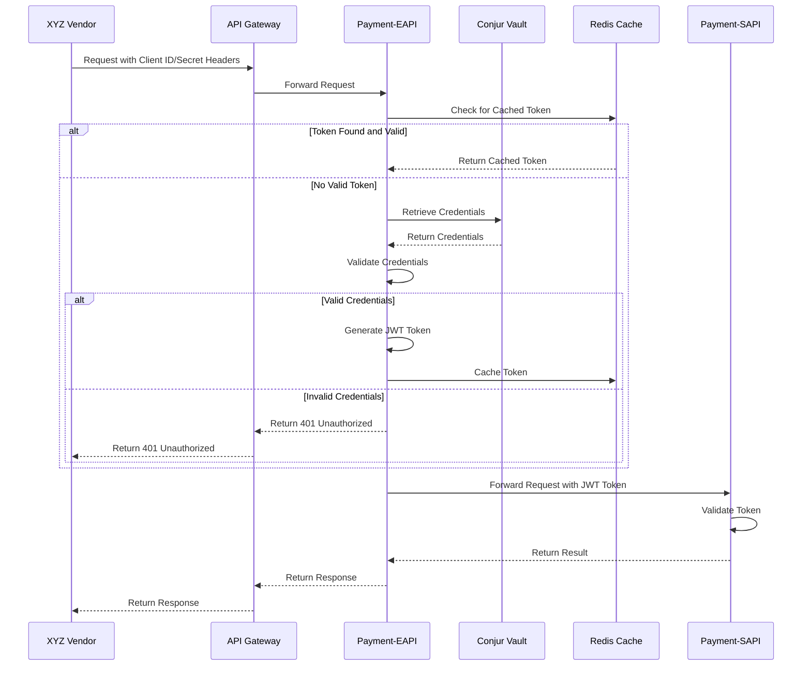
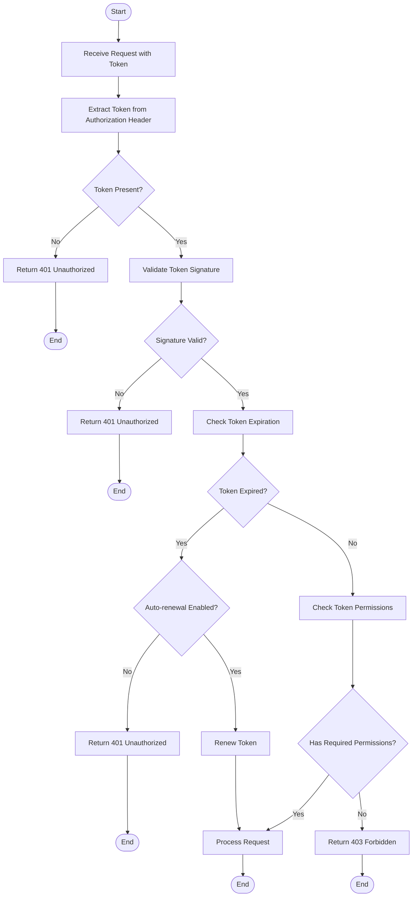
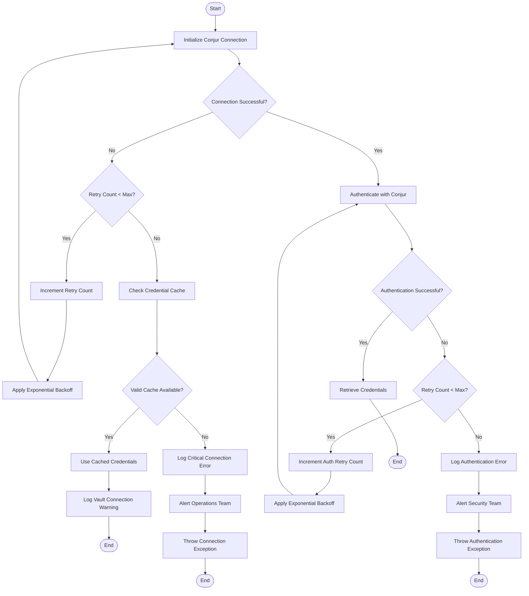

# Authentication Flow

## Overview

This document describes the authentication flow for the Payment API Security Enhancement project. The authentication mechanism is designed to maintain backward compatibility with existing vendor integrations while enhancing security through the use of Conjur vault for credential storage and JWT tokens for internal service communication.

The authentication flow consists of two main parts:
1. External authentication: Vendors authenticate using Client ID and Client Secret in request headers
2. Internal authentication: Services communicate using JWT tokens

This approach allows vendors to continue using their existing integration patterns while significantly improving the security of the internal authentication mechanism.

## Authentication Process

The authentication process handles vendor requests with Client ID and Client Secret headers, validates the credentials against those stored in Conjur vault, and generates JWT tokens for internal service communication.

### Authentication Flow Diagram



### Authentication Steps

1. **Vendor Request**: XYZ Vendor sends a request to the API Gateway with Client ID and Client Secret in headers.
2. **Request Forwarding**: API Gateway forwards the request to Payment-EAPI.
3. **Token Cache Check**: Payment-EAPI checks Redis cache for an existing valid token for the client.
4. **Token Found**: If a valid token exists, Payment-EAPI uses it for subsequent processing.
5. **Credential Retrieval**: If no valid token exists, Payment-EAPI retrieves credentials from Conjur vault.
6. **Credential Validation**: Payment-EAPI validates the provided credentials against those stored in Conjur vault.
7. **Token Generation**: If validation succeeds, Payment-EAPI generates a JWT token.
8. **Token Caching**: Payment-EAPI caches the token in Redis for future use.
9. **Request Forwarding**: Payment-EAPI forwards the request to Payment-SAPI with the JWT token.
10. **Token Validation**: Payment-SAPI validates the token and processes the request.
11. **Response Return**: Payment-SAPI returns the result to Payment-EAPI, which returns it to the vendor via the API Gateway.

### Header-Based Authentication

Vendors authenticate using the following headers:

```
X-Client-ID: {client_id}
X-Client-Secret: {client_secret}
```

These headers are extracted by Payment-EAPI and used to authenticate the vendor. This maintains backward compatibility with existing vendor integrations, as no changes are required on the vendor side.

### Authentication Service Implementation

The authentication process is implemented by the `AuthenticationService` interface in Payment-EAPI, which provides the following key methods:

- `authenticate(String clientId, String clientSecret)`: Authenticates a vendor using Client ID and Client Secret credentials
- `authenticateWithHeaders(Map<String, String> headers)`: Authenticates a vendor using headers containing Client ID and Client Secret
- `validateToken(String tokenString)`: Validates a JWT token's signature and claims
- `refreshToken(String tokenString)`: Refreshes an expired token with a new one
- `revokeAuthentication(String clientId)`: Revokes authentication for a specific client

The implementation of this interface handles the authentication flow, including credential validation, token generation, and error handling.

## Token Generation

JWT tokens are generated for internal service communication after successful authentication. These tokens contain claims that identify the client and specify permissions for accessing internal services.

### Token Structure

JWT tokens consist of three parts separated by dots: header, payload, and signature.

**Header**:
```json
{
  "alg": "HS256",
  "typ": "JWT"
}
```

**Payload**:
```json
{
  "sub": "client_id",           // Subject (client identifier)
  "iss": "payment-eapi",        // Issuer
  "aud": "payment-sapi",        // Audience
  "exp": 1623761445,            // Expiration time
  "iat": 1623757845,            // Issued at time
  "jti": "unique-token-id",     // JWT ID (unique identifier)
  "permissions": ["process_payment", "view_status"]  // Custom claim
}
```

**Signature**:
The signature is created by signing the encoded header and payload using HMAC-SHA256 with a secret key:
```
HMACSHA256(
  base64UrlEncode(header) + "." + base64UrlEncode(payload),
  secret
)
```

### Token Generation Process

The token generation process is implemented by the `TokenService` interface in Payment-EAPI and the `TokenGenerator` utility class in the common module. The process follows these steps:

1. Create a set of claims including client ID, issuer, audience, expiration time, issued time, JWT ID, and permissions
2. Convert the claims to a JSON string
3. Encode the header and payload using Base64URL encoding
4. Generate a signature using HMAC-SHA256 with the signing key
5. Combine the encoded header, payload, and signature to form the JWT token

The `TokenService` provides the following methods for token generation:

- `generateToken(String clientId)`: Generates a token with default permissions
- `generateToken(String clientId, List<String> permissions)`: Generates a token with custom permissions

### Token Expiration and Renewal

Tokens have a configurable expiration time (default: 1 hour) to limit the window of opportunity for token misuse. When a token expires, it can be renewed through the token renewal process:

1. Payment-SAPI detects that a token has expired during validation
2. If auto-renewal is enabled, Payment-SAPI requests a token renewal from Payment-EAPI
3. Payment-EAPI generates a new token with the same permissions
4. The new token is returned to Payment-SAPI, which continues processing the request

This renewal process is transparent to the vendor and ensures continuous operation without requiring re-authentication.

### Token Caching

Generated tokens are cached in Redis to improve performance and reduce the load on Conjur vault. The caching strategy includes:

1. Tokens are stored with the client ID as part of the key
2. Token expiration in Redis is set to match the token's expiration time
3. Token cache is invalidated when credentials are rotated
4. Cache hits and misses are monitored for performance optimization

## Token Validation

JWT tokens are validated by Payment-SAPI before processing requests to ensure they are authentic, unexpired, and have the required permissions.

### Token Validation Flow



### Validation Steps

The token validation process implemented by the `TokenValidationService` in Payment-SAPI includes the following steps:

1. **Token Extraction**: Extract the JWT token from the Authorization header
2. **Token Presence Check**: Verify that a token is present in the request
3. **Signature Validation**: Verify the token's signature using the verification key
4. **Expiration Check**: Check if the token has expired
5. **Token Renewal**: If the token is expired and auto-renewal is enabled, request a new token
6. **Permission Check**: Verify that the token has the required permissions for the requested operation
7. **Request Processing**: If all validations pass, process the request

If any validation step fails, an appropriate error response is returned.

### Validation Result

The token validation process returns a `ValidationResult` object that indicates the outcome of the validation:

- **Valid**: The token is valid and has the required permissions
- **Invalid**: The token is invalid (e.g., invalid signature, format)
- **Expired**: The token has expired
- **Forbidden**: The token is valid but lacks the required permissions

The `ValidationResult` may also include a renewed token if auto-renewal was triggered and successful.

### Token Revocation

Tokens can be revoked to immediately invalidate them before their expiration time. Revocation is useful in security-sensitive scenarios such as:

- User logout or session termination
- Detected security breach
- Credential rotation

Revoked tokens are tracked in a revocation registry, and the `TokenService` provides a `revokeToken` method to add tokens to this registry. During validation, the `TokenValidationService` checks if a token has been revoked before proceeding with other validation steps.

## Conjur Vault Integration

Conjur vault is used for secure storage and retrieval of authentication credentials. The integration ensures that credentials are never exposed in plain text and provides a secure mechanism for credential rotation.

### Credential Storage

Credentials in Conjur vault are stored with the following structure:

- Base path: `payment/credentials/{clientId}`
- Client ID: Stored in plain text as the identifier
- Client Secret: Stored as a secure hash, never in plain text
- Active status: Indicates if the credential is currently active
- Rotation state: Tracks the credential rotation status

This structure supports secure credential management and rotation without service disruption.

### Credential Retrieval

The `ConjurService` interface in Payment-EAPI provides methods for retrieving and validating credentials:

- `retrieveCredentials(String clientId)`: Retrieves credential information from Conjur vault
- `retrieveCredentialsWithFallback(String clientId)`: Retrieves credentials with fallback to cached credentials
- `validateCredentials(String clientId, String clientSecret)`: Validates credentials against those stored in Conjur vault
- `validateCredentialsWithFallback(String clientId, String clientSecret)`: Validates with fallback to cached credentials

These methods ensure secure credential handling and provide resilience in case of Conjur vault unavailability.

### Fallback Mechanisms

To ensure system availability even when Conjur vault is temporarily unavailable, the following fallback mechanisms are implemented:

1. **Credential Caching**: Credentials are cached in Redis with appropriate TTL
2. **Fallback Validation**: If Conjur vault is unavailable, cached credentials are used for validation
3. **Circuit Breaker**: A circuit breaker pattern prevents cascading failures during Conjur outages
4. **Graceful Degradation**: The system continues to function with cached credentials until Conjur is available again

These mechanisms ensure that temporary Conjur vault unavailability does not impact the authentication service.

### Conjur Vault Connection



## Error Handling

The authentication flow includes comprehensive error handling to ensure system stability, security, and a good user experience.

### Authentication Errors

Authentication errors occur when vendor credentials cannot be validated. These errors are handled as follows:

1. Invalid credentials (wrong Client Secret): Return 401 Unauthorized with appropriate error message
2. Unknown Client ID: Return 401 Unauthorized with appropriate error message
3. Missing credentials: Return 400 Bad Request with error details
4. Malformed credentials: Return 400 Bad Request with error details

All authentication errors are logged for security monitoring, but sensitive information such as credentials is never included in logs.

### Conjur Vault Errors

Errors related to Conjur vault operations are handled with resilience in mind:

1. Connection failures: Retry with exponential backoff, then fall back to cached credentials
2. Authentication failures: Retry with exponential backoff, then alert security team
3. Credential retrieval failures: Retry with exponential backoff, then fall back to cached credentials

The circuit breaker pattern is implemented to prevent cascading failures during Conjur vault outages.

### Token Validation Errors

Token validation errors are handled based on the type of error:

1. Missing token: Return 401 Unauthorized with appropriate error message
2. Invalid token format: Return 400 Bad Request with error details
3. Invalid signature: Return 401 Unauthorized with appropriate error message
4. Expired token: Attempt renewal if enabled, otherwise return 401 Unauthorized
5. Insufficient permissions: Return 403 Forbidden with appropriate error message

All token validation errors are logged for security monitoring and analysis.

### Error Response Format

All error responses follow a standardized format to ensure consistency and ease of handling by clients:

```json
{
  "errorCode": "string",
  "message": "string",
  "requestId": "string",
  "timestamp": "string"
}
```

Common error codes include:
- `AUTHENTICATION_FAILED`: Invalid credentials
- `INVALID_REQUEST`: Malformed request or missing required parameters
- `TOKEN_EXPIRED`: JWT token has expired
- `TOKEN_INVALID`: JWT token is invalid
- `PERMISSION_DENIED`: Insufficient permissions for the requested operation
- `SYSTEM_ERROR`: Unexpected system error

## Security Considerations

The authentication flow is designed with security as a primary concern, implementing multiple layers of protection for sensitive credentials and tokens.

### Credential Protection

Credentials are protected throughout the authentication flow:

1. Client Secrets are never stored in plain text, only as secure hashes
2. Credentials are never logged or exposed in responses
3. All credential operations use secure TLS connections
4. Credentials in memory are protected and promptly cleared
5. Access to credential operations is strictly controlled

### Token Security

JWT tokens are secured through multiple mechanisms:

1. Tokens are signed using HMAC-SHA256 to prevent tampering
2. Token expiration limits the window of opportunity for token misuse
3. Token permissions are explicitly specified and validated
4. Tokens can be revoked to immediately invalidate them
5. Token signing keys are securely stored and regularly rotated

### Brute Force Protection

The authentication system includes protection against brute force attacks:

1. Rate limiting on authentication attempts per client ID
2. Exponential backoff for repeated authentication failures
3. Account lockout after multiple failed authentication attempts
4. Alerts for suspicious authentication patterns

These measures help prevent credential guessing attacks while maintaining service availability for legitimate users.

### Secure Communication

All communication in the authentication flow is secured:

1. TLS 1.2+ for all external and internal communication
2. Certificate validation to prevent man-in-the-middle attacks
3. Secure headers to prevent common web vulnerabilities
4. Network segmentation to isolate security-critical components

### Audit and Monitoring

Comprehensive audit and monitoring is implemented for security visibility:

1. All authentication attempts are logged with appropriate context
2. Token operations (generation, validation, renewal, revocation) are logged
3. Suspicious patterns trigger security alerts
4. Regular security reviews of authentication logs

This monitoring helps detect and respond to potential security incidents promptly.

## Authentication During Credential Rotation

The authentication flow supports credential rotation without service disruption. During rotation, both old and new credentials are valid, allowing for a smooth transition. For detailed information on the credential rotation process, refer to the [Credential Rotation Architecture](credential-rotation.md) document.

### Dual Validation Period

During credential rotation, the authentication flow adapts to handle multiple valid credential versions:

1. Vendor submits request with Client ID and Client Secret
2. Payment-EAPI detects active rotation for the client ID
3. Payment-EAPI retrieves all active credential versions from Conjur vault
4. Payment-EAPI attempts validation against each active version
5. If any version validates successfully, authentication succeeds
6. Payment-EAPI generates JWT token
7. Payment-EAPI logs which credential version was used

This dual validation period ensures zero-downtime during credential rotation.

### Token Handling During Rotation

JWT tokens generated during credential rotation include information about the credential version used for authentication. This allows for monitoring of credential usage during the rotation process and helps determine when old credentials are no longer in use.

## Implementation Guidelines

This section provides guidelines for implementing the authentication flow in the Payment API Security Enhancement project.

### Authentication Service Implementation

The `AuthenticationService` interface should be implemented with the following considerations:

1. Thread safety for concurrent authentication requests
2. Proper error handling and logging
3. Performance optimization for high-volume authentication
4. Secure credential handling
5. Integration with monitoring and metrics

The implementation should follow the Single Responsibility Principle, with separate components for credential validation, token generation, and request forwarding.

### Token Service Implementation

The `TokenService` interface should be implemented with the following considerations:

1. Secure handling of signing keys
2. Efficient token generation and validation
3. Proper token caching and revocation
4. Support for token renewal
5. Integration with monitoring for token operations

The implementation should use the `TokenGenerator` utility for token generation and implement proper security measures for token handling.

### Conjur Service Implementation

The `ConjurService` interface should be implemented with the following considerations:

1. Secure connection to Conjur vault
2. Proper authentication with Conjur
3. Efficient credential retrieval and validation
4. Robust error handling and fallback mechanisms
5. Circuit breaker pattern for Conjur vault unavailability

The implementation should prioritize security while ensuring system resilience during Conjur vault outages.

### Performance Considerations

The authentication flow should be optimized for performance:

1. Efficient credential validation algorithms
2. Proper caching of tokens and credentials
3. Connection pooling for external services
4. Asynchronous logging to minimize impact on request processing
5. Regular performance testing and optimization

Performance metrics should be collected and monitored to identify bottlenecks and optimization opportunities.

## Conclusion

The authentication flow for the Payment API Security Enhancement project provides a secure and robust mechanism for authenticating vendor requests while maintaining backward compatibility. By leveraging Conjur vault for credential storage and JWT tokens for internal service communication, the system significantly enhances security while ensuring high availability and performance.

The flow supports credential rotation without service disruption, includes comprehensive error handling, and implements multiple security layers to protect sensitive credentials and tokens. The design prioritizes security, resilience, and performance, meeting the project's requirements for enhanced security with backward compatibility.