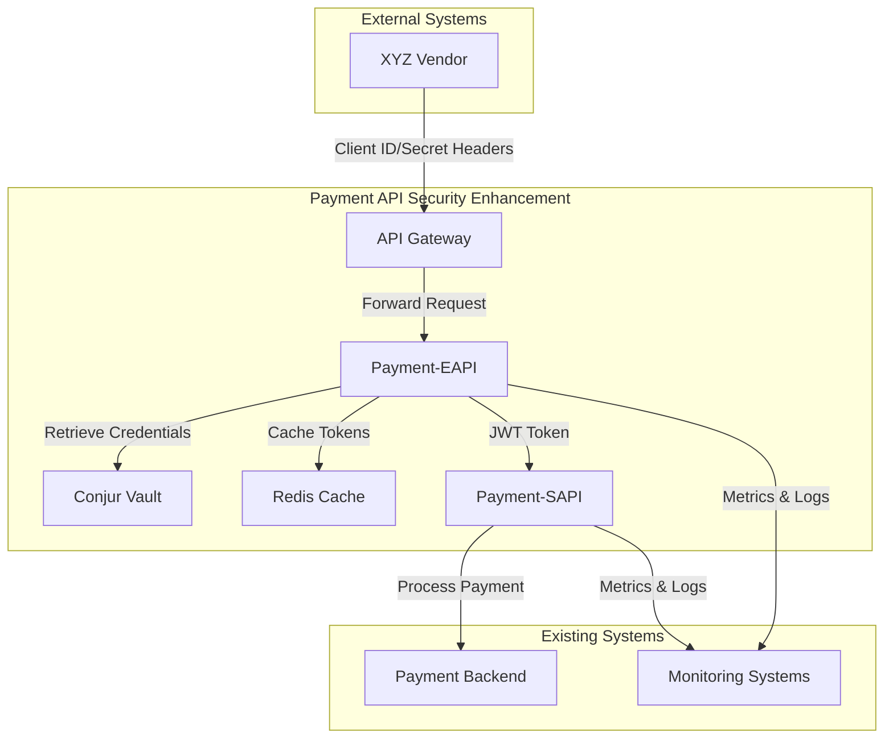
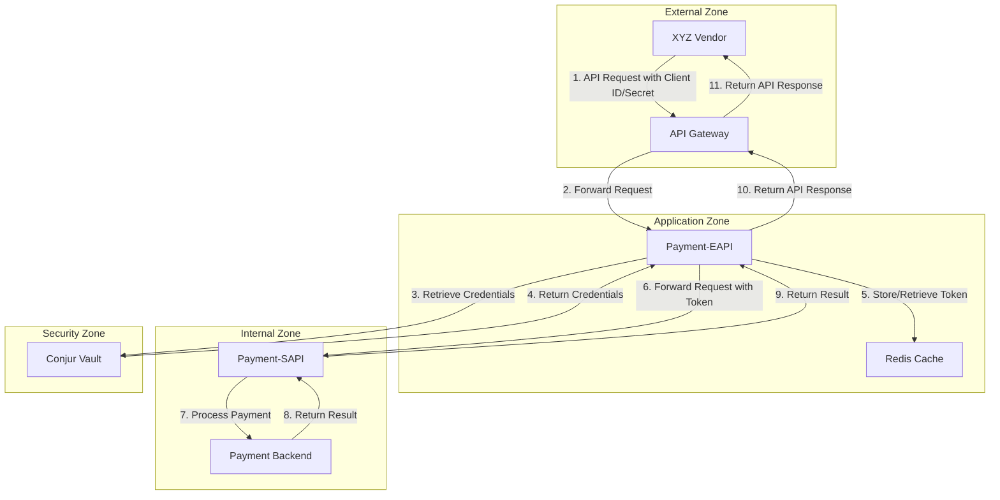
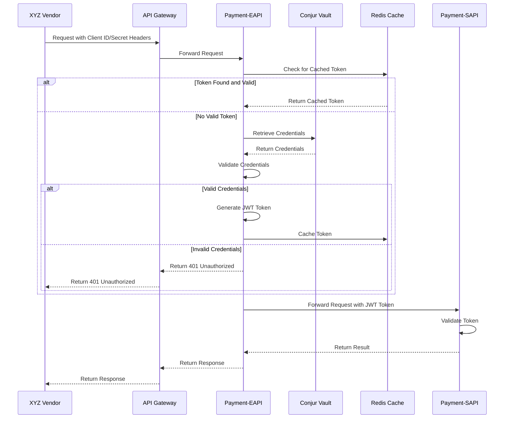
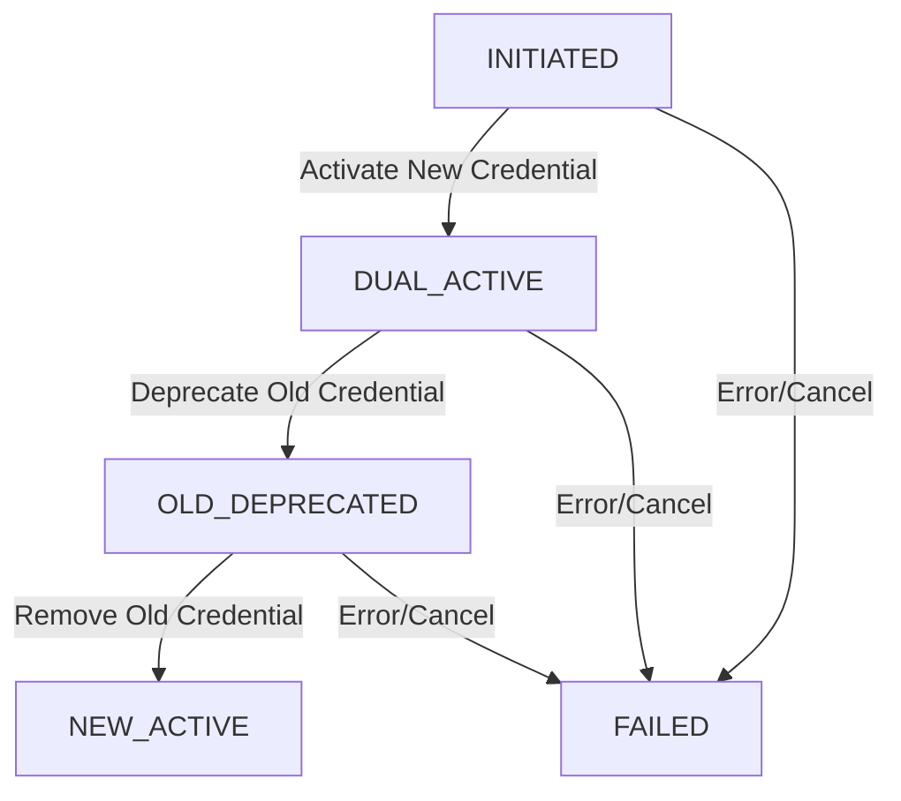
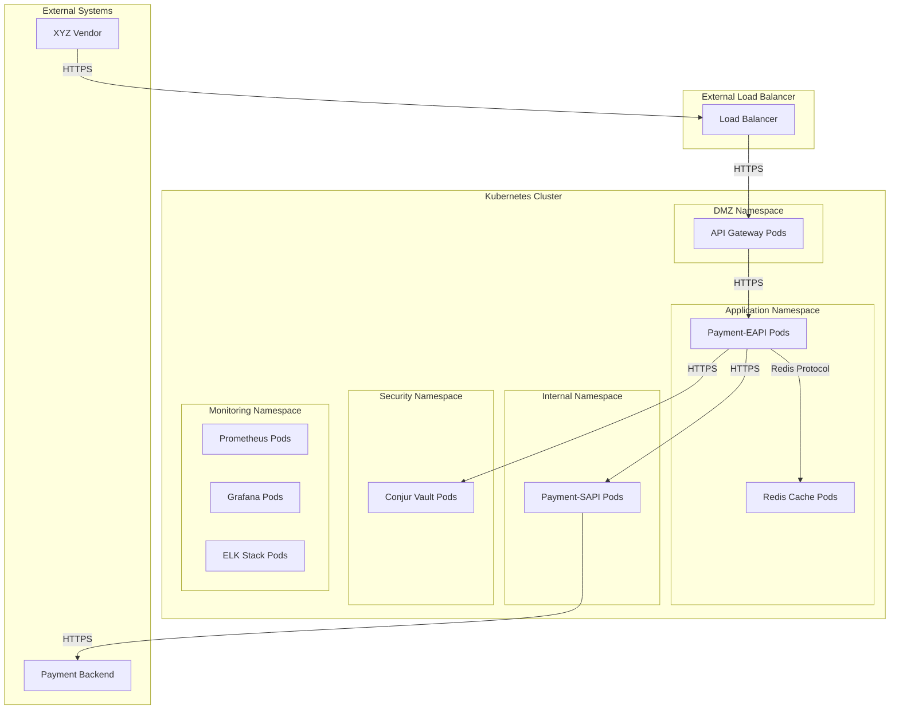
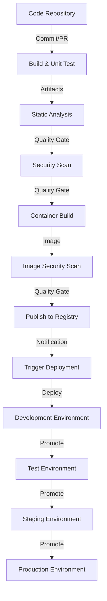

# High-Level Architecture - Payment API Security Enhancement

## Introduction

This document provides a high-level architecture overview of the Payment API Security Enhancement project. The project aims to strengthen the security of the existing payment processing system by implementing more secure authentication mechanisms while maintaining backward compatibility with current vendor integrations.

The architecture leverages Conjur vault for credential management to replace the current header-based Client ID and Client Secret authentication method for internal service communication, while preserving the existing API contract with vendors. This approach enhances security without disrupting existing business operations.

### Purpose and Scope

The purpose of this document is to provide a comprehensive architectural overview of the Payment API Security Enhancement project, including:

- System components and their interactions
- Security architecture and zones
- Authentication and authorization mechanisms
- Data flow and processing
- Deployment architecture

This document is intended for software architects, developers, security engineers, and operations personnel involved in the implementation, maintenance, and operation of the Payment API Security Enhancement project.

### Key Requirements

The architecture addresses the following key requirements:

1. **Enhanced Security**: Implement more secure authentication mechanisms using Conjur vault for credential storage and token-based authentication for internal service communication.

2. **Backward Compatibility**: Maintain the existing API contract with vendors, requiring no changes to vendor integrations.

3. **Credential Rotation**: Support credential rotation without service disruption.

4. **Operational Resilience**: Ensure high availability and fault tolerance for authentication services.

5. **Monitoring and Observability**: Provide comprehensive monitoring and logging for security events and system health.

### Design Principles

The architecture is guided by the following design principles:

1. **Security First**: Security is the primary consideration in all design decisions.

2. **Defense in Depth**: Multiple security layers protect the system from various threats.

3. **Least Privilege**: Components have only the permissions necessary to perform their functions.

4. **Separation of Concerns**: Clear separation between authentication, business logic, and security components.

5. **Backward Compatibility**: Existing vendor integrations continue to function without modification.

6. **Operational Excellence**: The system is designed for reliability, observability, and maintainability.

## System Overview

The Payment API Security Enhancement project implements a layered architecture with clear separation between external-facing and internal components. This approach allows for enhanced security internally while maintaining backward compatibility with existing vendor integrations.

### Architectural Patterns

The architecture implements the following key patterns:

- **API Gateway Pattern**: Centralizes request handling, routing, and initial authentication verification

- **Facade Pattern**: Payment-EAPI acts as a facade, hiding the complexity of the internal authentication mechanisms

- **Token-based Authentication**: JWT tokens for secure internal service communication

- **Vault Integration**: Secure credential storage and management using Conjur vault

- **Circuit Breaker Pattern**: Prevents cascading failures when external services are unavailable

- **Cache-Aside Pattern**: Improves performance and resilience through token caching

### System Context Diagram



### System Boundaries

The system has the following primary boundaries:

1. **External Boundary**: Interface between external systems (XYZ Vendor) and the Payment API Security Enhancement system via the API Gateway

2. **Authentication Boundary**: Interface between header-based authentication (external) and token-based authentication (internal)

3. **Service Boundary**: Interface between Payment-EAPI and Payment-SAPI

4. **Security Boundary**: Interface between application components and security components (Conjur vault)

5. **Backend Boundary**: Interface between Payment-SAPI and existing Payment Backend systems

Each boundary implements appropriate security controls and validation measures to ensure proper isolation and protection between different system domains.

### Technology Stack

The system is built using the following technology stack:

- **Programming Language**: Java 11

- **Framework**: Spring Boot 2.6.x with Spring Security 5.6.x

- **API Documentation**: Swagger/OpenAPI 3.0

- **Token Management**: JJWT (Java JWT) 0.11.x

- **Credential Management**: Conjur Vault with Java client

- **Caching**: Redis 6.2.x

- **Containerization**: Docker with Kubernetes orchestration

- **Monitoring**: Prometheus, Grafana, ELK Stack

- **CI/CD**: Jenkins, Maven, SonarQube

## Core Components

The Payment API Security Enhancement project consists of several core components that work together to provide secure authentication while maintaining backward compatibility with existing vendor integrations.

### Component Overview

| Component | Primary Responsibility | Key Dependencies |
|-----------|------------------------|------------------|
| API Gateway | Request routing, initial request handling | Load balancer, WAF |
| Payment-EAPI | External API, authentication translation | Conjur vault, Redis cache |
| Payment-SAPI | Internal service, payment processing | Payment-EAPI, Payment Backend |
| Conjur Vault | Secure credential storage | HSM (optional) |
| Redis Cache | Token caching | None |

These components are organized into distinct security zones with appropriate network segmentation and access controls.

### Payment-EAPI

The Payment-EAPI (External API) is the facade that maintains backward compatibility with existing vendor integrations while implementing enhanced security internally.

**Key Responsibilities**:
- Accept and validate vendor requests with Client ID/Secret in headers
- Retrieve and validate credentials from Conjur vault
- Generate JWT tokens for internal service communication
- Forward authenticated requests to Payment-SAPI
- Handle error scenarios and provide appropriate responses

**Key Components**:
- Authentication Controller: Handles authentication requests
- Token Service: Generates and manages JWT tokens
- Conjur Service: Interfaces with Conjur vault
- Cache Service: Manages token caching in Redis
- Forwarding Service: Forwards requests to Payment-SAPI

### Payment-SAPI

The Payment-SAPI (System API) is the internal service that processes payment transactions after authentication.

**Key Responsibilities**:
- Validate JWT tokens from Payment-EAPI
- Process payment transactions
- Communicate with backend systems
- Handle token renewal when needed
- Provide appropriate responses

**Key Components**:
- Token Validation Service: Validates JWT tokens
- Payment Processing Service: Processes payment transactions
- Token Renewal Service: Handles token renewal
- Audit Service: Logs security events

### Conjur Vault Integration

Conjur vault is used for secure storage and retrieval of authentication credentials.

**Key Responsibilities**:
- Securely store Client ID and Client Secret credentials
- Provide authenticated access to credentials
- Support credential versioning and rotation
- Maintain audit trail of credential access

**Integration Approach**:
- Certificate-based authentication from Payment-EAPI to Conjur
- Secure retrieval of credentials for validation
- Support for credential rotation without service disruption
- Fallback mechanisms for Conjur unavailability

### Redis Cache

Redis cache is used for token caching to improve performance and reduce load on Conjur vault.

**Key Responsibilities**:
- Cache JWT tokens with appropriate TTL
- Provide fast token retrieval
- Support token invalidation during credential rotation
- Improve system resilience during Conjur vault unavailability

**Caching Strategy**:
- Tokens cached with client ID as part of the key
- Token expiration in Redis matches token expiration time
- Cache invalidation during credential rotation
- Fallback to direct authentication when cache unavailable

### Component Interaction Diagram



## Security Architecture

The security architecture implements a defense-in-depth approach with multiple security layers to protect the payment processing system.

### Security Zones

The system is divided into distinct security zones, each with appropriate security controls and access restrictions:

- **External Zone**: Contains external clients (XYZ Vendor) and the public internet. This zone is considered untrusted.

- **DMZ (Demilitarized Zone)**: Contains the API Gateway, Web Application Firewall (WAF), and Load Balancer. This zone handles external traffic and provides the first layer of defense.

- **Application Zone**: Contains the Payment-EAPI and Redis Cache. This zone processes authenticated requests and manages token caching.

- **Internal Zone**: Contains the Payment-SAPI and backend systems. This zone processes payment transactions after authentication.

- **Security Zone**: Contains Conjur Vault and security infrastructure. This zone stores sensitive credentials and cryptographic material.

Each zone has specific security controls, network segmentation, and access restrictions to implement defense in depth.

### Authentication Mechanisms

The system implements multiple authentication mechanisms across different boundaries:

1. **External Authentication**: Client ID and Client Secret in HTTP headers for vendor requests

2. **Internal Authentication**: JWT tokens for service-to-service communication

3. **Vault Authentication**: Certificate-based mutual TLS for Conjur vault access

4. **Backend Authentication**: Service-specific authentication for backend systems

The Payment-EAPI translates between external header-based authentication and internal token-based authentication, maintaining backward compatibility while enhancing security.

### Authorization Framework

The authorization framework implements a multi-layered approach:

1. **Role-Based Access Control (RBAC)**: Vendors are assigned specific roles that determine which payment operations they can perform

2. **Claims-Based Authorization**: JWT tokens contain specific claims that define service permissions

3. **Policy-Based Access**: Conjur policies define which services can access specific credentials

This layered approach ensures that authorization is enforced at multiple levels, following the principle of defense in depth.

### Data Protection

Data protection measures ensure the confidentiality and integrity of sensitive data:

1. **Encryption in Transit**: All communication uses TLS 1.2+ with strong cipher suites

2. **Encryption at Rest**: Sensitive data is encrypted when stored, including credentials in Conjur vault

3. **Token Security**: JWT tokens are signed to prevent tampering and contain only necessary claims

4. **Credential Protection**: Client Secrets are never stored in plain text, only as secure hashes

5. **Data Minimization**: Only necessary data is transmitted and stored

### Security Monitoring

Comprehensive security monitoring ensures visibility into security events:

1. **Authentication Monitoring**: Monitoring of authentication success/failure rates, token operations

2. **Anomaly Detection**: Detection of unusual authentication patterns or credential usage

3. **Audit Logging**: Logging of security-relevant events for compliance and investigation

4. **Alert Generation**: Alerts for security incidents based on defined thresholds

5. **Security Dashboards**: Visualization of security metrics and events

### Trust Boundaries

Trust boundaries define the points where trust levels change and additional security controls are required:

1. **External to DMZ Boundary**: Boundary between untrusted external systems and semi-trusted DMZ components

2. **DMZ to Application Boundary**: Boundary between semi-trusted DMZ and trusted application components

3. **Application to Internal Boundary**: Boundary between application components and internal services

4. **Application to Security Boundary**: Boundary between application components and security components

Each trust boundary implements appropriate security controls to protect against threats, including authentication, authorization, input validation, and monitoring. These controls ensure that as data crosses trust boundaries, it is properly validated and protected.

## Authentication Implementation

The authentication implementation is a critical aspect of the Payment API Security Enhancement project, enabling secure authentication while maintaining backward compatibility with existing vendor integrations.

### Authentication Process Overview

The authentication process handles vendor requests with Client ID and Client Secret headers, validates the credentials against those stored in Conjur vault, and generates JWT tokens for internal service communication.



### Token Generation and Validation

JWT tokens are generated for internal service communication after successful authentication. These tokens contain claims that identify the client and specify permissions for accessing internal services.

**Token Structure**:
```json
{
  "sub": "client_id",           // Subject (client identifier)
  "iss": "payment-eapi",        // Issuer
  "aud": "payment-sapi",        // Audience
  "exp": 1623761445,            // Expiration time
  "iat": 1623757845,            // Issued at time
  "jti": "unique-token-id",     // JWT ID (unique identifier)
  "permissions": ["process_payment", "view_status"]  // Custom claim
}
```

**Token Validation**:
1. Extract token from Authorization header
2. Verify token signature using the verification key
3. Check token expiration
4. Validate token claims (issuer, audience, etc.)
5. Check token permissions for the requested operation

### Credential Rotation

The credential rotation process allows for updating authentication credentials without service disruption. The process follows a state machine model with well-defined states and transitions:

1. **INITIATED**: The initial state when a rotation process has been requested but not yet started.

2. **DUAL_ACTIVE**: Both old and new credentials are active and valid during the transition period.

3. **OLD_DEPRECATED**: The old credential is marked as deprecated but still accepted for authentication.

4. **NEW_ACTIVE**: Only the new credential is active, and the old credential has been removed.

5. **FAILED**: The rotation process failed and was rolled back or cancelled.



For detailed information on credential rotation, refer to the [Credential Rotation](credential-rotation.md) document.

### Error Handling and Resilience

The authentication implementation includes comprehensive error handling and resilience mechanisms:

1. **Authentication Errors**: Invalid credentials, missing credentials, malformed credentials

2. **Conjur Vault Errors**: Connection failures, authentication failures, credential retrieval failures

3. **Token Validation Errors**: Invalid token, expired token, insufficient permissions

4. **Resilience Mechanisms**:
   - Circuit breaker for Conjur vault operations
   - Token caching in Redis
   - Fallback to cached credentials when Conjur is unavailable
   - Automatic token renewal
   - Retry with exponential backoff for transient failures

## Data Flow

The data flow in the Payment API Security Enhancement project encompasses authentication data, payment transaction data, and monitoring data.

### Authentication Data Flow

The authentication data flow involves the following steps:

1. **Credential Submission**: XYZ Vendor submits Client ID and Client Secret in request headers to the API Gateway

2. **Credential Forwarding**: API Gateway forwards the request with credentials to Payment-EAPI

3. **Credential Validation**: Payment-EAPI retrieves credentials from Conjur vault and validates the submitted credentials

4. **Token Generation**: Upon successful validation, Payment-EAPI generates a JWT token

5. **Token Caching**: The token is cached in Redis for future use

6. **Token Usage**: Payment-EAPI includes the token in requests to Payment-SAPI

7. **Token Validation**: Payment-SAPI validates the token before processing the request

### Payment Transaction Flow

The payment transaction flow builds on the authentication flow:

1. **Payment Request**: XYZ Vendor submits a payment request with Client ID and Client Secret in headers

2. **Authentication**: The request is authenticated as described in the authentication data flow

3. **Request Forwarding**: Payment-EAPI forwards the authenticated request to Payment-SAPI with a JWT token

4. **Payment Processing**: Payment-SAPI processes the payment transaction through the Payment Backend

5. **Response Return**: The payment result is returned through the chain: Payment Backend → Payment-SAPI → Payment-EAPI → API Gateway → XYZ Vendor

### Monitoring Data Flow

The monitoring data flow captures metrics, logs, and events for system monitoring:

1. **Metrics Collection**: Components expose metrics endpoints that are scraped by Prometheus

2. **Log Generation**: Components generate logs that are collected by the logging infrastructure

3. **Event Publication**: Security events are published to the event bus for processing

4. **Data Aggregation**: Metrics, logs, and events are aggregated for analysis

5. **Visualization**: Dashboards display metrics, logs, and events for monitoring

6. **Alerting**: Alerts are generated based on defined thresholds and conditions

### Data Classification and Handling

Data is classified according to sensitivity, with appropriate handling controls:

| Data Type | Classification | Handling Controls |
|-----------|----------------|------------------|
| Client ID | Sensitive | Encryption, access logging |
| Client Secret | Highly Sensitive | Encryption, never logged, secure handling |
| JWT Tokens | Sensitive | Encryption, signature validation |
| Transaction Data | Sensitive | Encryption, data validation |
| Logs and Metrics | Internal | Anonymization, filtering of sensitive data |

### Data Flow Controls

Data flow controls ensure that data is properly protected as it flows through the system:

1. **Encryption**: All data in transit is encrypted using TLS 1.2+

2. **Authentication**: All data flows between components require authentication

3. **Authorization**: Access to data is controlled based on authorization rules

4. **Validation**: Data is validated at each boundary crossing

5. **Minimization**: Only necessary data is transmitted between components

6. **Monitoring**: Data flows are monitored for anomalies and security issues

## Deployment Architecture

The deployment architecture defines how the system components are deployed and managed in the infrastructure.

### Deployment Model

The system uses a containerized deployment model with Kubernetes orchestration:



### High Availability Design

The system is designed for high availability:

1. **Component Redundancy**: Multiple instances of each component deployed across availability zones

2. **Load Balancing**: Traffic distributed across component instances

3. **Auto-scaling**: Component instances scaled based on load

4. **Health Checks**: Regular health checks to detect and replace unhealthy instances

5. **Failover**: Automatic failover to healthy instances when failures occur

6. **Disaster Recovery**: Cross-region replication for disaster recovery

### Kubernetes Resources

The system is deployed using the following Kubernetes resources:

1. **Deployments**: For stateless components (Payment-EAPI, Payment-SAPI, API Gateway)

2. **StatefulSets**: For stateful components (Redis, Conjur Vault)

3. **Services**: For internal communication between components

4. **Ingress**: For external access to the API Gateway

5. **ConfigMaps**: For component configuration

6. **Secrets**: For sensitive configuration (certificates, credentials)

7. **Network Policies**: For network segmentation and access control

### Configuration Management

Configuration is managed using a combination of approaches:

1. **Environment-specific Configuration**: Different configuration for development, testing, staging, and production environments

2. **ConfigMaps and Secrets**: Kubernetes resources for configuration

3. **External Configuration**: Configuration stored in external systems (Conjur vault)

4. **Configuration Hierarchy**: Layered configuration with defaults and overrides

5. **Configuration Validation**: Validation of configuration at startup

### CI/CD Pipeline

The CI/CD pipeline automates the build, test, and deployment process:



### Monitoring and Observability

The monitoring and observability infrastructure provides visibility into system health and performance:

1. **Metrics Collection**: Prometheus for metrics collection

2. **Log Aggregation**: ELK Stack for log aggregation and analysis

3. **Distributed Tracing**: Jaeger for distributed tracing

4. **Dashboards**: Grafana for metrics visualization

5. **Alerting**: AlertManager for alert generation and notification

6. **Health Checks**: Regular health checks for all components

## Security Considerations

This section highlights key security considerations in the architecture design.

### Threat Model

The architecture addresses the following key threats:

1. **Credential Theft**: Mitigated through secure credential storage in Conjur vault

2. **Man-in-the-Middle Attacks**: Mitigated through TLS encryption for all communication

3. **Token Forgery**: Mitigated through token signing and validation

4. **Unauthorized Access**: Mitigated through multi-layered authentication and authorization

5. **Denial of Service**: Mitigated through rate limiting and resource constraints

6. **Data Leakage**: Mitigated through encryption and data minimization

### Security Controls

The architecture implements the following security controls:

1. **Authentication Controls**: Multi-layered authentication with header-based and token-based mechanisms

2. **Authorization Controls**: Role-based and claims-based authorization

3. **Encryption Controls**: TLS for data in transit, encryption for sensitive data at rest

4. **Access Controls**: Least privilege access to resources and data

5. **Monitoring Controls**: Comprehensive monitoring of security events

6. **Network Controls**: Network segmentation and access restrictions

### Compliance Alignment

The architecture aligns with the following compliance requirements:

1. **PCI-DSS**: Payment Card Industry Data Security Standard requirements for secure payment processing

2. **SOC2**: Service Organization Control 2 requirements for security, availability, and confidentiality

3. **Internal Security Policies**: Organizational security policies and standards

4. **Data Protection Regulations**: Requirements for protecting sensitive data

### Security Testing

The architecture includes provisions for comprehensive security testing:

1. **Static Analysis**: Code analysis for security vulnerabilities

2. **Dynamic Analysis**: Runtime testing for security vulnerabilities

3. **Penetration Testing**: Simulated attacks to identify vulnerabilities

4. **Vulnerability Scanning**: Regular scanning for known vulnerabilities

5. **Security Reviews**: Expert review of security design and implementation

## Performance Considerations

This section highlights key performance considerations in the architecture design.

### Performance Requirements

The system must meet the following performance requirements:

1. **Response Time**: API response time < 500ms (95th percentile)

2. **Throughput**: Support for 100+ transactions per second

3. **Scalability**: Ability to scale horizontally to handle increased load

4. **Availability**: 99.9% availability for the API

5. **Resource Utilization**: Efficient use of CPU, memory, and network resources

### Caching Strategy

The caching strategy improves performance and reduces load on backend systems:

1. **Token Caching**: JWT tokens cached in Redis to reduce authentication overhead

2. **Credential Caching**: Credential metadata cached to reduce Conjur vault requests

3. **Cache Invalidation**: Proper invalidation during credential rotation

4. **Cache Sizing**: Appropriate cache size based on expected load

5. **Cache Monitoring**: Monitoring of cache hit/miss rates and performance

### Optimization Techniques

The architecture implements the following optimization techniques:

1. **Connection Pooling**: Reuse of connections to backend systems

2. **Asynchronous Processing**: Non-blocking I/O for improved throughput

3. **Resource Pooling**: Efficient use of resources through pooling

4. **Load Balancing**: Distribution of load across component instances

5. **Efficient Algorithms**: Use of efficient algorithms for critical operations

### Performance Testing

The architecture includes provisions for comprehensive performance testing:

1. **Load Testing**: Testing under expected load conditions

2. **Stress Testing**: Testing under extreme load conditions

3. **Endurance Testing**: Testing over extended periods

4. **Scalability Testing**: Testing horizontal and vertical scaling

5. **Performance Monitoring**: Continuous monitoring of performance metrics

## Operational Considerations

This section highlights key operational considerations in the architecture design.

### Deployment and Upgrades

The architecture supports smooth deployment and upgrades:

1. **Zero-Downtime Deployment**: Rolling updates without service disruption

2. **Canary Deployments**: Gradual rollout of changes

3. **Blue-Green Deployments**: Parallel environments for seamless cutover

4. **Rollback Capability**: Ability to quickly roll back problematic changes

5. **Deployment Automation**: Automated deployment processes

### Monitoring and Alerting

The monitoring and alerting strategy ensures operational visibility:

1. **Health Monitoring**: Regular health checks for all components

2. **Performance Monitoring**: Tracking of key performance metrics

3. **Security Monitoring**: Monitoring of security events and anomalies

4. **Log Analysis**: Analysis of logs for troubleshooting and audit

5. **Alerting**: Timely notification of issues requiring attention

### Backup and Recovery

The backup and recovery strategy ensures data protection and service continuity:

1. **Regular Backups**: Scheduled backups of critical data

2. **Backup Verification**: Regular testing of backup integrity

3. **Recovery Procedures**: Documented procedures for different recovery scenarios

4. **Disaster Recovery**: Cross-region replication for disaster recovery

5. **Business Continuity**: Measures to ensure continued business operations

### Incident Management

The incident management process ensures timely response to issues:

1. **Incident Detection**: Automated detection of incidents

2. **Incident Classification**: Classification based on severity and impact

3. **Incident Response**: Defined procedures for incident response

4. **Incident Communication**: Clear communication during incidents

5. **Post-Incident Analysis**: Analysis to prevent recurrence

## Future Enhancements

This section outlines potential future enhancements to the architecture.

### Service Mesh Implementation

Implementation of a service mesh to enhance service-to-service communication security:

- **Mutual TLS**: Automatic mTLS between all services

- **Fine-grained Access Control**: Request-level access control between services

- **Traffic Management**: Advanced traffic management capabilities

- **Observability**: Enhanced visibility into service-to-service communication

### Zero Trust Architecture

Evolution toward a zero trust architecture:

- **Identity-based Access**: Access based on identity rather than network location

- **Continuous Verification**: Continuous verification of identity and device posture

- **Least Privilege Access**: Granular access controls for all resources

- **Microsegmentation**: Fine-grained segmentation at the workload level

### Advanced Authentication Methods

Implementation of advanced authentication methods:

- **OAuth 2.0 / OpenID Connect**: Standards-based authentication and authorization

- **Certificate-based Authentication**: Client certificate authentication for vendors

- **Multi-factor Authentication**: Additional authentication factors for sensitive operations

- **Biometric Authentication**: Biometric factors for high-security scenarios

### Enhanced Monitoring and Analytics

Implementation of enhanced monitoring and analytics capabilities:

- **AI/ML-based Anomaly Detection**: Advanced detection of security anomalies

- **Behavioral Analysis**: Analysis of user and system behavior patterns

- **Predictive Analytics**: Prediction of potential issues before they occur

- **Security Information and Event Management (SIEM)**: Comprehensive security event management

## Conclusion

The high-level architecture for the Payment API Security Enhancement project provides a comprehensive approach to enhancing the security of the payment processing system while maintaining backward compatibility with existing vendor integrations.

By leveraging Conjur vault for credential management and implementing token-based authentication for internal service communication, the architecture significantly improves security without disrupting business operations. The layered approach with clear separation between external-facing and internal components ensures that security enhancements can be implemented internally while preserving the existing API contract with vendors.

The architecture addresses key requirements including enhanced security, backward compatibility, credential rotation, operational resilience, and comprehensive monitoring. It implements industry best practices for security, performance, and operability, providing a solid foundation for the Payment API Security Enhancement project.

## References

1. [Credential Rotation](credential-rotation.md): Documentation of the credential rotation process

2. [Spring Boot Documentation](https://docs.spring.io/spring-boot/docs/current/reference/html/): Official Spring Boot documentation

3. [Spring Security Documentation](https://docs.spring.io/spring-security/reference/): Official Spring Security documentation

4. [Conjur Documentation](https://docs.conjur.org/): Official documentation for Conjur vault

5. [JWT Specification](https://tools.ietf.org/html/rfc7519): RFC 7519 - JSON Web Token specification