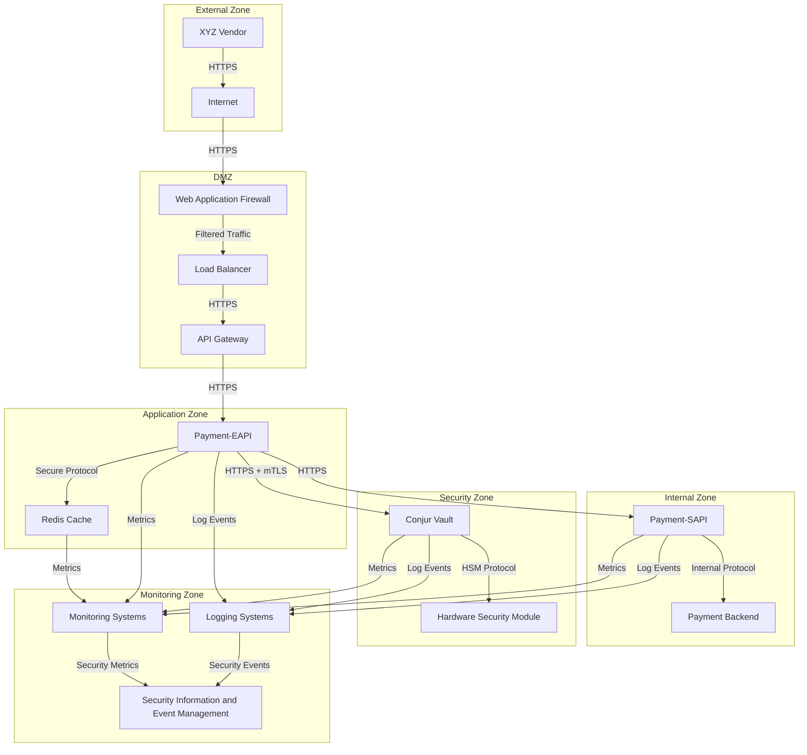
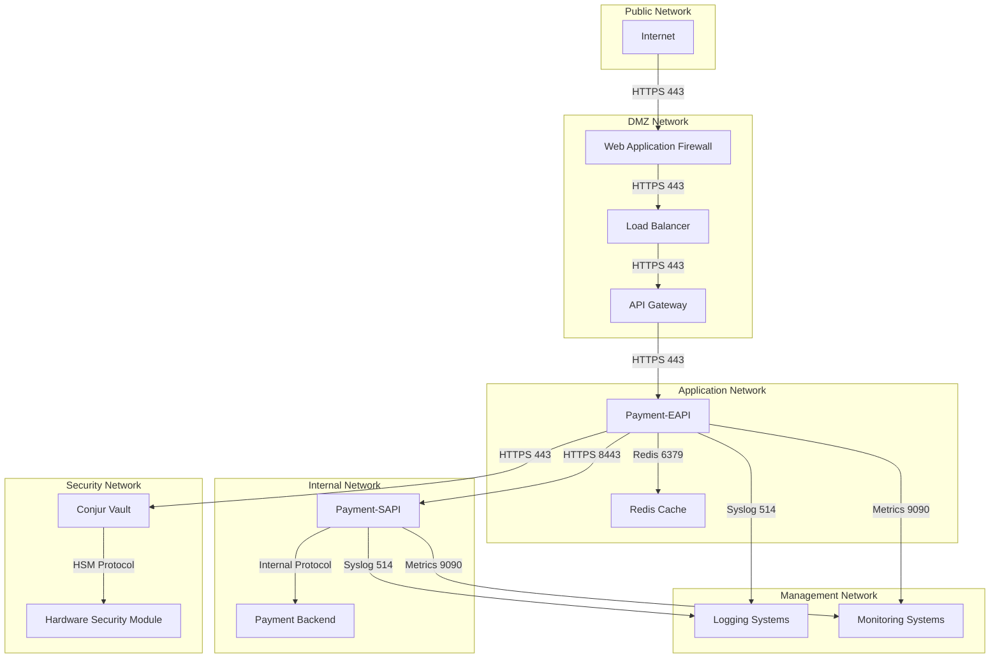
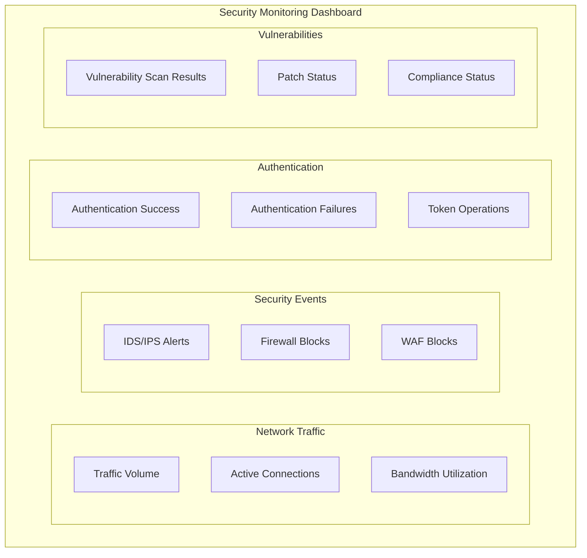

# Network Security Architecture

## Introduction

This document describes the network security architecture for the Payment API Security Enhancement project. Network security is a critical aspect of the overall security architecture, providing the foundation for protecting the payment processing system from external and internal threats.

The network security architecture implements defense in depth through multiple security layers, including network segmentation, access controls, encryption, and monitoring. These layers work together to protect sensitive components and data while maintaining the necessary connectivity for system operation and backward compatibility with existing vendor integrations.

### Purpose and Scope

The purpose of this document is to provide a comprehensive overview of the network security architecture for the Payment API Security Enhancement project, including:

- Network security zones and boundaries
- Network segmentation approach
- Network access controls
- Encryption and secure communication
- Network monitoring and defense mechanisms

This document is intended for security architects, network engineers, system administrators, and security operations personnel involved in the implementation, maintenance, and operation of the Payment API Security Enhancement project.

### Key Requirements

The network security architecture addresses the following key requirements:

1. **Defense in Depth**: Implement multiple layers of network security controls to protect against various threats.

2. **Secure Communication**: Ensure all network communication is encrypted and authenticated.

3. **Network Segmentation**: Implement strict network segmentation to isolate security components from public-facing services.

4. **Access Control**: Implement network-level access controls between different security zones.

5. **Monitoring and Detection**: Implement comprehensive network monitoring and threat detection capabilities.

6. **Backward Compatibility**: Maintain backward compatibility with existing vendor integrations while enhancing security.

### Design Principles

The network security architecture is guided by the following design principles:

1. **Defense in Depth**: Multiple security layers provide redundant protection.

2. **Least Privilege**: Network access is restricted to the minimum necessary for operation.

3. **Secure by Default**: Default configurations deny access unless explicitly allowed.

4. **Separation of Concerns**: Clear separation between different security zones and functions.

5. **Visibility and Monitoring**: Comprehensive monitoring of network traffic and security events.

6. **Resilience**: The network security architecture is designed to be resilient to failures and attacks.

## Network Security Zones

The network security architecture divides the system into distinct security zones, each with appropriate security controls and access restrictions. These zones create multiple security layers that must be traversed to reach sensitive components.

### Zone Definitions

The system is divided into the following security zones:

- **External Zone**: Contains external clients (XYZ Vendor) and the public internet. This zone is considered untrusted.

- **DMZ (Demilitarized Zone)**: Contains the API Gateway, Web Application Firewall (WAF), and Load Balancer. This zone handles external traffic and provides the first layer of defense.

- **Application Zone**: Contains the Payment-EAPI and Redis Cache. This zone processes authenticated requests and manages token caching.

- **Internal Zone**: Contains the Payment-SAPI and backend systems. This zone processes payment transactions after authentication.

- **Security Zone**: Contains Conjur Vault and security infrastructure. This zone stores sensitive credentials and cryptographic material.

- **Monitoring Zone**: Contains logging and monitoring systems. This zone collects and analyzes security events and metrics.

### Zone Architecture



### Zone Trust Levels

Each zone has a defined trust level that determines the security controls applied:

| Zone | Trust Level | Description |
|------|------------|-------------|
| External Zone | Untrusted | No trust assumptions, all traffic must be validated and authenticated |
| DMZ | Semi-trusted | Limited trust, traffic is filtered but still requires validation |
| Application Zone | Trusted | Higher trust level, but still requires authentication and authorization |
| Internal Zone | Trusted | Higher trust level, internal services with controlled access |
| Security Zone | Highly trusted | Highest trust level, contains sensitive security components |
| Monitoring Zone | Trusted | Collects and analyzes security data with controlled access |

### Zone Communication Patterns

Communication between zones follows specific patterns to maintain security:

1. **Controlled Flow**: Communication flows are strictly controlled, with explicit allow rules for necessary traffic.

2. **Directional Control**: Communication is generally initiated from lower trust zones to higher trust zones, with responses flowing back.

3. **Authentication Boundaries**: Authentication occurs at zone boundaries, with different mechanisms for different zones.

4. **Protocol Restrictions**: Only necessary protocols are allowed between zones, with secure versions required.

5. **Monitoring Points**: All cross-zone communication is monitored for security events and anomalies.

## Network Segmentation

Network segmentation is a key security control that divides the network into isolated segments, limiting the impact of a potential breach and protecting sensitive components.

### Segmentation Approach

The network segmentation approach implements multiple layers of isolation:

1. **Physical Segmentation**: Separate physical networks for different security zones where possible.

2. **VLAN Segmentation**: Virtual LANs (VLANs) to separate network traffic within shared physical infrastructure.

3. **Subnet Segmentation**: Separate IP subnets for different security zones and components.

4. **VPC Segmentation**: Separate Virtual Private Clouds (VPCs) for cloud-based components.

5. **Kubernetes Namespace Segmentation**: Separate Kubernetes namespaces for containerized components.

6. **Micro-segmentation**: Fine-grained segmentation at the workload level using network policies.

### Network Topology



### Subnet Design

The subnet design implements isolation between different security zones:

| Network | CIDR Block | Components | Access Controls |
|---------|------------|------------|----------------|
| DMZ Network | 10.1.0.0/24 | WAF, Load Balancer, API Gateway | Restricted inbound from internet, limited outbound |
| Application Network | 10.2.0.0/24 | Payment-EAPI, Redis Cache | No direct internet access, controlled access from DMZ |
| Internal Network | 10.3.0.0/24 | Payment-SAPI, Backend Systems | No direct internet access, controlled access from Application Network |
| Security Network | 10.4.0.0/24 | Conjur Vault, HSM | Highly restricted access, only from authorized components |
| Management Network | 10.5.0.0/24 | Logging, Monitoring | One-way data flow from other networks, restricted access |

### Kubernetes Network Policies

For containerized components, Kubernetes Network Policies provide additional segmentation:

```yaml
# Example Network Policy for Payment-EAPI
apiKind: NetworkPolicy
apiVersion: networking.k8s.io/v1
metadata:
  name: payment-eapi-network-policy
  namespace: application
spec:
  podSelector:
    matchLabels:
      app: payment-eapi
  policyTypes:
  - Ingress
  - Egress
  ingress:
  - from:
    - namespaceSelector:
        matchLabels:
          zone: dmz
      podSelector:
        matchLabels:
          app: api-gateway
    ports:
    - protocol: TCP
      port: 443
  egress:
  - to:
    - namespaceSelector:
        matchLabels:
          zone: internal
      podSelector:
        matchLabels:
          app: payment-sapi
    ports:
    - protocol: TCP
      port: 8443
  - to:
    - namespaceSelector:
        matchLabels:
          zone: application
      podSelector:
        matchLabels:
          app: redis
    ports:
    - protocol: TCP
      port: 6379
  - to:
    - namespaceSelector:
        matchLabels:
          zone: security
      podSelector:
        matchLabels:
          app: conjur
    ports:
    - protocol: TCP
      port: 443
  - to:
    - namespaceSelector:
        matchLabels:
          zone: monitoring
      podSelector:
        matchLabels:
          app: logging
    ports:
    - protocol: TCP
      port: 514
  - to:
    - namespaceSelector:
        matchLabels:
          zone: monitoring
      podSelector:
        matchLabels:
          app: monitoring
    ports:
    - protocol: TCP
      port: 9090
```

### Segmentation Verification

Network segmentation is regularly verified through:

1. **Automated Testing**: Automated tests verify that network segmentation is properly implemented.

2. **Penetration Testing**: Regular penetration testing attempts to bypass network segmentation.

3. **Configuration Auditing**: Regular auditing of network configurations to ensure compliance with segmentation requirements.

4. **Traffic Analysis**: Analysis of network traffic to detect unauthorized communication between segments.

5. **Compliance Validation**: Validation of network segmentation against compliance requirements (e.g., PCI-DSS).

## Network Access Controls

Network access controls restrict communication between different network segments and components, implementing the principle of least privilege at the network level.

### Firewall Architecture

The firewall architecture implements multiple layers of protection:

1. **Perimeter Firewalls**: Protect the DMZ from the internet, filtering inbound and outbound traffic.

2. **Internal Firewalls**: Separate different security zones, controlling traffic between zones.

3. **Host-based Firewalls**: Provide additional protection at the host level.

4. **Web Application Firewall (WAF)**: Protects against application-layer attacks.

5. **Container Firewalls**: Network policies for containerized components.

```mermaid
graph TD
    subgraph "Internet"
        Internet[Internet]
    end
    
    subgraph "Perimeter Security"
        DDoS[DDoS Protection]
        WAF[Web Application Firewall]
        PerimeterFW[Perimeter Firewall]
    end
    
    subgraph "Internal Security"
        DMZ_FW[DMZ Firewall]
        App_FW[Application Firewall]
        Sec_FW[Security Firewall]
    end
    
    subgraph "Host Security"
        Host_FW[Host-based Firewalls]
        Container_FW[Container Firewalls]
    end
    
    Internet --> DDoS
    DDoS --> WAF
    WAF --> PerimeterFW
    
    PerimeterFW --> DMZ_FW
    DMZ_FW --> App_FW
    App_FW --> Sec_FW
    
    App_FW --> Host_FW
    Host_FW --> Container_FW
```

### Access Control Rules

Access control rules follow the principle of least privilege:

| Source | Destination | Protocol | Port | Purpose | Rule |
|--------|-------------|----------|------|---------|------|
| Internet | WAF | HTTPS | 443 | External API access | Allow |
| WAF | Load Balancer | HTTPS | 443 | Load distribution | Allow |
| Load Balancer | API Gateway | HTTPS | 443 | API routing | Allow |
| API Gateway | Payment-EAPI | HTTPS | 443 | API processing | Allow |
| Payment-EAPI | Payment-SAPI | HTTPS | 8443 | Internal API calls | Allow |
| Payment-EAPI | Redis Cache | Redis | 6379 | Token caching | Allow |
| Payment-EAPI | Conjur Vault | HTTPS | 443 | Credential retrieval | Allow |
| Payment-SAPI | Backend Systems | Internal | Various | Payment processing | Allow |
| All Components | Logging Systems | Syslog | 514 | Log collection | Allow |
| All Components | Monitoring Systems | Metrics | 9090 | Metrics collection | Allow |
| All Other Traffic | Any | Any | Any | Unauthorized traffic | Deny |

### Network ACLs

Network Access Control Lists (ACLs) provide subnet-level protection:

1. **Stateless Filtering**: ACLs provide stateless packet filtering at the subnet level.

2. **Direction-specific Rules**: Separate rules for inbound and outbound traffic.

3. **IP-based Restrictions**: Restrictions based on source and destination IP addresses.

4. **Protocol Restrictions**: Restrictions based on protocols and ports.

5. **Default Deny**: Default deny for all traffic not explicitly allowed.

### Security Groups

Security groups provide instance-level protection:

1. **Stateful Filtering**: Security groups provide stateful filtering at the instance level.

2. **Component-specific Rules**: Specific rules for each component type.

3. **Service-based Restrictions**: Restrictions based on services rather than just ports.

4. **Dynamic Updates**: Rules can be updated dynamically based on changing requirements.

5. **Default Deny**: Default deny for all traffic not explicitly allowed.

### Rate Limiting and DDoS Protection

Rate limiting and DDoS protection mechanisms prevent abuse and attacks:

1. **Perimeter Rate Limiting**: Limits the rate of requests from external sources.

2. **API Rate Limiting**: Limits the rate of API requests per client.

3. **Connection Limiting**: Limits the number of concurrent connections.

4. **DDoS Protection**: Protection against distributed denial-of-service attacks.

5. **Anomaly Detection**: Detection of abnormal traffic patterns that might indicate attacks.

## Encryption and Secure Communication

All network communication is encrypted to protect data in transit, ensuring confidentiality and integrity of sensitive information.

### TLS Implementation

Transport Layer Security (TLS) is implemented for all network communication:

1. **TLS Version**: TLS 1.2+ is required for all communication.

2. **Strong Cipher Suites**: Only strong cipher suites with forward secrecy are allowed.

3. **Certificate Management**: Proper management of TLS certificates, including regular rotation.

4. **Certificate Validation**: Strict certificate validation for all TLS connections.

5. **HSTS Implementation**: HTTP Strict Transport Security for web-based communication.

### Mutual TLS Authentication

Mutual TLS (mTLS) authentication is implemented for sensitive communication:

1. **Client and Server Authentication**: Both client and server authenticate each other using X.509 certificates.

2. **Certificate Authority**: Certificates are issued by a trusted Certificate Authority (CA).

3. **Certificate Revocation**: Support for certificate revocation through CRLs or OCSP.

4. **Certificate Pinning**: Certificate pinning for critical connections.

5. **Automated Rotation**: Automated rotation of certificates before expiration.

### Secure Communication Paths

| Communication Path | Security Controls | Additional Protection |
|-------------------|-------------------|----------------------|
| Vendor to API Gateway | TLS 1.2+, Certificate validation | WAF, DDoS protection |
| API Gateway to Payment-EAPI | TLS 1.2+, Mutual TLS | Network segmentation |
| Payment-EAPI to Payment-SAPI | TLS 1.2+, JWT authentication | Internal network only |
| Payment-EAPI to Conjur | TLS 1.2+, Certificate authentication | Dedicated secure channel |
| Payment-EAPI to Redis | TLS-encrypted Redis protocol | Internal network only |
| Payment-SAPI to Backend | TLS 1.2+, Service authentication | Internal network only |
| All Components to Logging | TLS-encrypted Syslog | One-way communication |
| All Components to Monitoring | TLS-encrypted Metrics | One-way communication |

### Key Management

Cryptographic keys are securely managed:

1. **Key Hierarchy**: Hierarchical key management with root keys and derived keys.

2. **Key Storage**: Secure storage of keys in HSM or secure key management systems.

3. **Key Rotation**: Regular rotation of cryptographic keys.

4. **Key Access Control**: Strict access controls for cryptographic keys.

5. **Key Backup and Recovery**: Secure backup and recovery procedures for keys.

### Protocol Security

All protocols are configured for maximum security:

1. **HTTP Security Headers**: Implementation of security headers for HTTP communication.

2. **Secure Redis Configuration**: Secure configuration of Redis protocol with authentication and encryption.

3. **Secure RPC**: Secure configuration of RPC protocols for internal communication.

4. **Protocol Version Control**: Use of secure versions of all protocols.

5. **Protocol Validation**: Validation of protocol compliance and security.

## Network Monitoring and Defense

Comprehensive network monitoring and defense mechanisms detect and respond to security threats in real-time.

### Network Traffic Monitoring

Network traffic is continuously monitored for security threats:

1. **Flow Monitoring**: Monitoring of network flows to detect unusual patterns.

2. **Deep Packet Inspection**: Inspection of packet contents for security threats.

3. **Protocol Analysis**: Analysis of protocol behavior for anomalies.

4. **Baseline Comparison**: Comparison of current traffic with established baselines.

5. **Threshold Alerting**: Alerts when traffic exceeds defined thresholds.

### Intrusion Detection and Prevention

Intrusion Detection and Prevention Systems (IDPS) protect against network-based attacks:

1. **Network-based IDS/IPS**: Detection and prevention of network-based attacks.

2. **Host-based IDS/IPS**: Detection and prevention of host-based attacks.

3. **Signature-based Detection**: Detection based on known attack signatures.

4. **Anomaly-based Detection**: Detection based on deviations from normal behavior.

5. **Automated Response**: Automated response to detected attacks.

### Security Information and Event Management

Security Information and Event Management (SIEM) provides centralized visibility:

1. **Log Collection**: Collection of logs from all network devices and components.

2. **Event Correlation**: Correlation of events across different sources.

3. **Threat Intelligence**: Integration with threat intelligence feeds.

4. **Alert Generation**: Generation of alerts for security incidents.

5. **Incident Response**: Support for incident response procedures.

### Vulnerability Management

Vulnerability management processes identify and address network security vulnerabilities:

1. **Vulnerability Scanning**: Regular scanning for network vulnerabilities.

2. **Penetration Testing**: Regular penetration testing of network security.

3. **Configuration Analysis**: Analysis of network device configurations for vulnerabilities.

4. **Patch Management**: Timely application of security patches.

5. **Risk Assessment**: Assessment of vulnerabilities based on risk.

### Security Monitoring Dashboard

A security monitoring dashboard provides real-time visibility into network security:



## Network Security for Specific Components

This section details the network security measures for specific system components.

### API Gateway Security

The API Gateway implements the following network security measures:

1. **TLS Termination**: Terminates TLS connections from external clients.

2. **Request Validation**: Validates incoming requests for format and content.

3. **Rate Limiting**: Limits the rate of requests from clients.

4. **IP Filtering**: Filters requests based on source IP addresses.

5. **Header Validation**: Validates and sanitizes HTTP headers.

6. **Request Routing**: Routes requests to appropriate backend services.

7. **Response Filtering**: Ensures sensitive information is not leaked in responses.

### Payment-EAPI Security

The Payment-EAPI implements the following network security measures:

1. **TLS Implementation**: Secure TLS implementation for all communication.

2. **Authentication Handling**: Secure handling of authentication credentials.

3. **Token Management**: Secure generation and handling of JWT tokens.

4. **Connection Pooling**: Efficient management of connections to backend services.

5. **Timeout Configuration**: Appropriate timeout configuration for all connections.

6. **Retry Handling**: Secure handling of retries for failed connections.

7. **Circuit Breaking**: Implementation of circuit breakers for external dependencies.

### Payment-SAPI Security

The Payment-SAPI implements the following network security measures:

1. **Internal Network Restriction**: Restricted to internal network only.

2. **Token Validation**: Secure validation of JWT tokens.

3. **Service Authentication**: Secure authentication to backend services.

4. **Connection Security**: Secure connections to all dependencies.

5. **Request Validation**: Validation of all incoming requests.

6. **Response Security**: Secure handling of responses.

7. **Error Handling**: Secure error handling that doesn't leak sensitive information.

### Conjur Vault Security

The Conjur Vault implements the following network security measures:

1. **Isolated Network**: Deployment in a highly restricted network segment.

2. **Mutual TLS**: Mutual TLS authentication for all connections.

3. **Certificate-based Authentication**: Authentication using X.509 certificates.

4. **Connection Limiting**: Strict limits on the number of connections.

5. **Access Control**: Fine-grained access control for credential operations.

6. **Audit Logging**: Comprehensive logging of all access attempts.

7. **HSM Integration**: Integration with Hardware Security Module for key protection.

### Redis Cache Security

The Redis Cache implements the following network security measures:

1. **Network Isolation**: Deployment in a restricted network segment.

2. **TLS Encryption**: Encryption of all Redis traffic.

3. **Authentication**: Strong authentication for Redis access.

4. **Access Control**: IP-based and credential-based access control.

5. **Command Restrictions**: Restrictions on available Redis commands.

6. **Memory Limits**: Limits on memory usage to prevent resource exhaustion.

7. **Persistence Security**: Secure configuration of persistence options.

## Compliance and Standards

The network security architecture is designed to meet relevant compliance requirements and security standards.

### PCI-DSS Compliance

Network security controls that address PCI-DSS requirements:

- **Requirement 1**: Install and maintain a firewall configuration to protect cardholder data
  - Network segmentation with security groups, NACLs, and network policies
  - Default deny with explicit allow rules
  - Documentation of all allowed traffic flows

- **Requirement 2**: Do not use vendor-supplied defaults for system passwords and other security parameters
  - Secure configuration of all network devices
  - Removal of default accounts and configurations

- **Requirement 4**: Encrypt transmission of cardholder data across open, public networks
  - TLS 1.2+ for all external communication
  - Strong cipher suites with forward secrecy

- **Requirement 6**: Develop and maintain secure systems and applications
  - Secure network configurations
  - Regular security testing of network controls

- **Requirement 7**: Restrict access to cardholder data by business need to know
  - Network-level access controls
  - Least privilege network access

- **Requirement 10**: Track and monitor all access to network resources and cardholder data
  - Comprehensive logging of network access
  - Centralized log collection and analysis

- **Requirement 11**: Regularly test security systems and processes
  - Regular network vulnerability scanning
  - Regular penetration testing

### NIST Cybersecurity Framework

Alignment with NIST Cybersecurity Framework:

- **Identify**: Network inventory, risk assessment, vulnerability management
- **Protect**: Network segmentation, access controls, encryption
- **Detect**: Intrusion detection, traffic monitoring, anomaly detection
- **Respond**: Incident response procedures, automated defenses
- **Recover**: Backup and recovery procedures, resilience mechanisms

### Internal Security Policies

Alignment with internal security policies:

- **Network Security Policy**: Implementation of required network security controls
- **Data Protection Policy**: Encryption of sensitive data in transit
- **Access Control Policy**: Least privilege network access
- **Monitoring and Logging Policy**: Comprehensive monitoring and logging of network activity

## Implementation Guidelines

This section provides guidelines for implementing the network security architecture.

### Network Device Configuration

Guidelines for configuring network devices:

1. **Secure Baseline Configuration**: Start with a secure baseline configuration.

2. **Configuration Management**: Use configuration management tools to maintain configurations.

3. **Change Control**: Implement strict change control for network configurations.

4. **Configuration Validation**: Validate configurations against security requirements.

5. **Configuration Backup**: Regularly backup network device configurations.

6. **Configuration Auditing**: Regularly audit configurations for compliance.

### Firewall Rule Management

Guidelines for managing firewall rules:

1. **Rule Documentation**: Document the purpose and owner of each rule.

2. **Rule Review**: Regularly review rules for continued necessity.

3. **Rule Testing**: Test rules before implementation.

4. **Rule Optimization**: Optimize rules for performance and security.

5. **Rule Audit**: Regularly audit rules for compliance.

6. **Rule Change Control**: Implement strict change control for rule changes.

### Certificate Management

Guidelines for managing TLS certificates:

1. **Certificate Authority**: Use a trusted Certificate Authority.

2. **Certificate Lifecycle**: Manage the complete lifecycle of certificates.

3. **Certificate Rotation**: Regularly rotate certificates before expiration.

4. **Certificate Revocation**: Support certificate revocation.

5. **Certificate Inventory**: Maintain an inventory of all certificates.

6. **Certificate Monitoring**: Monitor certificate expiration and validity.

### Network Monitoring Implementation

Guidelines for implementing network monitoring:

1. **Monitoring Coverage**: Ensure comprehensive coverage of all network segments.

2. **Data Collection**: Collect relevant data for security analysis.

3. **Alert Configuration**: Configure alerts for security events.

4. **Baseline Establishment**: Establish normal baselines for comparison.

5. **Monitoring Validation**: Validate that monitoring is functioning correctly.

6. **Monitoring Maintenance**: Regularly maintain and update monitoring systems.

## Future Enhancements

Planned future enhancements to the network security architecture.

### Zero Trust Network Architecture

Evolution toward a zero trust network architecture:

- **Identity-based Access**: Network access based on identity rather than location
- **Continuous Verification**: Continuous verification of identity and device posture
- **Least Privilege Access**: Granular access controls for all network resources
- **Micro-segmentation**: Fine-grained segmentation at the workload level
- **Encryption Everywhere**: Encryption of all network traffic, even within trusted networks

### Software-Defined Networking

Implementation of software-defined networking (SDN) for enhanced security:

- **Centralized Control**: Centralized control of network configurations
- **Dynamic Segmentation**: Dynamic creation and modification of network segments
- **Policy-based Routing**: Routing based on security policies
- **Network Virtualization**: Virtualization of network functions
- **Automated Response**: Automated network reconfiguration in response to threats

### Advanced Threat Protection

Implementation of advanced threat protection capabilities:

- **AI/ML-based Detection**: Use of artificial intelligence and machine learning for threat detection
- **Behavioral Analysis**: Analysis of network behavior to detect anomalies
- **Deception Technology**: Deployment of decoys and honeypots to detect and analyze attacks
- **Threat Hunting**: Proactive search for threats that have evaded existing security controls
- **Automated Response**: Automated response to detected threats

## Conclusion

The network security architecture for the Payment API Security Enhancement project implements a comprehensive defense-in-depth approach with multiple security layers. By implementing strict network segmentation, access controls, encryption, and monitoring, the architecture provides robust protection for the payment processing system while maintaining backward compatibility with existing vendor integrations.

The architecture addresses key security requirements including:

- Clear separation of components across security zones
- Strict network segmentation to isolate sensitive components
- Comprehensive network access controls
- Encryption of all network communication
- Extensive monitoring and defense mechanisms

This approach ensures that the payment processing system is protected against a wide range of network-based threats while providing the necessary flexibility to support existing business operations.

## References

1. [High-Level Architecture](high-level-architecture.md): Overview of the system architecture

2. System Boundaries document: Documentation of system boundaries and integration points

3. [Credential Rotation](credential-rotation.md): Documentation of the credential rotation process

4. [NIST SP 800-53](https://csrc.nist.gov/publications/detail/sp/800-53/rev-5/final): Security and Privacy Controls for Information Systems and Organizations

5. [PCI-DSS](https://www.pcisecuritystandards.org/): Payment Card Industry Data Security Standard

6. [NIST Cybersecurity Framework](https://www.nist.gov/cyberframework): Framework for Improving Critical Infrastructure Cybersecurity

7. [CIS Controls](https://www.cisecurity.org/controls/): Center for Internet Security Critical Security Controls