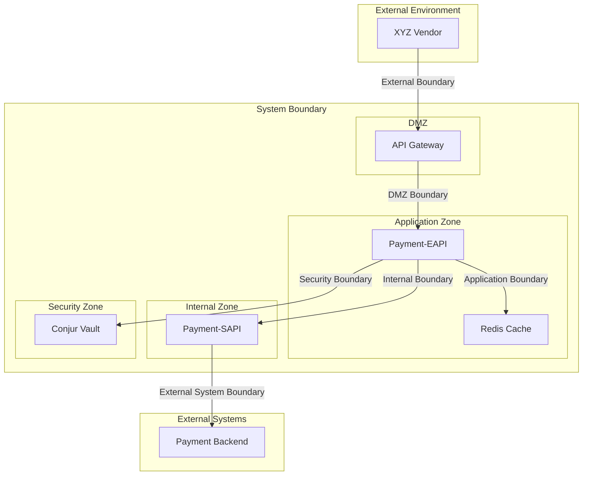
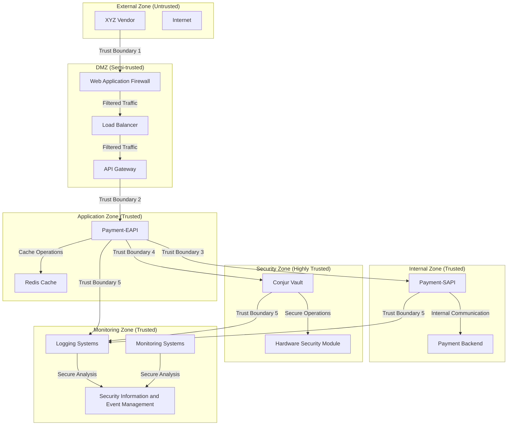
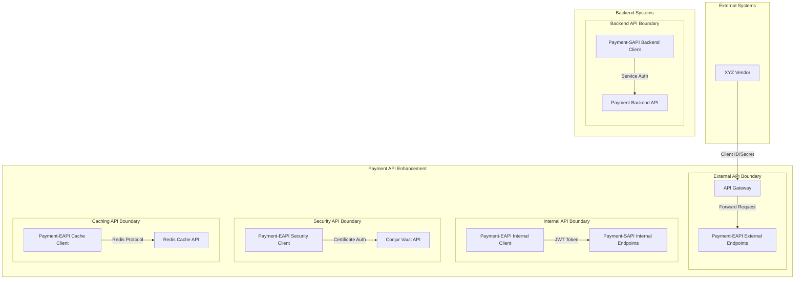
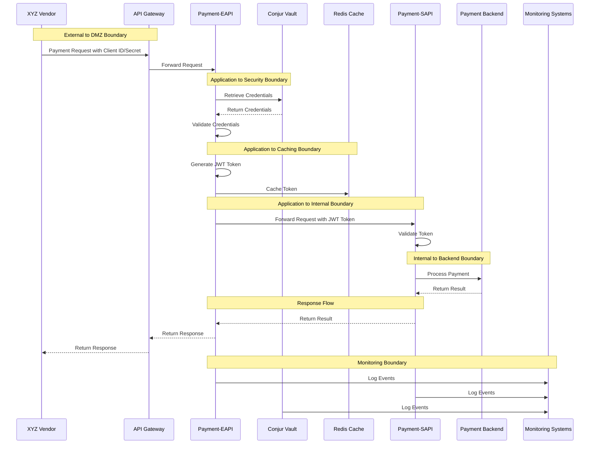
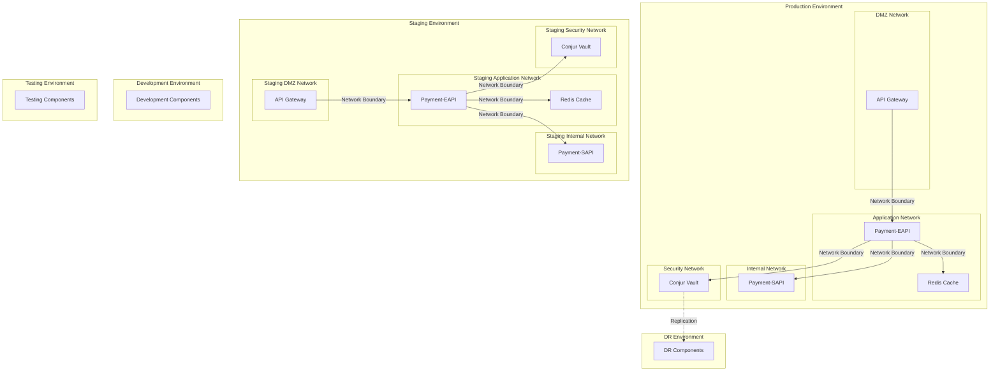

# System Boundaries Architecture

## Introduction

This document describes the system boundaries for the Payment API Security Enhancement project. System boundaries define the logical and physical separation between different components, security zones, and external systems. Understanding these boundaries is critical for implementing proper security controls, ensuring isolation between components with different trust levels, and maintaining the integrity of the payment processing system.

The Payment API Security Enhancement project implements a layered architecture with clear boundaries between external-facing and internal components. This approach allows for enhanced security internally while maintaining backward compatibility with existing vendor integrations.

### Purpose and Scope

The purpose of this document is to provide a comprehensive overview of the system boundaries for the Payment API Security Enhancement project, including:

- Types of system boundaries (logical, physical, security, etc.)
- Security zones and trust boundaries
- API boundaries and contracts
- Data flow boundaries
- Deployment boundaries
- Boundary controls and protection mechanisms

This document is intended for security architects, system architects, developers, security engineers, and operations personnel involved in the implementation, maintenance, and operation of the Payment API Security Enhancement project.

### Key Requirements

The system boundaries address the following key requirements:

1. **Defense in Depth**: Implement multiple layers of boundaries to protect against various threats.

2. **Clear Separation**: Maintain clear separation between components with different trust levels.

3. **Secure Communication**: Ensure secure communication across boundaries.

4. **Access Control**: Implement appropriate access controls at boundary crossings.

5. **Monitoring**: Monitor boundary crossings for security events and anomalies.

6. **Backward Compatibility**: Maintain backward compatibility with existing vendor integrations while enhancing security.

### Design Principles

The system boundaries design is guided by the following principles:

1. **Least Privilege**: Components should have only the access necessary for their function.

2. **Defense in Depth**: Multiple boundary layers provide redundant protection.

3. **Secure by Default**: Default configurations deny access unless explicitly allowed.

4. **Separation of Concerns**: Clear separation between different functions and security zones.

5. **Explicit Trust Boundaries**: Trust boundaries are explicitly defined and protected.

6. **Boundary Validation**: All data crossing boundaries is validated.

## System Boundary Types

The Payment API Security Enhancement project implements several types of system boundaries, each serving a specific purpose in the overall security architecture.

### Logical Boundaries

Logical boundaries define the separation between different software components and functions:

1. **Component Boundaries**: Separation between different software components (Payment-EAPI, Payment-SAPI, Conjur Vault, Redis Cache).

2. **Function Boundaries**: Separation between different functions within components (authentication, payment processing, token management).

3. **Service Boundaries**: Separation between different services (external API, internal API, security services).

4. **Data Boundaries**: Separation between different types of data (credentials, tokens, payment data).

Logical boundaries are implemented through software design patterns, interface definitions, and access controls.

### Physical Boundaries

Physical boundaries define the separation between different hardware and infrastructure components:

1. **Network Boundaries**: Separation between different network segments (DMZ, Application Network, Internal Network, Security Network).

2. **Host Boundaries**: Separation between different hosts and servers.

3. **Container Boundaries**: Separation between different containers and pods in Kubernetes.

4. **Data Center Boundaries**: Separation between different data centers or availability zones.

Physical boundaries are implemented through network segmentation, firewalls, and infrastructure design.

### Security Boundaries

Security boundaries define the separation between different security domains:

1. **Trust Boundaries**: Separation between domains with different trust levels.

2. **Authentication Boundaries**: Points where authentication occurs.

3. **Authorization Boundaries**: Points where authorization decisions are made.

4. **Encryption Boundaries**: Points where data is encrypted or decrypted.

Security boundaries are implemented through authentication mechanisms, authorization controls, and encryption.

### Organizational Boundaries

Organizational boundaries define the separation between different organizational entities:

1. **Vendor Boundaries**: Separation between the organization and external vendors.

2. **Team Boundaries**: Separation between different internal teams (development, operations, security).

3. **Responsibility Boundaries**: Separation between different areas of responsibility.

Organizational boundaries are implemented through policies, procedures, and access controls.

### System Boundary Diagram

This diagram illustrates the key system boundaries in the Payment API Security Enhancement project, showing how different components are separated by various boundary types.

## Security Zones and Trust Boundaries

The system is divided into distinct security zones, each with a defined trust level and appropriate security controls. Trust boundaries exist at the interfaces between these zones, where additional security controls are required to protect against threats.

### Security Zone Definitions

The system is divided into the following security zones:

1. **External Zone**: Contains external clients (XYZ Vendor) and the public internet. This zone is considered untrusted.

2. **DMZ (Demilitarized Zone)**: Contains the API Gateway, Web Application Firewall (WAF), and Load Balancer. This zone handles external traffic and provides the first layer of defense.

3. **Application Zone**: Contains the Payment-EAPI and Redis Cache. This zone processes authenticated requests and manages token caching.

4. **Internal Zone**: Contains the Payment-SAPI and backend systems. This zone processes payment transactions after authentication.

5. **Security Zone**: Contains Conjur Vault and security infrastructure. This zone stores sensitive credentials and cryptographic material.

6. **Monitoring Zone**: Contains logging and monitoring systems. This zone collects and analyzes security events and metrics.

### Trust Levels

Each security zone has a defined trust level that determines the security controls applied:

| Zone | Trust Level | Description |
|------|------------|-------------|
| External Zone | Untrusted | No trust assumptions, all traffic must be validated and authenticated |
| DMZ | Semi-trusted | Limited trust, traffic is filtered but still requires validation |
| Application Zone | Trusted | Higher trust level, but still requires authentication and authorization |
| Internal Zone | Trusted | Higher trust level, internal services with controlled access |
| Security Zone | Highly trusted | Highest trust level, contains sensitive security components |
| Monitoring Zone | Trusted | Collects and analyzes security data with controlled access |

### Trust Boundaries

Trust boundaries exist at the interfaces between security zones with different trust levels:

1. **External to DMZ Boundary**: Boundary between untrusted external systems and semi-trusted DMZ components. This boundary implements strict filtering, rate limiting, and initial validation.

2. **DMZ to Application Boundary**: Boundary between semi-trusted DMZ and trusted application components. This boundary implements authentication and more detailed validation.

3. **Application to Internal Boundary**: Boundary between application components and internal services. This boundary implements token-based authentication and authorization.

4. **Application to Security Boundary**: Boundary between application components and security components. This boundary implements strong authentication and strict access controls.

5. **All Zones to Monitoring Boundary**: Boundary between all zones and monitoring components. This boundary implements one-way data flow for logs and metrics.

### Trust Boundary Controls

Each trust boundary implements appropriate security controls:

| Trust Boundary | Security Controls | Validation Requirements |
|---------------|-------------------|-------------------------|
| External to DMZ | WAF, DDoS protection, TLS termination | Request format, rate limiting, basic validation |
| DMZ to Application | Authentication, input validation, TLS | Credential validation, request validation |
| Application to Internal | Token validation, authorization, TLS | Token integrity, permissions, request validation |
| Application to Security | Certificate authentication, TLS | Certificate validation, request authorization |
| All Zones to Monitoring | One-way communication, TLS | Data format validation |

### Security Zone Diagram

This diagram illustrates the security zones and trust boundaries in the Payment API Security Enhancement project, showing how different components are separated by trust boundaries with appropriate security controls.

## API Boundaries

API boundaries define the interfaces between different components and external systems. These boundaries are critical for maintaining separation between components while allowing necessary communication.

### External API Boundary

The External API boundary is the interface between external vendors and the Payment API Security Enhancement system:

1. **Endpoint**: `/api/v1/*`

2. **Authentication**: Client ID and Client Secret in HTTP headers

3. **Protocol**: HTTPS with TLS 1.2+

4. **Data Format**: JSON

5. **Key Operations**:
   - `/api/v1/payments` - Process payments
   - `/api/v1/payments/{paymentId}` - Get payment status
   - `/api/v1/health` - Health check

6. **Security Controls**:
   - TLS encryption
   - Client authentication
   - Input validation
   - Rate limiting
   - Logging and monitoring

The External API boundary maintains backward compatibility with existing vendor integrations while implementing enhanced security internally.

### Internal API Boundary

The Internal API boundary is the interface between Payment-EAPI and Payment-SAPI:

1. **Endpoint**: `/internal/v1/*`

2. **Authentication**: JWT token in Authorization header

3. **Protocol**: HTTPS with TLS 1.2+

4. **Data Format**: JSON

5. **Key Operations**:
   - `/internal/v1/payments` - Process payments
   - `/internal/v1/payments/{paymentId}` - Get payment status
   - `/internal/v1/tokens/validate` - Validate token
   - `/internal/v1/tokens/renew` - Renew token
   - `/internal/v1/health` - Health check

6. **Security Controls**:
   - TLS encryption
   - Token-based authentication
   - Token validation
   - Authorization checks
   - Input validation
   - Logging and monitoring

The Internal API boundary implements token-based authentication for secure service-to-service communication.

### Security API Boundary

The Security API boundary is the interface between Payment-EAPI and Conjur Vault:

1. **Authentication**: Certificate-based mutual TLS

2. **Protocol**: HTTPS with TLS 1.2+

3. **Key Operations**:
   - Retrieve credentials
   - Validate credentials
   - Rotate credentials

4. **Security Controls**:
   - Mutual TLS authentication
   - Certificate validation
   - Strict access controls
   - Audit logging
   - Network segmentation

The Security API boundary implements strong authentication and access controls to protect sensitive credential operations.

### Caching API Boundary

The Caching API boundary is the interface between Payment-EAPI and Redis Cache:

1. **Protocol**: Redis protocol with TLS

2. **Authentication**: Redis authentication

3. **Key Operations**:
   - Store tokens
   - Retrieve tokens
   - Invalidate tokens

4. **Security Controls**:
   - TLS encryption
   - Authentication
   - Network segmentation
   - Data encryption

The Caching API boundary implements secure token caching to improve performance and reduce load on Conjur Vault.

### Backend API Boundary

The Backend API boundary is the interface between Payment-SAPI and the Payment Backend:

1. **Protocol**: Backend-specific protocol with TLS

2. **Authentication**: Service authentication

3. **Key Operations**:
   - Process payments
   - Query payment status

4. **Security Controls**:
   - TLS encryption
   - Service authentication
   - Input validation
   - Logging and monitoring

The Backend API boundary implements secure communication with existing backend systems.

### API Boundary Diagram

This diagram illustrates the API boundaries in the Payment API Security Enhancement project, showing how different components communicate through well-defined API interfaces.

## Data Flow Boundaries

Data flow boundaries define the paths and controls for data moving between different components and zones. These boundaries ensure that data is properly protected as it flows through the system.

### Authentication Data Flow

The authentication data flow crosses several boundaries:

1. **External to DMZ Boundary**:
   - Vendor submits Client ID and Client Secret in request headers
   - API Gateway forwards the request to Payment-EAPI
   - Security controls: TLS encryption, input validation

2. **Application to Security Boundary**:
   - Payment-EAPI retrieves credentials from Conjur Vault
   - Payment-EAPI validates the submitted credentials
   - Security controls: Certificate authentication, TLS encryption

3. **Application to Caching Boundary**:
   - Payment-EAPI generates a JWT token
   - Token is cached in Redis for future use
   - Security controls: TLS encryption, data encryption

4. **Application to Internal Boundary**:
   - Payment-EAPI includes the token in requests to Payment-SAPI
   - Payment-SAPI validates the token before processing
   - Security controls: Token validation, TLS encryption

### Payment Transaction Data Flow

The payment transaction data flow crosses several boundaries:

1. **External to DMZ Boundary**:
   - Vendor submits payment request with Client ID and Client Secret
   - API Gateway forwards the request to Payment-EAPI
   - Security controls: TLS encryption, input validation

2. **Application to Internal Boundary**:
   - Payment-EAPI forwards the authenticated request to Payment-SAPI
   - Security controls: Token authentication, TLS encryption

3. **Internal to Backend Boundary**:
   - Payment-SAPI processes the payment through the Payment Backend
   - Security controls: Service authentication, TLS encryption

4. **Response Flow**:
   - Payment result returns through the chain: Backend → SAPI → EAPI → Gateway → Vendor
   - Security controls: Response validation, TLS encryption

### Credential Rotation Data Flow

The credential rotation data flow crosses several boundaries:

1. **Administrative to Security Boundary**:
   - Administrator initiates credential rotation
   - Rotation service generates new credentials in Conjur Vault
   - Security controls: Administrative authentication, audit logging

2. **Security to Application Boundary**:
   - Rotation service configures system for dual validation period
   - Both old and new credentials are valid during transition
   - Security controls: Secure configuration, monitoring

3. **Monitoring Boundary**:
   - System monitors usage of old and new credentials
   - Metrics and logs are collected for analysis
   - Security controls: One-way data flow, data anonymization

### Monitoring Data Flow

The monitoring data flow crosses several boundaries:

1. **All Zones to Monitoring Boundary**:
   - Components generate logs and metrics
   - Logs and metrics are collected by monitoring systems
   - Security controls: One-way data flow, data filtering

2. **Monitoring to Alert Boundary**:
   - Monitoring systems analyze data and generate alerts
   - Alerts are sent to appropriate personnel
   - Security controls: Secure notification, access controls

### Data Flow Controls

Data flow controls ensure that data is properly protected as it flows through the system:

1. **Encryption**: All data in transit is encrypted using TLS 1.2+

2. **Authentication**: All data flows between components require authentication

3. **Authorization**: Access to data is controlled based on authorization rules

4. **Validation**: Data is validated at each boundary crossing

5. **Minimization**: Only necessary data is transmitted between components

6. **Monitoring**: Data flows are monitored for anomalies and security issues

### Data Flow Diagram

This diagram illustrates the data flows across different boundaries in the Payment API Security Enhancement project, showing how data moves between components with appropriate security controls at each boundary.

## Deployment Boundaries

Deployment boundaries define the separation between different deployment environments and infrastructure components. These boundaries ensure proper isolation between environments and components.

### Environment Boundaries

Environment boundaries separate different deployment environments:

1. **Development Environment**: Used for development and testing. Isolated from other environments.

2. **Testing Environment**: Used for integration and system testing. Isolated from development and production.

3. **Staging Environment**: Used for pre-production validation. Configured similarly to production but isolated.

4. **Production Environment**: Used for live operations. Strictly isolated from other environments.

5. **DR Environment**: Used for disaster recovery. Synchronized with production but isolated until needed.

Environment boundaries are implemented through separate infrastructure, network isolation, and access controls.

### Infrastructure Boundaries

Infrastructure boundaries separate different infrastructure components:

1. **Network Boundaries**: Separate network segments for different components and zones.

2. **Compute Boundaries**: Separate compute resources (VMs, containers) for different components.

3. **Storage Boundaries**: Separate storage resources for different data types and sensitivity levels.

4. **Service Boundaries**: Separate managed services for different functions.

Infrastructure boundaries are implemented through network segmentation, resource isolation, and access controls.

### Container Boundaries

Container boundaries separate different containerized components:

1. **Namespace Boundaries**: Separate Kubernetes namespaces for different security zones.

2. **Pod Boundaries**: Separate pods for different components.

3. **Container Boundaries**: Separate containers within pods when necessary.

4. **Volume Boundaries**: Separate storage volumes for different data types.

Container boundaries are implemented through Kubernetes namespaces, network policies, and pod security policies.

### Deployment Topology

This diagram illustrates the deployment boundaries in the Payment API Security Enhancement project, showing how different environments and infrastructure components are separated by appropriate boundaries.

## Boundary Controls

Boundary controls are the security mechanisms implemented at system boundaries to protect against threats and ensure proper isolation between components.

### Authentication Controls

Authentication controls verify the identity of entities crossing boundaries:

1. **External Boundary Authentication**:
   - Client ID and Client Secret in HTTP headers
   - Validation against credentials stored in Conjur Vault
   - Rate limiting to prevent brute force attacks

2. **Internal Boundary Authentication**:
   - JWT tokens with digital signatures
   - Token validation including signature, expiration, and claims
   - Token renewal for long-running operations

3. **Security Boundary Authentication**:
   - Certificate-based mutual TLS authentication
   - Certificate validation and revocation checking
   - Strong authentication for administrative operations

### Authorization Controls

Authorization controls determine what actions are allowed across boundaries:

1. **Role-Based Authorization**:
   - Roles assigned to authenticated entities
   - Permissions associated with roles
   - Role verification at boundary crossings

2. **Claim-Based Authorization**:
   - Claims included in JWT tokens
   - Claim verification for specific operations
   - Fine-grained permission control

3. **Policy-Based Authorization**:
   - Policies defining allowed operations
   - Policy enforcement at boundary crossings
   - Centralized policy management

### Encryption Controls

Encryption controls protect data as it crosses boundaries:

1. **Transport Encryption**:
   - TLS 1.2+ for all network communication
   - Strong cipher suites with forward secrecy
   - Certificate validation

2. **Token Encryption**:
   - JWT token signing for integrity
   - Sensitive claims protection
   - Token encryption when necessary

3. **Data Encryption**:
   - Encryption of sensitive data at rest
   - Encryption of sensitive data in transit
   - Key management for encryption operations

### Validation Controls

Validation controls ensure that data crossing boundaries is valid and safe:

1. **Input Validation**:
   - Validation of all input data at boundary crossings
   - Schema validation for structured data
   - Content validation for specific data types

2. **Output Validation**:
   - Validation of data before it leaves a boundary
   - Filtering of sensitive information
   - Format validation for compatibility

3. **Protocol Validation**:
   - Validation of protocol compliance
   - Protocol version verification
   - Protocol security feature enforcement

### Monitoring Controls

Monitoring controls observe and analyze boundary crossings:

1. **Logging**:
   - Logging of all significant boundary crossings
   - Detailed logging of authentication and authorization decisions
   - Secure log transmission and storage

2. **Alerting**:
   - Alerts for suspicious boundary crossing attempts
   - Alerts for authentication or authorization failures
   - Alerts for unusual patterns or volumes

3. **Auditing**:
   - Audit trails for security-relevant boundary crossings
   - Regular audit review and analysis
   - Compliance reporting based on audit data

### Boundary Control Matrix

| Boundary | Authentication Controls | Authorization Controls | Encryption Controls | Validation Controls | Monitoring Controls |
|----------|--------------------------|------------------------|---------------------|---------------------|---------------------|
| External to DMZ | Client ID/Secret in headers | Role-based access | TLS 1.2+ | Request validation, WAF | Logging, alerting |
| DMZ to Application | Client ID/Secret validation | Role-based access | TLS 1.2+ | Request validation | Logging, alerting |
| Application to Internal | JWT token | Claim-based authorization | TLS 1.2+ | Token and request validation | Logging, auditing |
| Application to Security | Certificate authentication | Policy-based authorization | TLS 1.2+ with mTLS | Request validation | Logging, auditing, alerting |
| Internal to Backend | Service authentication | Service authorization | TLS 1.2+ | Request validation | Logging, monitoring |
| All to Monitoring | One-way authentication | Read-only access | TLS 1.2+ | Data validation | Meta-monitoring |

## Boundary Verification and Testing

Boundary verification and testing ensure that system boundaries are properly implemented and effective in protecting the system.

### Boundary Verification Methods

Methods for verifying boundary implementation and effectiveness:

1. **Architecture Review**:
   - Review of boundary design and implementation
   - Verification of boundary completeness
   - Identification of potential boundary weaknesses

2. **Configuration Verification**:
   - Verification of boundary configuration
   - Validation of security controls at boundaries
   - Checking for misconfigurations or gaps

3. **Code Review**:
   - Review of code implementing boundary controls
   - Verification of proper authentication and authorization
   - Checking for security vulnerabilities

### Boundary Testing Approaches

Approaches for testing boundary security:

1. **Penetration Testing**:
   - Attempts to bypass or breach boundaries
   - Testing of authentication and authorization controls
   - Identification of boundary vulnerabilities

2. **Security Scanning**:
   - Automated scanning for boundary vulnerabilities
   - Configuration scanning for security issues
   - Compliance checking against security standards

3. **Boundary Crossing Analysis**:
   - Analysis of boundary crossing patterns
   - Detection of unusual or suspicious crossings
   - Identification of potential security issues

### Continuous Boundary Validation

Methods for continuous validation of boundaries:

1. **Continuous Monitoring**:
   - Real-time monitoring of boundary crossings
   - Alerting on suspicious or unauthorized crossings
   - Trend analysis for boundary activity

2. **Compliance Checking**:
   - Regular checking of boundary compliance
   - Validation against security policies and standards
   - Reporting of compliance status

3. **Security Testing**:
   - Regular security testing of boundaries
   - Automated and manual testing approaches
   - Remediation of identified issues

### Boundary Testing Schedule

| Test Type | Frequency | Scope | Responsibility |
|-----------|-----------|-------|----------------|
| Architecture Review | Quarterly and on significant changes | All boundaries | Security Architecture Team |
| Configuration Verification | Monthly and on changes | All boundaries | Security Operations Team |
| Code Review | On changes | Boundary implementation code | Security Development Team |
| Penetration Testing | Quarterly | External and critical boundaries | Security Testing Team |
| Security Scanning | Weekly | All boundaries | Security Operations Team |
| Boundary Crossing Analysis | Daily | All boundary crossings | Security Monitoring Team |

## Compliance and Standards

System boundaries are designed to meet relevant compliance requirements and security standards.

### PCI-DSS Compliance

Boundary controls that address PCI-DSS requirements:

- **Requirement 1**: Install and maintain a firewall configuration to protect cardholder data
  - Network segmentation with security zones
  - Firewall rules at boundary crossings
  - Default deny with explicit allow rules

- **Requirement 4**: Encrypt transmission of cardholder data across open, public networks
  - TLS 1.2+ for all external communication
  - Strong cipher suites with forward secrecy

- **Requirement 7**: Restrict access to cardholder data by business need to know
  - Role-based and claim-based authorization
  - Least privilege access at boundaries

- **Requirement 8**: Identify and authenticate access to system components
  - Strong authentication at boundaries
  - Multi-factor authentication for administrative access

- **Requirement 10**: Track and monitor all access to network resources and cardholder data
  - Comprehensive logging of boundary crossings
  - Monitoring and alerting for suspicious activity

### NIST Cybersecurity Framework

Alignment with NIST Cybersecurity Framework:

- **Identify**: Inventory of boundaries, risk assessment
- **Protect**: Boundary controls, access restrictions, encryption
- **Detect**: Boundary monitoring, anomaly detection
- **Respond**: Incident response for boundary breaches
- **Recover**: Recovery procedures for compromised boundaries

### Internal Security Policies

Alignment with internal security policies:

- **System Boundary Policy**: Implementation of required boundary controls
- **Data Protection Policy**: Protection of data crossing boundaries
- **Access Control Policy**: Authentication and authorization at boundaries
- **Monitoring and Logging Policy**: Monitoring of boundary crossings

## Future Enhancements

Planned future enhancements to system boundaries.

### Zero Trust Architecture

Evolution toward a zero trust architecture for system boundaries:

- **Identity-based Boundaries**: Boundaries based on identity rather than network location
- **Continuous Verification**: Continuous verification at all boundary crossings
- **Micro-segmentation**: Fine-grained boundaries at the workload level
- **Least Privilege Access**: Granular access controls at all boundaries
- **Encryption Everywhere**: Encryption of all data crossing boundaries

### Advanced Boundary Protection

Implementation of advanced boundary protection mechanisms:

- **AI/ML-based Detection**: Use of artificial intelligence and machine learning for boundary threat detection
- **Behavioral Analysis**: Analysis of boundary crossing behavior to detect anomalies
- **Deception Technology**: Deployment of decoys and honeypots at boundaries
- **Automated Response**: Automated response to boundary threats

### Enhanced Boundary Visibility

Implementation of enhanced boundary visibility capabilities:

- **Comprehensive Boundary Mapping**: Automated discovery and mapping of all boundaries
- **Real-time Boundary Visualization**: Real-time visualization of boundary activity
- **Boundary Analytics**: Advanced analytics of boundary crossing patterns
- **Boundary Health Monitoring**: Monitoring of boundary control effectiveness

## Conclusion

The system boundaries for the Payment API Security Enhancement project implement a comprehensive defense-in-depth approach with multiple boundary layers. By clearly defining and protecting logical, physical, and security boundaries, the architecture provides robust protection for the payment processing system while maintaining backward compatibility with existing vendor integrations.

The architecture addresses key security requirements including:

- Clear separation between components with different trust levels
- Secure communication across boundaries
- Appropriate access controls at boundary crossings
- Comprehensive monitoring of boundary activity
- Backward compatibility with existing vendor integrations

This approach ensures that the payment processing system is protected against a wide range of threats while providing the necessary flexibility to support existing business operations.

## References

1. [High-Level Architecture](high-level-architecture.md): Overview of the system architecture

2. [Network Security](network-security.md): Documentation of network security measures

3. [Credential Rotation](credential-rotation.md): Documentation of the credential rotation process

4. [NIST SP 800-53](https://csrc.nist.gov/publications/detail/sp/800-53/rev-5/final): Security and Privacy Controls for Information Systems and Organizations

5. [PCI-DSS](https://www.pcisecuritystandards.org/): Payment Card Industry Data Security Standard

6. [NIST Cybersecurity Framework](https://www.nist.gov/cyberframework): Framework for Improving Critical Infrastructure Cybersecurity

7. [Zero Trust Architecture](https://nvlpubs.nist.gov/nistpubs/SpecialPublications/NIST.SP.800-207.pdf): NIST Special Publication 800-207