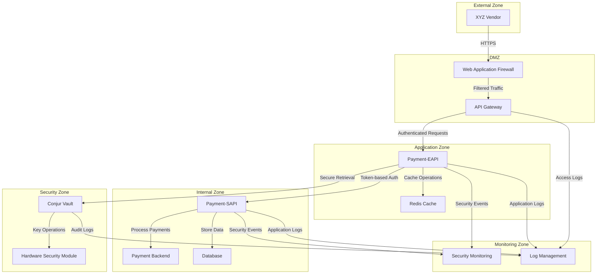

## Introduction

This deployment guide provides detailed instructions for deploying the Payment API Security Enhancement project across different environments. The guide covers infrastructure provisioning, application deployment, configuration management, and post-deployment verification.

The Payment API Security Enhancement project implements secure authentication mechanisms using Conjur vault for credential management while maintaining backward compatibility with existing vendor integrations. The deployment process is designed to ensure zero-downtime updates and secure handling of sensitive credentials.

### Deployment Overview

The deployment process follows these high-level steps:

1. **Infrastructure Provisioning**: Deploy the underlying infrastructure using Terraform
2. **Conjur Vault Setup**: Configure Conjur vault for secure credential storage
3. **Redis Cache Deployment**: Deploy Redis for token caching
4. **Application Deployment**: Deploy the Payment-EAPI and Payment-SAPI components
5. **Monitoring Setup**: Configure monitoring and alerting
6. **Verification**: Verify the deployment is functioning correctly

The deployment supports multiple environments (Development, Test, Staging, Production) with environment-specific configurations. The deployment process is automated through CI/CD pipelines and deployment scripts.

### Deployment Architecture

The deployment architecture consists of the following components:



This architecture implements defense in depth with clear separation between security zones.

### Deployment Environments

The project supports the following deployment environments:

| Environment | Purpose | Infrastructure | Access Control |
|------------|---------|----------------|---------------|
| Development | Development and testing | Minimal resources, non-HA | Developer access |
| Test | Integration testing | Test-sized resources, non-HA | QA team access |
| Staging | Pre-production validation | Production-like, HA | Limited team access |
| Production | Live system | Full resources, HA, DR | Restricted access |

Each environment has its own configuration settings and deployment parameters, managed through environment-specific variable files.

## Prerequisites

Before beginning the deployment process, ensure the following prerequisites are met:

### Required Tools

| Tool | Version | Purpose | Installation |
|------|---------|---------|-------------|
| Terraform | 1.1.x or later | Infrastructure provisioning | [Terraform Installation](https://www.terraform.io/downloads.html) |
| kubectl | 1.22+ | Kubernetes management | [kubectl Installation](https://kubernetes.io/docs/tasks/tools/) |
| Docker | 20.10.x or later | Container management | [Docker Installation](https://docs.docker.com/get-docker/) |
| AWS CLI | 2.x | AWS resource management | [AWS CLI Installation](https://aws.amazon.com/cli/) |
| jq | 1.6+ | JSON processing | Package manager (apt, yum, brew) |
| git | 2.x+ | Source code management | Package manager (apt, yum, brew) |

Ensure all tools are properly installed and configured before proceeding.

### Access Requirements

| Resource | Access Level | Purpose |
|----------|--------------|--------|
| AWS Account | Admin or Power User | Infrastructure deployment |
| Kubernetes Cluster | Admin | Application deployment |
| Container Registry | Write access | Push/pull container images |
| Conjur Vault | Admin | Configure credential storage |
| CI/CD System | Admin | Configure deployment pipelines |

Ensure all necessary credentials and access tokens are available before starting the deployment process.

### Network Requirements

| Connection | Direction | Ports | Purpose |
|------------|-----------|-------|--------|
| Kubernetes API | Outbound | 443 | Cluster management |
| Container Registry | Outbound | 443 | Image pulling |
| Conjur Vault | Outbound | 443 | Credential management |
| Redis Cache | Internal | 6379 | Token caching |
| Database | Internal | 5432 | Data storage |
| API Gateway | Inbound | 443 | External API access |

Ensure all required network paths are available and properly secured.

### Resource Requirements

| Component | CPU | Memory | Storage | Network |
|-----------|-----|--------|---------|--------|
| Payment-EAPI | 1-2 cores per instance | 2-4GB per instance | 50GB system | 1Gbps |
| Payment-SAPI | 1-2 cores per instance | 2-4GB per instance | 50GB system | 1Gbps |
| Redis Cache | 2-4 cores per instance | 4-8GB per instance | 100GB SSD | 1Gbps |
| Conjur Vault | 2-4 cores per instance | 4-8GB per instance | 100GB SSD | 1Gbps |
| Database | 2-4 cores per instance | 4-8GB per instance | 100GB+ SSD | 1Gbps |

Ensure sufficient resources are available in the target environment before deployment.

## Infrastructure Deployment

This section covers the deployment of the underlying infrastructure using Terraform.

### Terraform Configuration

The infrastructure is defined as code using Terraform. The main configuration files are located in the `src/backend/terraform` directory.

**Key Terraform Files:**

- `main.tf`: Main configuration file with provider settings and module orchestration
- `variables.tf`: Variable definitions for the infrastructure
- `outputs.tf`: Output definitions for the infrastructure
- `networking.tf`: Network infrastructure configuration
- `kubernetes.tf`: Kubernetes cluster configuration
- `conjur.tf`: Conjur vault infrastructure configuration
- `redis.tf`: Redis cache infrastructure configuration
- `monitoring.tf`: Monitoring infrastructure configuration

**Environment-Specific Variables:**

- `environments/dev/terraform.tfvars`: Development environment variables
- `environments/test/terraform.tfvars`: Test environment variables
- `environments/staging/terraform.tfvars`: Staging environment variables
- `environments/prod/terraform.tfvars`: Production environment variables

### Infrastructure Deployment Steps

Follow these steps to deploy the infrastructure:

1. **Initialize Terraform:**

```bash
cd src/backend/terraform
terraform init
```

2. **Select Environment:**

```bash
# For development environment
export TF_VAR_environment=dev
cp environments/dev/terraform.tfvars .

# For test environment
export TF_VAR_environment=test
cp environments/test/terraform.tfvars .

# For staging environment
export TF_VAR_environment=staging
cp environments/staging/terraform.tfvars .

# For production environment
export TF_VAR_environment=prod
cp environments/prod/terraform.tfvars .
```

3. **Plan Deployment:**

```bash
terraform plan -out=tfplan
```

4. **Review Plan:**

Carefully review the plan to ensure it will create the expected resources.

5. **Apply Deployment:**

```bash
terraform apply tfplan
```

6. **Verify Deployment:**

```bash
terraform output
```

This will display important information about the deployed infrastructure, including endpoints and access information.

### Conjur Vault Setup

After deploying the infrastructure, configure Conjur vault for secure credential storage:

1. **Access Conjur Admin Console:**

Use the endpoint provided in the Terraform output:

```bash
conjur_endpoint=$(terraform output -raw conjur_endpoint)
echo "Conjur Endpoint: $conjur_endpoint"
```

2. **Initialize Conjur:**

```bash
# Set up Conjur CLI
conjur init -u $conjur_endpoint -a payment-system

# Login as admin
conjur login -i admin -p <admin_password>
```

3. **Load Conjur Policies:**

```bash
# Load EAPI policy
conjur policy load -b root -f ../../infrastructure/conjur/policy/eapi-policy.yml

# Load SAPI policy
conjur policy load -b root -f ../../infrastructure/conjur/policy/sapi-policy.yml

# Load rotation policy
conjur policy load -b root -f ../../infrastructure/conjur/policy/rotation-policy.yml
```

4. **Create Initial Credentials:**

```bash
# Create vendor credentials
conjur variable set -i payment-system/vendors/xyz-vendor/client-id -v "vendor_client_id"
conjur variable set -i payment-system/vendors/xyz-vendor/client-secret -v "vendor_client_secret"

# Create service credentials
conjur variable set -i payment-system/services/payment-eapi/api-key -v "eapi_service_key"
conjur variable set -i payment-system/services/payment-sapi/api-key -v "sapi_service_key"
```

5. **Verify Conjur Setup:**

```bash
# List variables
conjur list

# Test variable retrieval
conjur variable value payment-system/vendors/xyz-vendor/client-id
```

### Redis Cache Setup

Configure Redis cache for token storage:

1. **Verify Redis Deployment:**

```bash
redis_endpoint=$(terraform output -raw redis_endpoint)
echo "Redis Endpoint: $redis_endpoint"
```

2. **Configure Redis Security:**

```bash
# Set Redis password (if not already set by Terraform)
redis_password=$(terraform output -raw redis_auth_secret_arn)
aws secretsmanager get-secret-value --secret-id $redis_password --query SecretString --output text
```

3. **Test Redis Connectivity:**

```bash
redis-cli -h $redis_endpoint -p 6379 -a $REDIS_PASSWORD ping
```

You should receive a `PONG` response if the connection is successful.

### Network Security Configuration

Configure network security for the deployed infrastructure:

1. **Review Security Groups:**

```bash
aws ec2 describe-security-groups --filters "Name=tag:Project,Values=Payment API Security Enhancement"
```

2. **Configure WAF Rules:**

```bash
# Deploy WAF rules
cd ../../infrastructure/waf
terraform init
terraform apply -var="environment=$TF_VAR_environment"
```

3. **Verify Network Policies:**

```bash
kubectl get networkpolicies -n payment-system
```

4. **Apply Additional Network Policies if Needed:**

```bash
kubectl apply -f ../../backend/kubernetes/network-policy.yaml
```

## Application Deployment

This section covers the deployment of the application components to the Kubernetes cluster.

### Container Image Building

Build the container images for the application components:

1. **Set Environment Variables:**

```bash
export REGISTRY_URL=$(terraform output -raw container_registry_url)
export VERSION=$(git describe --tags --always)
export ENVIRONMENT=$TF_VAR_environment
```

2. **Build Images:**

```bash
cd ../../backend

# Build Payment-EAPI image
docker build -t $REGISTRY_URL/payment-eapi:$VERSION -f Dockerfile-eapi .

# Build Payment-SAPI image
docker build -t $REGISTRY_URL/payment-sapi:$VERSION -f Dockerfile-sapi .

# Build Credential Rotation image
docker build -t $REGISTRY_URL/credential-rotation:$VERSION -f Dockerfile-rotation .

# Build Monitoring image
docker build -t $REGISTRY_URL/monitoring:$VERSION -f Dockerfile-monitoring .
```

3. **Push Images to Registry:**

```bash
# Login to container registry
aws ecr get-login-password | docker login --username AWS --password-stdin $REGISTRY_URL

# Push images
docker push $REGISTRY_URL/payment-eapi:$VERSION
docker push $REGISTRY_URL/payment-sapi:$VERSION
docker push $REGISTRY_URL/credential-rotation:$VERSION
docker push $REGISTRY_URL/monitoring:$VERSION
```

### Kubernetes Deployment

Deploy the application components to the Kubernetes cluster:

1. **Configure kubectl:**

```bash
aws eks update-kubeconfig --name $(terraform output -raw kubernetes_cluster_name) --region $(terraform output -raw region)
```

2. **Deploy Using Script:**

The deployment script automates the deployment process:

```bash
cd ../scripts

./deploy.sh \
  --environment $ENVIRONMENT \
  --namespace payment-system \
  --registry $REGISTRY_URL \
  --version $VERSION \
  --eapi \
  --sapi \
  --monitoring
```

3. **Manual Deployment (Alternative):**

If you prefer to deploy manually, you can apply the Kubernetes manifests directly:

```bash
# Create ConfigMaps and Secrets
kubectl apply -f ../kubernetes/eapi-configmap.yaml
kubectl apply -f ../kubernetes/eapi-secret.yaml
kubectl apply -f ../kubernetes/sapi-configmap.yaml
kubectl apply -f ../kubernetes/sapi-secret.yaml

# Deploy Services
kubectl apply -f ../kubernetes/eapi-service.yaml
kubectl apply -f ../kubernetes/sapi-service.yaml
kubectl apply -f ../kubernetes/redis-service.yaml
kubectl apply -f ../kubernetes/monitoring-service.yaml

# Deploy Applications
kubectl apply -f ../kubernetes/eapi-deployment.yaml
kubectl apply -f ../kubernetes/sapi-deployment.yaml
kubectl apply -f ../kubernetes/monitoring-deployment.yaml

# Deploy Redis StatefulSet
kubectl apply -f ../kubernetes/redis-statefulset.yaml

# Configure Ingress
kubectl apply -f ../kubernetes/ingress.yaml
```

4. **Verify Deployments:**

```bash
kubectl get deployments -n payment-system
kubectl get pods -n payment-system
kubectl get services -n payment-system
```

### Deployment Verification

Verify that the deployment was successful:

1. **Check Pod Status:**

```bash
kubectl get pods -n payment-system
```

All pods should be in the `Running` state.

2. **Check Service Endpoints:**

```bash
kubectl get services -n payment-system
```

3. **Check Health Endpoints:**

```bash
# Get the API endpoint
api_endpoint=$(kubectl get ingress -n payment-system payment-api-ingress -o jsonpath='{.status.loadBalancer.ingress[0].hostname}')

# Check EAPI health
curl -k https://$api_endpoint/api/health

# Check SAPI health (via EAPI)
curl -k https://$api_endpoint/api/internal-health
```

4. **Verify Logs:**

```bash
# Check EAPI logs
kubectl logs -n payment-system -l app=payment-eapi

# Check SAPI logs
kubectl logs -n payment-system -l app=payment-sapi
```

### Blue-Green Deployment (Production)

For production deployments, use a blue-green deployment strategy to minimize downtime:

1. **Deploy New Version (Green):**

```bash
./deploy.sh \
  --environment prod \
  --namespace payment-system \
  --registry $REGISTRY_URL \
  --version $VERSION \
  --eapi \
  --sapi \
  --monitoring \
  --deployment-suffix green
```

2. **Verify Green Deployment:**

```bash
# Test green deployment
green_endpoint=$(kubectl get ingress -n payment-system payment-api-ingress-green -o jsonpath='{.status.loadBalancer.ingress[0].hostname}')
curl -k https://$green_endpoint/api/health
```

3. **Switch Traffic:**

```bash
# Update main ingress to point to green deployment
kubectl apply -f ../kubernetes/ingress-green.yaml
```

4. **Verify Traffic Switch:**

```bash
# Test main endpoint (should now point to green)
main_endpoint=$(kubectl get ingress -n payment-system payment-api-ingress -o jsonpath='{.status.loadBalancer.ingress[0].hostname}')
curl -k https://$main_endpoint/api/health
```

5. **Remove Old Version (Blue) After Confirmation:**

```bash
# After confirming green deployment is working correctly
kubectl delete -f ../kubernetes/eapi-deployment-blue.yaml
kubectl delete -f ../kubernetes/sapi-deployment-blue.yaml
kubectl delete -f ../kubernetes/monitoring-deployment-blue.yaml
```

## Configuration Management

This section covers the management of configuration settings for the deployed application.

### Environment-Specific Configuration

The application uses environment-specific configuration files for different deployment environments:

1. **Configuration Files:**

- Development: `application-dev.yml`
- Test: `application-test.yml`
- Staging: `application-staging.yml`
- Production: `application-prod.yml`

2. **Configuration Storage:**

Configuration is stored in Kubernetes ConfigMaps and Secrets:

```bash
# View ConfigMaps
kubectl get configmaps -n payment-system

# View Secrets
kubectl get secrets -n payment-system
```

3. **Updating Configuration:**

```bash
# Update ConfigMap
kubectl edit configmap -n payment-system payment-eapi-config

# Update Secret
kubectl edit secret -n payment-system payment-eapi-secrets
```

4. **Apply Configuration Changes:**

```bash
# Restart deployment to apply changes
kubectl rollout restart deployment -n payment-system payment-eapi
```

### Credential Management

Manage credentials securely using Conjur vault:

1. **View Current Credentials:**

```bash
# Login to Conjur
conjur login -i admin -p <admin_password>

# List credentials
conjur list -k variable
```

2. **Update Credentials:**

```bash
# Update vendor credential
conjur variable set -i payment-system/vendors/xyz-vendor/client-secret -v "new_client_secret"
```

3. **Rotate Credentials:**

See the [Credential Rotation Runbook](./credential-rotation-runbook.md) for detailed instructions on credential rotation.

```bash
# Initiate credential rotation
./scripts/rotate-credentials.sh initiate \
  --client-id vendor_client_id \
  --reason "Scheduled rotation" \
  --transition-period 60
```

### Feature Flags

The application uses feature flags to control behavior:

1. **View Current Feature Flags:**

```bash
kubectl get configmap -n payment-system payment-eapi-config -o jsonpath='{.data.feature-flags\.properties}'
```

2. **Update Feature Flags:**

```bash
# Create updated feature flags file
cat > feature-flags.properties << EOF
# Feature Flags
feature.token.auto-renewal=true
feature.credential.rotation.enabled=true
feature.monitoring.enhanced=true
EOF

# Update ConfigMap
kubectl create configmap payment-eapi-config --from-file=feature-flags.properties --dry-run=client -o yaml | kubectl apply -f -
```

3. **Apply Feature Flag Changes:**

```bash
# Restart deployment to apply changes
kubectl rollout restart deployment -n payment-system payment-eapi
```

### Logging Configuration

Configure logging settings for the application:

1. **View Current Logging Configuration:**

```bash
kubectl get configmap -n payment-system payment-eapi-config -o jsonpath='{.data.logback-spring\.xml}'
```

2. **Update Logging Configuration:**

```bash
# Create updated logging configuration file
cat > logback-spring.xml << EOF
<?xml version="1.0" encoding="UTF-8"?>
<configuration>
    <appender name="CONSOLE" class="ch.qos.logback.core.ConsoleAppender">
        <encoder>
            <pattern>%d{yyyy-MM-dd HH:mm:ss} [%thread] %-5level %logger{36} - %msg%n</pattern>
        </encoder>
    </appender>
    
    <appender name="FILE" class="ch.qos.logback.core.rolling.RollingFileAppender">
        <file>/var/log/payment-api/application.log</file>
        <rollingPolicy class="ch.qos.logback.core.rolling.TimeBasedRollingPolicy">
            <fileNamePattern>/var/log/payment-api/application.%d{yyyy-MM-dd}.log</fileNamePattern>
            <maxHistory>30</maxHistory>
        </rollingPolicy>
        <encoder>
            <pattern>%d{yyyy-MM-dd HH:mm:ss} [%thread] %-5level %logger{36} - %msg%n</pattern>
        </encoder>
    </appender>
    
    <logger name="com.payment" level="INFO" />
    <logger name="org.springframework" level="WARN" />
    
    <root level="INFO">
        <appender-ref ref="CONSOLE" />
        <appender-ref ref="FILE" />
    </root>
</configuration>
EOF

# Update ConfigMap
kubectl create configmap payment-eapi-config --from-file=logback-spring.xml --dry-run=client -o yaml | kubectl apply -f -
```

3. **Apply Logging Changes:**

```bash
# Restart deployment to apply changes
kubectl rollout restart deployment -n payment-system payment-eapi
```

## Post-Deployment Verification

After deployment, perform comprehensive verification to ensure the system is functioning correctly.

### Health Checks

Verify the health of all deployed components:

1. **Check Component Health:**

```bash
# Get API endpoint
api_endpoint=$(kubectl get ingress -n payment-system payment-api-ingress -o jsonpath='{.status.loadBalancer.ingress[0].hostname}')

# Check EAPI health
curl -k https://$api_endpoint/api/health

# Check SAPI health
curl -k https://$api_endpoint/api/internal-health

# Check Redis health
kubectl exec -n payment-system -it $(kubectl get pod -n payment-system -l app=redis -o jsonpath='{.items[0].metadata.name}') -- redis-cli ping
```

2. **Check Pod Status:**

```bash
kubectl get pods -n payment-system
```

All pods should be in the `Running` state with `1/1` or appropriate ready status.

3. **Check Service Endpoints:**

```bash
kubectl get services -n payment-system
```

All services should have assigned cluster IPs and appropriate ports.

### Functional Testing

Perform functional tests to verify the system is working correctly:

1. **Test Authentication:**

```bash
# Test authentication with sample credentials
curl -k -X POST https://$api_endpoint/api/v1/authenticate \
  -H "X-Client-ID: test_client_id" \
  -H "X-Client-Secret: test_client_secret"
```

2. **Test Payment Processing:**

```bash
# Test payment processing
curl -k -X POST https://$api_endpoint/api/v1/payments \
  -H "X-Client-ID: test_client_id" \
  -H "X-Client-Secret: test_client_secret" \
  -H "Content-Type: application/json" \
  -d '{
    "amount": 100.00,
    "currency": "USD",
    "reference": "TEST-12345",
    "description": "Test payment"
  }'
```

3. **Test Token Validation:**

```bash
# Get token from authentication response
token=$(curl -k -X POST https://$api_endpoint/api/v1/authenticate \
  -H "X-Client-ID: test_client_id" \
  -H "X-Client-Secret: test_client_secret" | jq -r '.token')

# Test token validation
curl -k -X POST https://$api_endpoint/api/v1/validate-token \
  -H "Authorization: Bearer $token"
```

### Security Verification

Verify security aspects of the deployment:

1. **Check TLS Configuration:**

```bash
# Check TLS certificate
openssl s_client -connect $api_endpoint:443 -servername $api_endpoint
```

2. **Verify Network Policies:**

```bash
kubectl get networkpolicies -n payment-system
```

3. **Check Conjur Access:**

```bash
# Verify EAPI can access Conjur
kubectl exec -n payment-system -it $(kubectl get pod -n payment-system -l app=payment-eapi -o jsonpath='{.items[0].metadata.name}') -- curl -k $CONJUR_URL/health
```

4. **Verify Secret Management:**

```bash
# Check that secrets are properly mounted
kubectl exec -n payment-system -it $(kubectl get pod -n payment-system -l app=payment-eapi -o jsonpath='{.items[0].metadata.name}') -- ls -la /etc/secrets
```

### Monitoring Setup Verification

Verify that monitoring is properly configured:

1. **Check Prometheus Targets:**

```bash
# Get Prometheus URL
prometheus_url=$(kubectl get ingress -n monitoring prometheus-ingress -o jsonpath='{.status.loadBalancer.ingress[0].hostname}')

# Check targets
curl -k https://$prometheus_url/api/v1/targets
```

2. **Check Grafana Dashboards:**

```bash
# Get Grafana URL
grafana_url=$(kubectl get ingress -n monitoring grafana-ingress -o jsonpath='{.status.loadBalancer.ingress[0].hostname}')

# Access Grafana (credentials from Terraform output)
echo "Grafana URL: https://$grafana_url"
echo "Username: admin"
echo "Password: $(terraform output -raw grafana_admin_password)"
```

3. **Verify Alerting:**

```bash
# Check AlertManager configuration
alertmanager_url=$(kubectl get ingress -n monitoring alertmanager-ingress -o jsonpath='{.status.loadBalancer.ingress[0].hostname}')
curl -k https://$alertmanager_url/api/v1/status
```

For more details on monitoring, see the [Monitoring Guide](./monitoring-guide.md).

### Performance Verification

Verify the performance of the deployed system:

1. **Check Response Times:**

```bash
# Install hey load testing tool if not available
# https://github.com/rakyll/hey

# Test authentication performance
hey -n 100 -c 10 -m POST \
  -H "X-Client-ID: test_client_id" \
  -H "X-Client-Secret: test_client_secret" \
  https://$api_endpoint/api/v1/authenticate
```

2. **Monitor Resource Usage:**

```bash
# Check CPU and memory usage
kubectl top pods -n payment-system
```

3. **Check Prometheus Metrics:**

Access the Prometheus UI and check the following metrics:

- `http_server_requests_seconds` (response time)
- `system_cpu_usage` (CPU usage)
- `jvm_memory_used_bytes` (memory usage)
- `authentication_requests_total` (authentication volume)

Verify that all metrics are within expected ranges.

## Rollback Procedures

In case of deployment issues, follow these rollback procedures to restore system functionality.

### Automated Rollback

The deployment script includes automated rollback functionality:

```bash
# Deploy with automatic rollback on failure
./deploy.sh \
  --environment $ENVIRONMENT \
  --namespace payment-system \
  --registry $REGISTRY_URL \
  --version $VERSION \
  --eapi \
  --sapi \
  --monitoring \
  --rollback-on-failure
```

If the deployment fails verification, it will automatically roll back to the previous version.

### Manual Rollback

If you need to manually roll back a deployment:

1. **Rollback Kubernetes Deployment:**

```bash
# Rollback EAPI deployment
kubectl rollout undo deployment -n payment-system payment-eapi

# Rollback SAPI deployment
kubectl rollout undo deployment -n payment-system payment-sapi

# Rollback monitoring deployment
kubectl rollout undo deployment -n payment-system monitoring
```

2. **Verify Rollback:**

```bash
# Check rollback status
kubectl rollout status deployment -n payment-system payment-eapi
kubectl rollout status deployment -n payment-system payment-sapi

# Check pod status
kubectl get pods -n payment-system
```

3. **Verify System Functionality:**

```bash
# Check health endpoints
curl -k https://$api_endpoint/api/health
```

### Infrastructure Rollback

If you need to roll back infrastructure changes:

1. **Terraform Rollback:**

```bash
# List Terraform state versions
aws s3api list-object-versions \
  --bucket $TF_VAR_environment-payment-terraform-state \
  --prefix payment-api-security/terraform.tfstate \
  --query 'Versions[*].[VersionId, LastModified]'

# Download previous state version
aws s3api get-object \
  --bucket $TF_VAR_environment-payment-terraform-state \
  --key payment-api-security/terraform.tfstate \
  --version-id <previous_version_id> \
  terraform.tfstate.backup

# Restore previous state
mv terraform.tfstate.backup terraform.tfstate

# Apply the previous state
terraform apply
```

2. **Verify Infrastructure:**

```bash
# Check infrastructure components
terraform output
```

### Credential Rollback

If you need to roll back credential changes:

1. **Cancel Credential Rotation:**

```bash
# List active rotations
./scripts/rotate-credentials.sh list --active-only

# Cancel rotation
./scripts/rotate-credentials.sh cancel \
  --rotation-id <rotation_id> \
  --reason "Emergency rollback" \
  --force
```

2. **Restore Previous Credentials:**

```bash
# Restore credentials from backup
conjur variable set -i payment-system/vendors/xyz-vendor/client-secret -v "previous_client_secret"
```

3. **Verify Credential Access:**

```bash
# Test authentication with restored credentials
curl -k -X POST https://$api_endpoint/api/v1/authenticate \
  -H "X-Client-ID: test_client_id" \
  -H "X-Client-Secret: previous_client_secret"
```

## Maintenance Procedures

This section covers routine maintenance procedures for the deployed system.

### Routine Updates

Perform routine updates to keep the system secure and up-to-date:

1. **Update Container Images:**

```bash
# Build and push updated images
./scripts/build.sh --version $NEW_VERSION

# Deploy updated images
./deploy.sh \
  --environment $ENVIRONMENT \
  --namespace payment-system \
  --registry $REGISTRY_URL \
  --version $NEW_VERSION \
  --eapi \
  --sapi \
  --monitoring
```

2. **Update Kubernetes Resources:**

```bash
# Apply updated Kubernetes manifests
kubectl apply -f ../kubernetes/
```

3. **Update Infrastructure:**

```bash
# Update Terraform modules
terraform init -upgrade

# Plan and apply updates
terraform plan -out=tfplan
terraform apply tfplan
```

### Backup Procedures

Regularly back up critical data and configurations:

1. **Back Up Conjur Vault:**

```bash
# Follow Conjur backup procedures
conjur-backup.sh --output-dir /backups/conjur/$(date +%Y%m%d)
```

2. **Back Up Kubernetes Resources:**

```bash
# Back up all resources in the namespace
kubectl get all -n payment-system -o yaml > /backups/kubernetes/payment-system-$(date +%Y%m%d).yaml

# Back up ConfigMaps and Secrets
kubectl get configmaps -n payment-system -o yaml > /backups/kubernetes/configmaps-$(date +%Y%m%d).yaml
kubectl get secrets -n payment-system -o yaml > /backups/kubernetes/secrets-$(date +%Y%m%d).yaml
```

3. **Back Up Terraform State:**

```bash
# Terraform state is automatically backed up in S3
# You can create additional backups if needed
cp terraform.tfstate /backups/terraform/terraform-$(date +%Y%m%d).tfstate
```

### Monitoring and Alerting

Maintain monitoring and alerting systems:

1. **Review Alert Rules:**

```bash
# Get current alert rules
kubectl get configmap -n monitoring prometheus-alerts -o yaml
```

2. **Update Alert Rules:**

```bash
# Apply updated alert rules
kubectl apply -f ../infrastructure/prometheus/alert-rules.yml
```

3. **Test Alerting:**

```bash
# Trigger test alert
curl -X POST https://$alertmanager_url/api/v1/alerts -d '[
  {
    "labels": {
      "alertname": "TestAlert",
      "service": "payment-api",
      "severity": "info",
      "instance": "test"
    },
    "annotations": {
      "summary": "Test alert",
      "description": "This is a test alert"
    },
    "generatorURL": "http://example.com"
  }
]'
```

For more details on monitoring, see the [Monitoring Guide](./monitoring-guide.md).

### Credential Rotation

Regularly rotate credentials to maintain security:

1. **Schedule Credential Rotation:**

```bash
# Schedule credential rotation
./scripts/rotate-credentials.sh schedule \
  --client-id vendor_client_id \
  --schedule "0 2 * * 0" \
  --transition-period 60
```

2. **Manual Credential Rotation:**

```bash
# Initiate manual credential rotation
./scripts/rotate-credentials.sh initiate \
  --client-id vendor_client_id \
  --reason "Regular security maintenance" \
  --transition-period 60
```

3. **Verify Rotation Status:**

```bash
# Check rotation status
./scripts/rotate-credentials.sh status --rotation-id <rotation_id>
```

For detailed credential rotation procedures, see the [Credential Rotation Runbook](./credential-rotation-runbook.md).

### Scaling Procedures

Scale the system to handle changing load requirements:

1. **Horizontal Scaling:**

```bash
# Scale EAPI deployment
kubectl scale deployment -n payment-system payment-eapi --replicas=5

# Scale SAPI deployment
kubectl scale deployment -n payment-system payment-sapi --replicas=5
```

2. **Configure Auto-scaling:**

```bash
# Apply HorizontalPodAutoscaler
kubectl apply -f ../kubernetes/eapi-hpa.yaml
kubectl apply -f ../kubernetes/sapi-hpa.yaml
```

3. **Vertical Scaling:**

```bash
# Update resource requests and limits
kubectl edit deployment -n payment-system payment-eapi