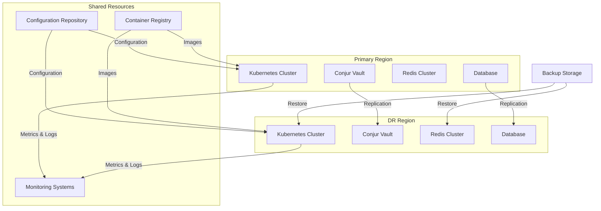
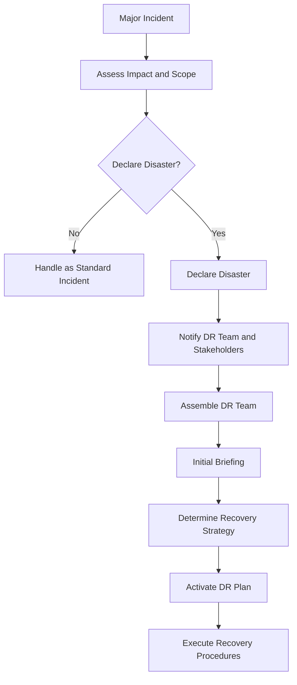

## Introduction

This document provides a comprehensive disaster recovery (DR) plan for the Payment API Security Enhancement project. It outlines the strategies, procedures, and resources required to recover the payment processing system in the event of a major incident or disaster that disrupts normal operations.

The disaster recovery plan is designed to minimize downtime, data loss, and business impact while ensuring the security of the payment processing system during recovery operations. It covers all critical components of the system, including Payment-EAPI, Payment-SAPI, Conjur vault, Redis cache, and supporting infrastructure.

### Purpose and Scope

The purpose of this disaster recovery plan is to:

- Define the strategy for recovering the Payment API Security Enhancement system after a disaster
- Document detailed recovery procedures for different disaster scenarios
- Establish roles and responsibilities during disaster recovery operations
- Define recovery time objectives (RTO) and recovery point objectives (RPO)
- Provide guidelines for testing and maintaining the disaster recovery plan

This plan covers the following components of the Payment API Security Enhancement project:

- Payment-EAPI (External API)
- Payment-SAPI (System API)
- Conjur vault for credential management
- Redis cache for token storage
- Supporting infrastructure (Kubernetes, databases, networking)
- Monitoring and alerting systems

### Disaster Recovery Team

The Disaster Recovery Team is responsible for executing this plan during a disaster event:

| Role | Responsibilities | Primary Contact | Secondary Contact |
|------|-----------------|-----------------|-------------------|
| DR Coordinator | Overall coordination of DR activities | [Name], [Phone], [Email] | [Name], [Phone], [Email] |
| Infrastructure Lead | Recovery of infrastructure components | [Name], [Phone], [Email] | [Name], [Phone], [Email] |
| Application Lead | Recovery of application components | [Name], [Phone], [Email] | [Name], [Phone], [Email] |
| Security Lead | Security oversight during recovery | [Name], [Phone], [Email] | [Name], [Phone], [Email] |
| Communications Lead | Stakeholder communications | [Name], [Phone], [Email] | [Name], [Phone], [Email] |

During a disaster event, the DR Coordinator will assemble the team and assign responsibilities based on the nature and scope of the disaster.

### Recovery Objectives

The following recovery objectives have been established for the Payment API Security Enhancement system:

| Component | Recovery Time Objective (RTO) | Recovery Point Objective (RPO) | Priority |
|-----------|-------------------------------|-------------------------------|----------|
| Payment-EAPI | 4 hours | 15 minutes | Critical |
| Payment-SAPI | 4 hours | 15 minutes | Critical |
| Conjur Vault | 2 hours | 5 minutes | Critical |
| Redis Cache | 1 hour | 15 minutes | High |
| Monitoring Systems | 8 hours | 1 hour | Medium |

These objectives represent the maximum acceptable downtime (RTO) and data loss (RPO) for each component. The actual recovery time and data loss may be less depending on the nature of the disaster and the effectiveness of the recovery procedures.

### Disaster Scenarios

This plan addresses the following disaster scenarios:

1. **Infrastructure Failure**: Failure of infrastructure components such as servers, storage, or networking

2. **Data Center Outage**: Complete loss of a data center due to power outage, natural disaster, or other causes

3. **Application Failure**: Critical failure of application components

4. **Data Corruption**: Corruption of critical data

5. **Security Breach**: Major security incident requiring system recovery

6. **Vendor Service Outage**: Failure of critical vendor services

Each scenario may require different recovery procedures, which are detailed in the respective sections of this document.

## Disaster Recovery Strategy

The disaster recovery strategy for the Payment API Security Enhancement project is based on a multi-layered approach that combines high availability within the primary region and disaster recovery capabilities in a secondary region.

### High-Level Strategy

The disaster recovery strategy consists of the following key elements:

1. **Multi-Region Deployment**: Primary production environment with a standby disaster recovery environment in a separate geographic region

2. **Regular Backups**: Comprehensive backup strategy with offsite storage

3. **Automated Recovery**: Automated recovery procedures where possible

4. **Manual Procedures**: Documented manual procedures for scenarios that cannot be fully automated

5. **Regular Testing**: Quarterly testing of disaster recovery procedures



### Recovery Approaches

Different recovery approaches are used depending on the component and disaster scenario:

| Component | Primary Approach | Alternative Approach | Data Protection |
|-----------|-----------------|----------------------|----------------|
| Payment-EAPI | Redeployment from images | Restore from backup | Stateless, no data loss |
| Payment-SAPI | Redeployment from images | Restore from backup | Stateless, no data loss |
| Conjur Vault | Failover to standby | Restore from backup | Synchronous replication |
| Redis Cache | Failover to replica | Rebuild from scratch | Asynchronous replication |
| Database | Failover to standby | Restore from backup | Synchronous replication |
| Kubernetes | Redeployment of resources | Restore from backup | Configuration in Git |

The primary approach is the preferred method for recovery, while the alternative approach serves as a fallback if the primary approach fails.

### Replication and Synchronization

Data replication and synchronization mechanisms ensure that critical data is available in the DR environment:

1. **Conjur Vault**: Synchronous replication to standby instance in the same region, asynchronous replication to DR region

2. **Database**: Synchronous replication to standby instance in the same region, asynchronous replication to DR region

3. **Redis Cache**: Asynchronous replication to replicas in the same region, periodic snapshots to DR region

4. **Configuration**: All configuration stored in Git repositories, available to both primary and DR environments

5. **Container Images**: All container images stored in a registry accessible from both primary and DR environments

### Recovery Modes

The system supports different recovery modes depending on the severity of the disaster:

1. **Component Recovery**: Recovery of individual failed components while the rest of the system remains operational

2. **Region Recovery**: Recovery of all components within a region after a regional failure

3. **Full System Recovery**: Complete recovery of the entire system after a catastrophic failure

4. **Degraded Mode Operation**: Operation in a reduced capacity mode during recovery

The appropriate recovery mode is selected based on the nature and scope of the disaster, with the goal of minimizing downtime and data loss while ensuring system security.

### Security Considerations

Security remains a critical consideration during disaster recovery operations:

1. **Authentication and Authorization**: Maintain secure authentication and authorization mechanisms during recovery

2. **Data Protection**: Ensure encryption of sensitive data during backup, transfer, and recovery

3. **Access Control**: Implement proper access controls for recovery operations

4. **Audit Logging**: Maintain comprehensive audit logging during recovery

5. **Vulnerability Management**: Ensure recovered systems are not exposed to known vulnerabilities

All recovery procedures must be performed in accordance with security policies and standards to prevent security compromises during recovery operations.

## Backup and Restore

A comprehensive backup strategy is essential for successful disaster recovery. This section details the backup and restore procedures for all critical components of the Payment API Security Enhancement system.

### Backup Strategy

The backup strategy includes the following elements:

| Component | Backup Type | Frequency | Retention | Storage Location |
|-----------|------------|-----------|-----------|------------------|
| Conjur Vault | Full backup | Daily | 30 days | Encrypted S3 bucket |
| Conjur Vault | Incremental backup | Hourly | 7 days | Encrypted S3 bucket |
| Database | Full backup | Daily | 30 days | Encrypted S3 bucket |
| Database | Transaction logs | Continuous | 7 days | Encrypted S3 bucket |
| Redis Cache | RDB snapshot | Hourly | 7 days | Encrypted S3 bucket |
| Kubernetes Resources | YAML exports | Daily | 30 days | Git repository |
| Configuration | Git repository | On change | Indefinite | Git repository with multiple remotes |
| Container Images | Image registry | On build | 90 days | Container registry with replication |

All backups are encrypted and stored in multiple locations to ensure availability during disaster recovery.

### Backup Procedures

The following procedures are used for creating backups:

1. **Conjur Vault Backup**:
```bash
# Full backup of Conjur vault
conjur-backup.sh --full --output-dir /backups/conjur/$(date +%Y%m%d)

# Incremental backup of Conjur vault
conjur-backup.sh --incremental --output-dir /backups/conjur/$(date +%Y%m%d_%H)

# Upload backup to S3
aws s3 sync /backups/conjur s3://payment-api-backups/conjur/ --sse AES256
```

2. **Database Backup**:
```bash
# Full database backup
pg_dump -Fc -f /backups/database/payment_db_$(date +%Y%m%d).dump payment_db

# Upload backup to S3
aws s3 cp /backups/database/payment_db_$(date +%Y%m%d).dump s3://payment-api-backups/database/ --sse AES256

# Configure continuous WAL archiving
# In postgresql.conf:
# archive_mode = on
# archive_command = 'aws s3 cp %p s3://payment-api-backups/database/wal/%f --sse AES256'
```

3. **Redis Cache Backup**:
```bash
# Configure Redis to create RDB snapshots
# In redis.conf:
# save 3600 1

# Copy RDB file to backup location
cp /var/lib/redis/dump.rdb /backups/redis/dump_$(date +%Y%m%d_%H).rdb

# Upload backup to S3
aws s3 cp /backups/redis/dump_$(date +%Y%m%d_%H).rdb s3://payment-api-backups/redis/ --sse AES256
```

4. **Kubernetes Resource Backup**:
```bash
# Export all resources in the namespace
kubectl get all -n payment-system -o yaml > /backups/kubernetes/payment-system-$(date +%Y%m%d).yaml

# Export ConfigMaps and Secrets
kubectl get configmaps -n payment-system -o yaml > /backups/kubernetes/configmaps-$(date +%Y%m%d).yaml
kubectl get secrets -n payment-system -o yaml > /backups/kubernetes/secrets-$(date +%Y%m%d).yaml

# Commit and push to Git repository
git add .
git commit -m "Daily backup $(date +%Y%m%d)"
git push origin master
```

### Backup Verification

Regular verification of backups is essential to ensure they can be used for recovery:

1. **Automated Verification**:
   - Checksums verified for all backup files
   - Backup completion status checked
   - Backup size and content validated against expected patterns

2. **Manual Verification**:
   - Weekly test restoration of Conjur vault backup to test environment
   - Weekly test restoration of database backup to test environment
   - Monthly full recovery test in isolated environment

3. **Verification Reporting**:
   - Automated verification results logged and monitored
   - Failed verifications trigger alerts
   - Monthly verification report generated and reviewed

### Restore Procedures

The following procedures are used for restoring from backups:

1. **Conjur Vault Restore**:
```bash
# Download backup from S3
aws s3 cp s3://payment-api-backups/conjur/latest/ /restore/conjur/ --recursive

# Restore Conjur vault
conjur-restore.sh --input-dir /restore/conjur --accept-eula

# Verify restoration
conjur health check
conjur list
```

2. **Database Restore**:
```bash
# Download backup from S3
aws s3 cp s3://payment-api-backups/database/payment_db_YYYYMMDD.dump /restore/database/

# Restore database
pg_restore -c -d payment_db /restore/database/payment_db_YYYYMMDD.dump

# For point-in-time recovery using WAL files:
pg_basebackup -D /var/lib/postgresql/data
# Create recovery.conf with appropriate settings
# Start PostgreSQL in recovery mode
```

3. **Redis Cache Restore**:
```bash
# Download RDB file from S3
aws s3 cp s3://payment-api-backups/redis/dump_YYYYMMDD_HH.rdb /restore/redis/

# Stop Redis
systemctl stop redis

# Replace RDB file
cp /restore/redis/dump_YYYYMMDD_HH.rdb /var/lib/redis/dump.rdb
chown redis:redis /var/lib/redis/dump.rdb

# Start Redis
systemctl start redis

# Verify restoration
redis-cli info keyspace
```

4. **Kubernetes Resource Restore**:
```bash
# Apply resource definitions
kubectl apply -f /restore/kubernetes/payment-system-YYYYMMDD.yaml

# Apply ConfigMaps and Secrets
kubectl apply -f /restore/kubernetes/configmaps-YYYYMMDD.yaml
kubectl apply -f /restore/kubernetes/secrets-YYYYMMDD.yaml

# Verify restoration
kubectl get all -n payment-system
```

### Backup Retention and Purging

Proper management of backup retention and purging is important for cost control and compliance:

1. **Retention Policies**:
   - Daily backups retained for 30 days
   - Weekly backups retained for 90 days
   - Monthly backups retained for 1 year
   - Annual backups retained for 7 years

2. **Automated Purging**:
```bash
# Purge expired daily backups
aws s3 ls s3://payment-api-backups/conjur/ | grep -v $(date -d "30 days ago" +%Y%m%d) | xargs -I {} aws s3 rm s3://payment-api-backups/conjur/{}

# Similar commands for other backup types and retention periods
```

3. **Backup Lifecycle Rules**:
   - S3 lifecycle rules configured to transition older backups to cheaper storage classes
   - Glacier storage used for long-term retention
   - Automatic expiration of backups beyond retention period

## Recovery Procedures

This section provides detailed recovery procedures for different disaster scenarios. These procedures should be followed in the event of a disaster to restore the Payment API Security Enhancement system to normal operation.

### Disaster Declaration and Activation

The disaster recovery process begins with disaster declaration and activation of the DR plan:

1. **Disaster Assessment**:
   - Determine the nature and scope of the disaster
   - Assess impact on system components and services
   - Estimate recovery time using standard procedures

2. **Disaster Declaration**:
   - DR Coordinator declares a disaster based on assessment
   - Notification sent to DR Team and key stakeholders
   - DR Command Center established (physical or virtual)

3. **DR Plan Activation**:
   - DR Team assembled and roles assigned
   - Initial situation briefing conducted
   - Recovery strategy determined based on disaster type
   - Recovery procedures initiated



### Component Failure Recovery

Procedures for recovering from individual component failures:

1. **Payment-EAPI Failure**:
```bash
# Check deployment status
kubectl get deployment -n payment-system payment-eapi

# If pods are failing, check logs
kubectl logs -l app=payment-eapi -n payment-system

# Restart deployment if needed
kubectl rollout restart deployment -n payment-system payment-eapi

# If restart fails, scale down and up
kubectl scale deployment -n payment-system payment-eapi --replicas=0
kubectl scale deployment -n payment-system payment-eapi --replicas=3

# If deployment is corrupted, reapply from backup
kubectl apply -f /backups/kubernetes/payment-eapi-deployment.yaml

# Verify recovery
kubectl get pods -l app=payment-eapi -n payment-system
curl -k https://$API_ENDPOINT/api/health
```

2. **Payment-SAPI Failure**:
```bash
# Similar steps as Payment-EAPI recovery
kubectl get deployment -n payment-system payment-sapi
kubectl logs -l app=payment-sapi -n payment-system
kubectl rollout restart deployment -n payment-system payment-sapi

# Verify recovery
kubectl get pods -l app=payment-sapi -n payment-system
curl -k https://$API_ENDPOINT/api/internal-health
```

3. **Conjur Vault Failure**:
```bash
# Check Conjur health
conjur health check

# If primary instance is failing, trigger failover to standby
conjur-cli failover --force

# If both primary and standby are failing, restore from backup
# Follow Conjur Vault Restore procedure

# Verify recovery
conjur health check
conjur list
```

4. **Redis Cache Failure**:
```bash
# Check Redis status
kubectl get pods -l app=redis -n payment-system

# If primary is failing, trigger failover to replica
redis-cli -h $REDIS_HOST -p 6379 -a $REDIS_PASSWORD CLUSTER FAILOVER

# If all instances are failing, restore from backup
# Follow Redis Cache Restore procedure

# Alternatively, Redis can be rebuilt from scratch as it's a cache
kubectl delete pods -l app=redis -n payment-system

# Verify recovery
redis-cli -h $REDIS_HOST -p 6379 -a $REDIS_PASSWORD PING
```

### Regional Failure Recovery

Procedures for recovering from a complete regional failure:

1. **Assessment and Decision**:
   - Confirm primary region is unavailable
   - Estimate time to recovery for primary region
   - Decision to activate DR region based on estimated outage duration

2. **DNS Failover**:
```bash
# Update DNS to point to DR region
aws route53 change-resource-record-sets --hosted-zone-id $HOSTED_ZONE_ID --change-batch file://dns-failover.json

# Verify DNS propagation
dig $API_ENDPOINT
```

3. **Database Promotion**:
```bash
# Promote DR database to primary
pg_ctl promote -D /var/lib/postgresql/data

# Verify promotion
psql -c "SELECT pg_is_in_recovery();"
```

4. **Conjur Vault Promotion**:
```bash
# Promote DR Conjur instance to primary
conjur-cli failover --force --site dr

# Verify promotion
conjur health check
```

5. **Application Activation**:
```bash
# Scale up application components in DR region
kubectl scale deployment -n payment-system payment-eapi --replicas=3
kubectl scale deployment -n payment-system payment-sapi --replicas=3

# Verify application health
curl -k https://$DR_API_ENDPOINT/api/health
```

6. **Verification and Monitoring**:
```bash
# Verify end-to-end functionality
./scripts/health-check.sh --environment dr

# Monitor system health
watch kubectl get pods -n payment-system
```

### Data Corruption Recovery

Procedures for recovering from data corruption:

1. **Identify Corruption Scope**:
   - Determine which data is corrupted
   - Identify the time when corruption occurred
   - Assess impact on system functionality

2. **Database Recovery**:
```bash
# For point-in-time recovery to before corruption
# Download backup and WAL files from S3
aws s3 cp s3://payment-api-backups/database/payment_db_YYYYMMDD.dump /restore/database/
aws s3 cp s3://payment-api-backups/database/wal/ /restore/database/wal/ --recursive

# Restore to point in time
pg_restore -c -d payment_db /restore/database/payment_db_YYYYMMDD.dump
# Create recovery.conf with recovery_target_time parameter
# Start PostgreSQL in recovery mode
```

3. **Conjur Vault Recovery**:
```bash
# If credential data is corrupted, restore from backup
# Follow Conjur Vault Restore procedure with appropriate backup

# Verify credential integrity
conjur list
conjur variable metadata payment-system/clients/xyz-vendor/client-id
```

4. **Application Data Verification**:
```bash
# Verify application data integrity
./scripts/verify-data-integrity.sh

# Correct any remaining data issues
./scripts/data-correction.sh --scope identified-issues
```

### Security Breach Recovery

Procedures for recovering from a security breach:

1. **Containment**:
   - Isolate affected systems
   - Block compromised credentials
   - Implement additional security controls

2. **Credential Rotation**:
```bash
# Rotate all credentials as emergency procedure
./scripts/rotate-credentials.sh emergency-rotation --all-clients --force --reason "Security breach recovery"

# Verify credential rotation
./scripts/verify-credentials.sh --all-clients
```

3. **Clean System Deployment**:
```bash
# Deploy clean system from verified images
./scripts/deploy.sh \
  --environment prod \
  --namespace payment-system \
  --registry $REGISTRY_URL \
  --version $VERIFIED_VERSION \
  --clean-deployment
```

4. **Security Verification**:
```bash
# Run security scans on recovered system
./scripts/security-scan.sh --comprehensive

# Verify security configurations
./scripts/verify-security-config.sh
```

5. **Enhanced Monitoring**:
```bash
# Deploy additional security monitoring
kubectl apply -f enhanced-security-monitoring.yaml

# Configure additional alerts
./scripts/configure-security-alerts.sh --enhanced
```

### Complete System Recovery

Procedures for complete system recovery after a catastrophic failure:

1. **Infrastructure Provisioning**:
```bash
# Provision infrastructure using Terraform
cd terraform
terraform init
terraform apply -var-file=dr-recovery.tfvars
```

2. **Database Recovery**:
```bash
# Follow Database Restore procedure
```

3. **Conjur Vault Recovery**:
```bash
# Follow Conjur Vault Restore procedure
```

4. **Application Deployment**:
```bash
# Deploy application components
./scripts/deploy.sh \
  --environment prod \
  --namespace payment-system \
  --registry $REGISTRY_URL \
  --version $LAST_KNOWN_GOOD_VERSION \
  --eapi \
  --sapi \
  --monitoring
```

5. **Configuration Restoration**:
```bash
# Apply configuration from backup
kubectl apply -f /backups/kubernetes/configmaps-YYYYMMDD.yaml
kubectl apply -f /backups/kubernetes/secrets-YYYYMMDD.yaml

# Restart deployments to apply configuration
kubectl rollout restart deployment -n payment-system
```

6. **Verification and Validation**:
```bash
# Verify system functionality
./scripts/system-verification.sh --comprehensive

# Validate data integrity
./scripts/data-validation.sh
```

### Recovery Verification

After executing recovery procedures, thorough verification is essential:

1. **Component Health Verification**:
```bash
# Verify all components are healthy
kubectl get pods -n payment-system
conjur health check
redis-cli -h $REDIS_HOST -p 6379 -a $REDIS_PASSWORD PING
psql -c "SELECT 1;"
```

2. **Functional Verification**:
```bash
# Verify authentication functionality
curl -k -X POST https://$API_ENDPOINT/api/v1/authenticate \
  -H "X-Client-ID: test-client-id" \
  -H "X-Client-Secret: test-client-secret"

# Verify payment processing
curl -k -X POST https://$API_ENDPOINT/api/v1/payments \
  -H "X-Client-ID: test-client-id" \
  -H "X-Client-Secret: test-client-secret" \
  -H "Content-Type: application/json" \
  -d '{"amount": 100.00, "currency": "USD", "reference": "TEST-12345"}'
```

3. **Performance Verification**:
```bash
# Run performance tests
./scripts/performance-test.sh --basic

# Check response times
./scripts/monitor-performance.sh --duration 10m
```

4. **Security Verification**:
```bash
# Verify security configurations
./scripts/security-check.sh

# Verify credential access
./scripts/verify-credential-access.sh
```

## DR Testing

Regular testing of the disaster recovery plan is essential to ensure it remains effective and that the team is prepared to execute it when needed.

### Testing Strategy

The disaster recovery testing strategy includes the following elements:

1. **Test Types**:
   - **Component Recovery Tests**: Testing recovery of individual components
   - **Functional Recovery Tests**: Testing recovery of specific functions
   - **Full DR Tests**: Testing complete recovery in DR environment
   - **Tabletop Exercises**: Walkthrough of DR procedures without actual execution

2. **Test Frequency**:
   - Component Recovery Tests: Monthly
   - Functional Recovery Tests: Quarterly
   - Full DR Tests: Annually
   - Tabletop Exercises: Quarterly

3. **Test Scope**:
   - Each test has a defined scope and objectives
   - Tests are designed to validate specific recovery procedures
   - Tests include both technical and procedural elements
   - Tests cover all critical components and scenarios over time

### Test Planning

Proper planning is essential for effective DR testing:

1. **Test Plan Development**:
   - Define test objectives and success criteria
   - Identify required resources and participants
   - Develop detailed test procedures
   - Establish timeline and schedule
   - Define communication protocols during test

2. **Risk Assessment**:
   - Identify potential risks associated with testing
   - Develop mitigation strategies for each risk
   - Ensure backup procedures are in place
   - Define abort criteria for test termination

3. **Stakeholder Notification**:
   - Notify all stakeholders of planned tests
   - Provide clear information about potential impacts
   - Establish communication channels during testing
   - Ensure support teams are aware and available

### Test Execution

The following procedures are used for executing DR tests:

1. **Pre-Test Checklist**:
```
□ Test plan reviewed and approved
□ All participants briefed on their roles
□ Test environment prepared
□ Monitoring systems in place
□ Rollback procedures ready
□ Stakeholders notified
□ Go/No-Go decision made
```

2. **Test Execution Steps**:
```bash
# Document initial state
./scripts/document-state.sh --output pre-test-state.json

# Execute test procedures according to test plan
# For example, component recovery test:
./scripts/dr-test.sh --component redis --scenario failure

# Monitor test progress
./scripts/monitor-test.sh --test-id $TEST_ID

# Document results
./scripts/document-results.sh --test-id $TEST_ID --output test-results.json

# Restore normal operation
./scripts/restore-normal.sh
```

3. **Test Monitoring**:
   - Real-time monitoring of test progress
   - Tracking of recovery time metrics
   - Documentation of issues and observations
   - Regular status updates to stakeholders

### Test Evaluation

After test completion, thorough evaluation is essential:

1. **Success Criteria Evaluation**:
   - Compare actual results with expected results
   - Evaluate whether recovery time objectives were met
   - Assess effectiveness of recovery procedures
   - Identify any unexpected issues or challenges

2. **Lessons Learned**:
   - Conduct post-test review meeting
   - Document what worked well and what didn't
   - Identify areas for improvement
   - Capture feedback from all participants

3. **Improvement Actions**:
   - Develop specific action items to address identified issues
   - Update recovery procedures based on test findings
   - Enhance monitoring and alerting if needed
   - Schedule follow-up tests to validate improvements

### Test Documentation

Comprehensive documentation of DR tests is maintained:

1. **Test Plans**:
   - Detailed plans for each test
   - Objectives and success criteria
   - Resource requirements
   - Test procedures

2. **Test Results**:
   - Actual vs. expected results
   - Recovery time measurements
   - Issues encountered
   - Observations and notes

3. **Improvement Tracking**:
   - Action items from test findings
   - Implementation status
   - Validation of improvements
   - Trend analysis across multiple tests

All test documentation is stored in a central repository and reviewed regularly to ensure continuous improvement of the DR plan.

### Annual DR Exercise

An annual comprehensive DR exercise is conducted to validate the complete DR plan:

1. **Exercise Scope**:
   - Full recovery in DR environment
   - All critical components and functions
   - End-to-end testing of recovery procedures
   - Involvement of all DR team members

2. **Exercise Scenario**:
   - Realistic disaster scenario
   - Simulated primary region outage
   - Multiple component failures
   - Communication challenges

3. **Exercise Execution**:
   - Conducted over 1-2 days
   - Includes both technical and procedural elements
   - Involves all stakeholders
   - Monitored by independent observers

4. **Exercise Evaluation**:
   - Comprehensive evaluation against all objectives
   - Detailed documentation of findings
   - Executive summary for leadership
   - Action plan for identified improvements

## Communication Plan

Effective communication is critical during disaster recovery operations. This section outlines the communication plan for disaster events.

### Communication Roles and Responsibilities

Clear roles and responsibilities for communication during disaster recovery:

| Role | Responsibilities | Primary Contact | Secondary Contact |
|------|-----------------|-----------------|-------------------|
| DR Coordinator | Overall coordination of communications | [Name], [Phone], [Email] | [Name], [Phone], [Email] |
| Communications Lead | External stakeholder communications | [Name], [Phone], [Email] | [Name], [Phone], [Email] |
| Technical Communicator | Technical status updates | [Name], [Phone], [Email] | [Name], [Phone], [Email] |
| Executive Liaison | Executive leadership communications | [Name], [Phone], [Email] | [Name], [Phone], [Email] |
| Vendor Coordinator | Vendor communications | [Name], [Phone], [Email] | [Name], [Phone], [Email] |

### Communication Channels

Multiple communication channels are established for disaster recovery operations:

1. **Primary Channels**:
   - DR Command Center conference bridge (Zoom/Teams)
   - Dedicated Slack channel (#disaster-recovery)
   - Email distribution list (dr-team@example.com)
   - SMS/Text message alerts for critical updates

2. **Backup Channels**:
   - Alternative conference bridge
   - Secondary chat platform
   - Personal mobile phones
   - Satellite phones (for severe disasters)

3. **External Communication Channels**:
   - Status page (status.example.com)
   - Customer notification system
   - Vendor portal
   - Corporate website

### Communication Templates

Standardized templates for disaster recovery communications:

1. **Disaster Declaration Template**:
```
DISASTER RECOVERY INITIATED: [Incident ID] - [Brief Description]

Time Declared: [YYYY-MM-DD HH:MM UTC]
Impact: [Brief impact description]
Affected Services: [List of affected services]

DR Coordinator: [Name]
Communications Lead: [Name]

Current Status: DR plan activated, recovery in progress
Estimated Recovery Time: [Estimate or "Under assessment"]

Next Update: [Time]

Conference Bridge: [Link]
Slack Channel: #disaster-recovery
```

2. **Status Update Template**:
```
DR STATUS UPDATE: [Incident ID] - [Brief Description]

Time: [YYYY-MM-DD HH:MM UTC]
Current Status: [Recovery phase]

Progress:
- [Key milestone 1]
- [Key milestone 2]

Remaining Steps:
- [Step 1]
- [Step 2]

Revised Recovery Estimate: [Updated time]
Next Update: [Time]
```

3. **Recovery Complete Template**:
```
DR RECOVERY COMPLETE: [Incident ID] - [Brief Description]

Time Completed: [YYYY-MM-DD HH:MM UTC]
Total Recovery Duration: [HH:MM]

Recovered Services:
- [Service 1]: Fully operational
- [Service 2]: Fully operational

Outcome Summary:
- [Brief summary of recovery outcome]
- [Any remaining minor issues]

Follow-up Actions:
- [Action 1]
- [Action 2]

Post-Recovery Review scheduled for: [Date/Time]