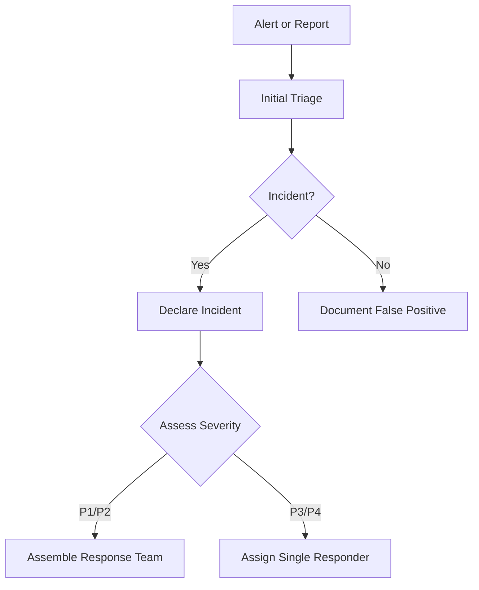
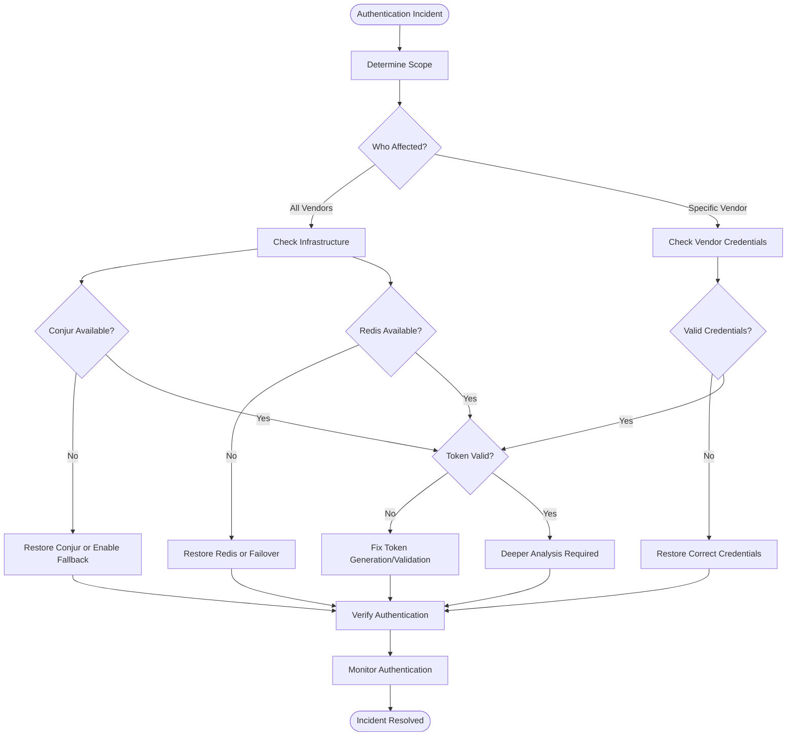
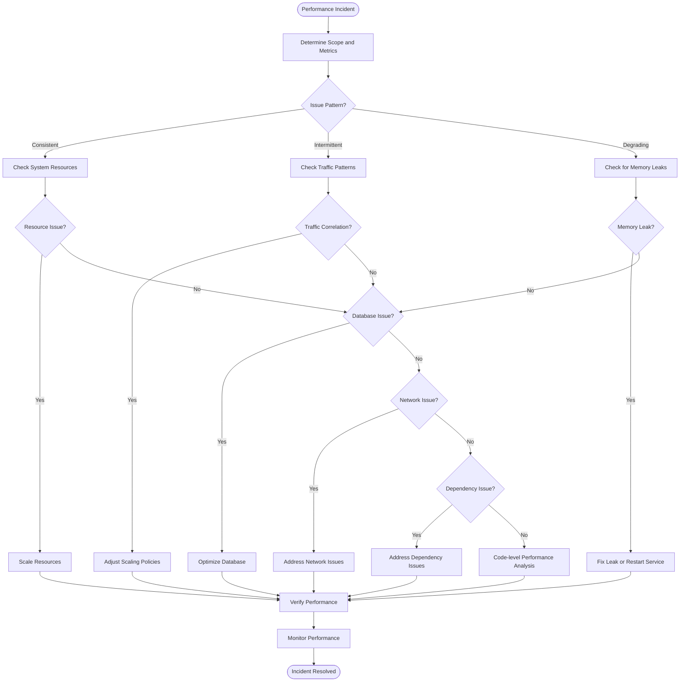
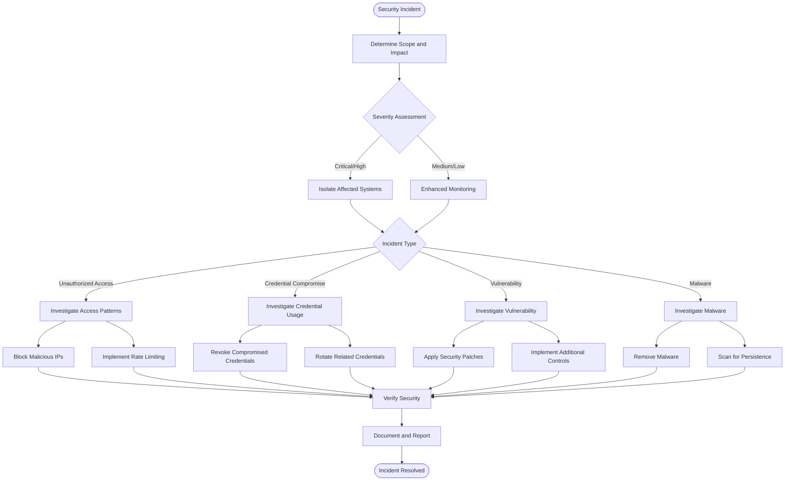
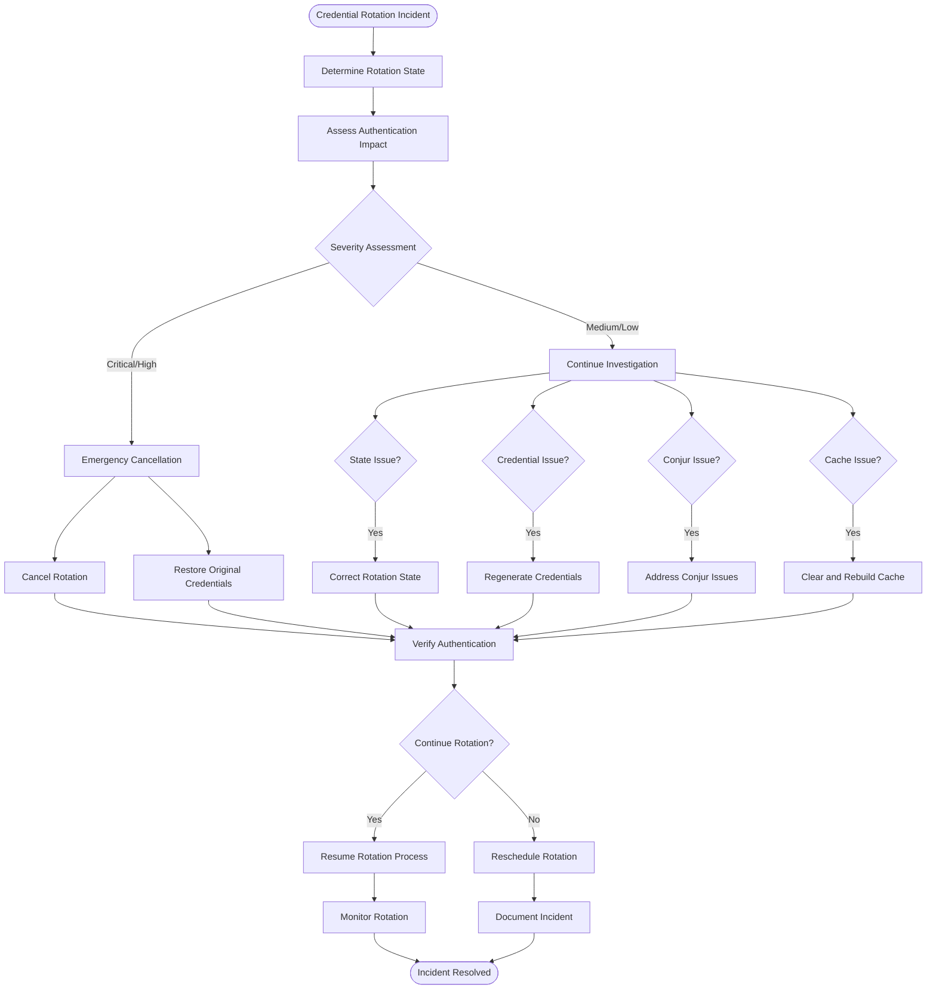
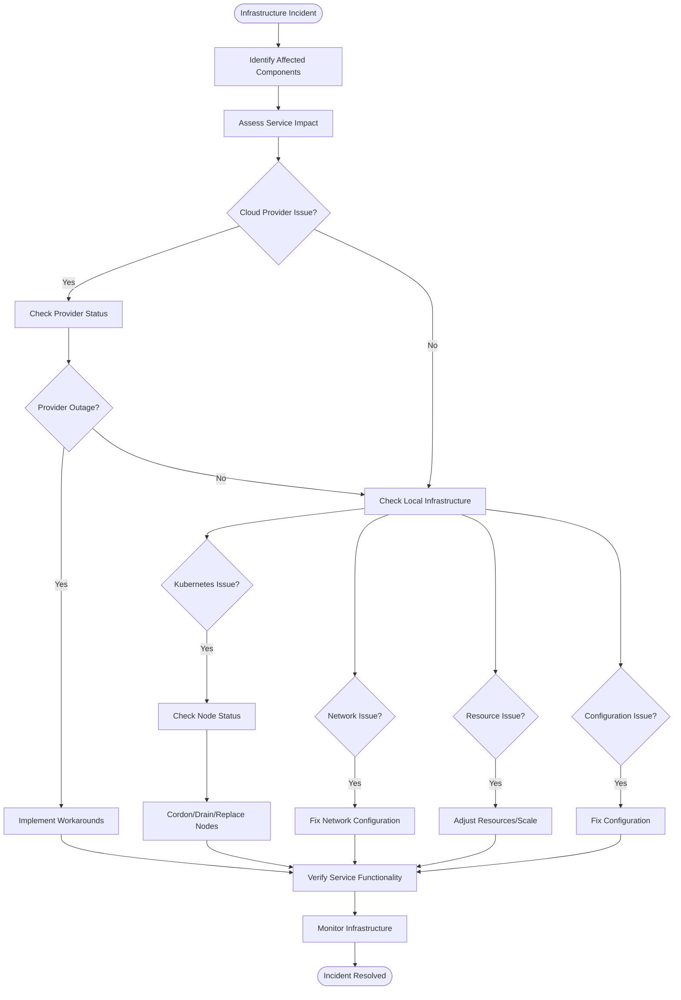
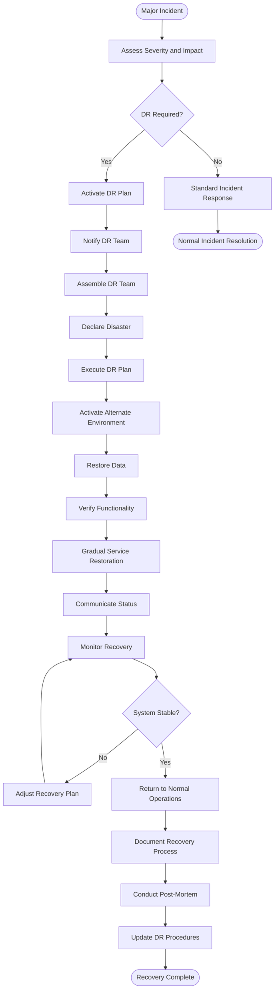
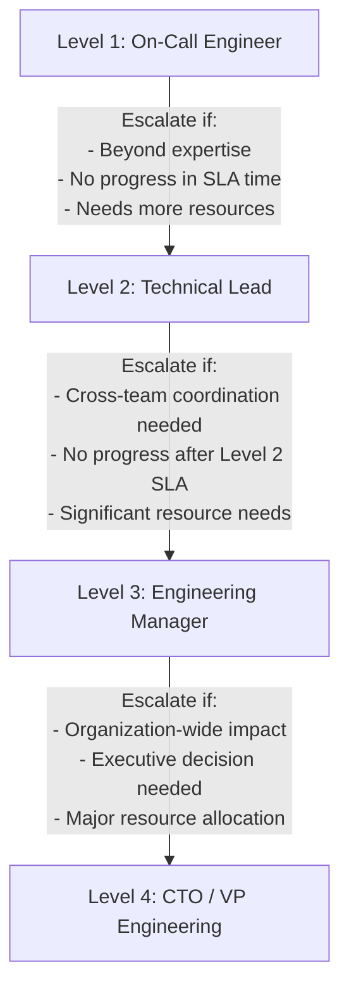
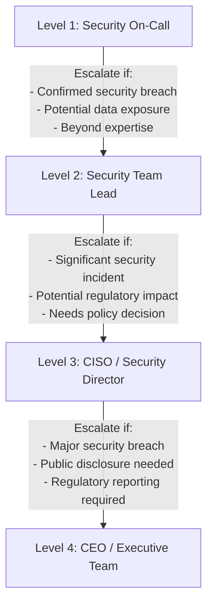
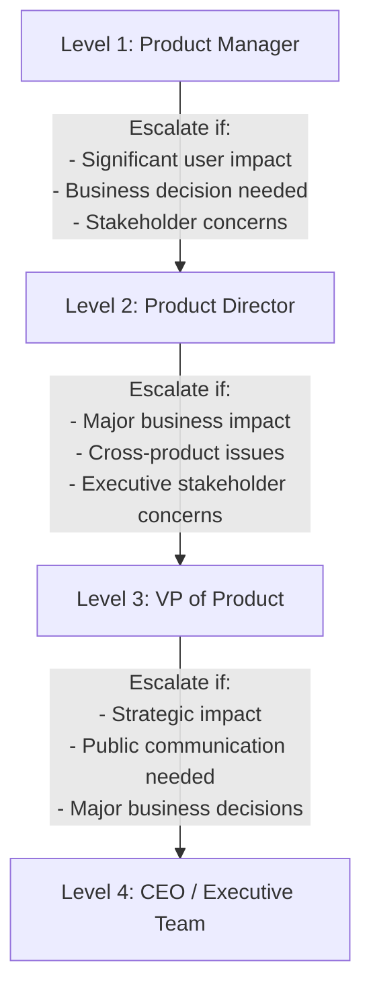

# Incident Response Procedures

## Introduction

This document provides comprehensive guidance for incident response procedures for the Payment API Security Enhancement project. It defines the incident classification, escalation procedures, response workflows, communication protocols, and post-incident analysis processes to ensure effective and timely response to incidents affecting the payment processing system.

The incident response plan is designed to minimize the impact of incidents on system availability, data integrity, and security while ensuring clear communication and coordination among all stakeholders. It covers all critical components of the system, including Payment-EAPI, Payment-SAPI, Conjur vault, Redis cache, and supporting infrastructure.

### Purpose

The purpose of this incident response plan is to:

- Define a structured approach to handling incidents affecting the Payment API Security Enhancement system
- Establish clear roles and responsibilities during incident response
- Provide standardized procedures for different types of incidents
- Ensure timely and effective communication during incidents
- Define escalation paths for different severity levels
- Establish a framework for post-incident analysis and continuous improvement

### Scope

This incident response plan covers the following components of the Payment API Security Enhancement project:

- Payment-EAPI (External API)
- Payment-SAPI (System API)
- Conjur vault for credential management
- Redis cache for token storage
- Supporting infrastructure (Kubernetes, databases, networking)
- Monitoring and alerting systems

The plan addresses various incident types, including:

- Authentication failures and security incidents
- Performance degradation and service disruptions
- Infrastructure and component failures
- Data integrity and consistency issues
- Credential and token management issues

### Audience

This guide is intended for:

- Operations Team: Primary responders for incidents
- Security Team: Responders for security-related incidents
- Development Team: Technical support during incident response
- Management: Oversight and decision-making for major incidents
- Stakeholders: For awareness of incident response procedures

## Incident Classification

Incidents are classified based on severity, impact, and type to ensure appropriate response and prioritization.

### Severity Levels

Incidents are classified into the following severity levels:

| Severity | Description | Examples | Response Time | Resolution Time |
|----------|-------------|----------|---------------|----------------|
| Critical (P1) | Complete service outage or severe security breach affecting all users | - Complete authentication failure<br>- Payment processing completely unavailable<br>- Confirmed data breach | Immediate (15 min) | < 4 hours |
| High (P2) | Partial service outage or security issue affecting many users | - Intermittent authentication failures<br>- Significant performance degradation<br>- Conjur vault unavailability | Prompt (30 min) | < 8 hours |
| Medium (P3) | Limited service impact affecting some users or functionality | - Isolated authentication failures<br>- Minor performance issues<br>- Non-critical component failures | Standard (2 hours) | < 24 hours |
| Low (P4) | Minimal service impact with acceptable workarounds | - Cosmetic issues<br>- Non-critical alerts<br>- Minor anomalies | Scheduled (8 hours) | < 5 days |

The severity level may be adjusted during incident response as more information becomes available or as the situation evolves.

### Impact Assessment

Impact is assessed across multiple dimensions to determine the overall severity:

1. **User Impact**:
   - Number of affected users or vendors
   - Criticality of affected functionality
   - Availability of workarounds

2. **Business Impact**:
   - Financial implications
   - Reputational damage
   - Regulatory or compliance concerns

3. **Technical Impact**:
   - Affected components and services
   - Data integrity or loss concerns
   - Security implications

4. **Recovery Complexity**:
   - Estimated time to resolve
   - Resource requirements
   - Dependencies on external parties

The impact assessment should be continuously updated as more information becomes available during the incident response process.

### Incident Types

Incidents are categorized by type to guide the response approach:

1. **Authentication Incidents**:
   - Authentication failures
   - Token validation issues
   - Credential management problems

2. **Security Incidents**:
   - Unauthorized access attempts
   - Suspicious activity patterns
   - Potential data breaches

3. **Performance Incidents**:
   - Response time degradation
   - Throughput issues
   - Resource exhaustion

4. **Availability Incidents**:
   - Component failures
   - Service outages
   - Connectivity issues

5. **Data Incidents**:
   - Data corruption
   - Inconsistency issues
   - Synchronization problems

6. **Infrastructure Incidents**:
   - Kubernetes issues
   - Network problems
   - Cloud provider outages

Many incidents may span multiple categories, and the primary category may change as the incident investigation progresses.

### Incident Triggers

Incidents may be triggered through various channels:

1. **Automated Alerts**:
   - Prometheus alerts based on metric thresholds
   - Log-based alerts from ELK Stack
   - Health check failures
   - Security monitoring alerts

2. **Manual Reports**:
   - User or vendor reports
   - Operations team observations
   - Development team findings
   - Security team discoveries

3. **Proactive Monitoring**:
   - Dashboard observations
   - Trend analysis
   - Anomaly detection
   - Scheduled health checks

Specific alert thresholds and monitoring dashboards are configured in the monitoring system to detect and trigger incidents based on predefined criteria for authentication failures, performance degradation, and system availability issues.

## Incident Response Organization

Effective incident response requires clear roles, responsibilities, and coordination among team members.

### Roles and Responsibilities

The following roles are defined for incident response:

| Role | Responsibilities | Assigned To |
|------|-----------------|------------|
| Incident Commander | Overall coordination, decision-making, status updates | Operations Team Lead |
| Technical Lead | Technical investigation, troubleshooting, resolution | Senior Engineer (rotational) |
| Communications Lead | Stakeholder updates, user communication | Product Manager / Operations Manager |
| Security Lead | Security assessment, forensic analysis | Security Engineer (for security incidents) |
| Subject Matter Experts | Specialized knowledge and support | Component owners (as needed) |
| Executive Sponsor | Executive decisions, resource allocation | CTO / CISO (for major incidents) |

Roles are assigned at the beginning of incident response and may be transferred as needed during the incident lifecycle. The Incident Commander is responsible for ensuring all roles are filled appropriately.

### Response Team Structure

The incident response team structure varies based on incident severity:

1. **Critical (P1) Incidents**:
   - Full response team with all roles filled
   - Executive involvement
   - Dedicated war room (physical or virtual)
   - 24/7 coverage if needed

2. **High (P2) Incidents**:
   - Core response team (Incident Commander, Technical Lead, Communications Lead)
   - SMEs as needed
   - Regular status updates
   - Extended hours coverage if needed

3. **Medium (P3) Incidents**:
   - Minimal response team (Technical Lead with Incident Commander oversight)
   - SMEs consulted as needed
   - Standard business hours coverage

4. **Low (P4) Incidents**:
   - Individual responder with escalation path
   - Standard business hours coverage

The response team structure may be adjusted during the incident as the situation evolves.

### On-Call Rotations

On-call responsibilities are managed through defined rotations:

1. **Primary On-Call**:
   - First responder for all incidents
   - Initial triage and assessment
   - Escalation to appropriate teams
   - 24/7 availability during on-call period

2. **Secondary On-Call**:
   - Backup for Primary On-Call
   - Additional support for high severity incidents
   - 24/7 availability during on-call period

3. **Specialized On-Call**:
   - Security team on-call
   - Database team on-call
   - Network team on-call
   - Called in as needed based on incident type

On-call schedules are managed through PagerDuty with weekly rotations. Handoffs between on-call personnel include a review of ongoing incidents and potential issues.

### Escalation Paths

Clear escalation paths ensure that incidents receive appropriate attention:

1. **Technical Escalation**:
   - Level 1: On-Call Engineer
   - Level 2: Technical Lead / Team Lead
   - Level 3: Engineering Manager
   - Level 4: CTO / VP of Engineering

2. **Security Escalation**:
   - Level 1: Security On-Call
   - Level 2: Security Team Lead
   - Level 3: CISO / Security Director
   - Level 4: CEO / Executive Team

3. **Business Escalation**:
   - Level 1: Product Manager
   - Level 2: Product Director
   - Level 3: VP of Product
   - Level 4: CEO / Executive Team

Escalation should occur when:
- The incident exceeds the current responder's authority or expertise
- The incident is not progressing toward resolution within expected timeframes
- The incident severity increases
- Additional resources or decision-making is required

## Incident Response Lifecycle

The incident response lifecycle defines the stages from detection to resolution and learning.

### Detection and Reporting

The incident response process begins with detection and reporting:

1. **Alert Detection**:
   - Automated alerts from monitoring systems
   - Manual observations from dashboards
   - User or vendor reports

2. **Initial Triage**:
   - Acknowledge the alert or report
   - Perform initial assessment of validity and severity
   - Determine if an incident should be declared

3. **Incident Declaration**:
   - Create an incident record in the incident management system
   - Assign initial severity level
   - Notify the appropriate on-call personnel

4. **Initial Response**:
   - Acknowledge the incident within SLA timeframe
   - Begin initial investigation
   - Determine if additional responders are needed



### Assessment and Diagnosis

Once an incident is declared, the focus shifts to assessment and diagnosis:

1. **Team Assembly**:
   - Assign incident roles based on severity
   - Establish communication channels
   - Brief team on current information

2. **Impact Assessment**:
   - Determine affected components and services
   - Assess user and business impact
   - Refine severity classification if needed

3. **Technical Investigation**:
   - Analyze logs, metrics, and traces
   - Review recent changes and deployments
   - Identify potential root causes
   - Develop hypotheses and test them

4. **Status Documentation**:
   - Document findings in incident management system
   - Update status regularly
   - Maintain timeline of key events and actions

During this phase, the team should focus on understanding the incident without immediately jumping to solutions unless immediate containment is required for security incidents.

### Containment and Mitigation

After assessment, the team focuses on containment and mitigation:

1. **Containment Strategy**:
   - Determine actions to limit impact and prevent spread
   - For security incidents, isolate affected components
   - For performance incidents, reduce load or increase resources
   - For availability incidents, redirect traffic or activate failover

2. **Mitigation Actions**:
   - Implement temporary fixes or workarounds
   - Restore service functionality, potentially in degraded mode
   - Monitor effectiveness of mitigation actions
   - Adjust approach based on results

3. **Service Restoration Priority**:
   - Authentication capabilities
   - Payment processing functionality
   - Reporting and monitoring capabilities
   - Administrative functions

4. **Stakeholder Updates**:
   - Provide status updates to affected stakeholders
   - Communicate expected resolution timeline
   - Advise on any workarounds for users

The goal of this phase is to minimize the impact on users and business operations while working toward a full resolution.

### Resolution and Recovery

The resolution and recovery phase focuses on permanent fixes and full service restoration:

1. **Permanent Fix Implementation**:
   - Develop and test permanent solution
   - Implement fix with appropriate change management
   - Verify fix resolves the root cause
   - Ensure no new issues are introduced

2. **Service Verification**:
   - Verify all affected services are fully operational
   - Conduct end-to-end testing
   - Confirm normal performance and functionality
   - Verify security controls are effective

3. **Monitoring Period**:
   - Implement enhanced monitoring for affected components
   - Define specific metrics to watch
   - Establish alert thresholds for potential recurrence
   - Determine monitoring duration based on incident severity

4. **Incident Closure**:
   - Confirm resolution with stakeholders
   - Document final status and resolution
   - Schedule post-incident review
   - Formally close the incident

The incident is considered resolved when normal service operation is restored, and any temporary measures have been replaced with permanent solutions.

### Post-Incident Activities

After incident resolution, several activities ensure learning and improvement:

1. **Post-Incident Review (PIR)**:
   - Schedule review within 5 business days for P1/P2 incidents
   - Include all key participants and stakeholders
   - Review incident timeline and response effectiveness
   - Identify what went well and what could be improved

2. **Root Cause Analysis (RCA)**:
   - Conduct thorough analysis of underlying causes
   - Use techniques like 5 Whys or Fishbone Diagram
   - Document technical and process-related root causes
   - Identify contributing factors

3. **Improvement Actions**:
   - Develop specific, actionable improvements
   - Assign owners and due dates
   - Track implementation progress
   - Validate effectiveness

4. **Knowledge Sharing**:
   - Update documentation and runbooks
   - Share lessons learned with wider team
   - Conduct training if needed
   - Update monitoring and alerting based on findings

The post-incident process is critical for preventing similar incidents in the future and continuously improving the incident response capability.

## Response Workflows

This section provides specific response workflows for common incident types.

### Authentication Incident Response

Workflow for responding to authentication-related incidents:

1. **Initial Assessment**:
   - Determine scope of authentication failures
   - Identify affected components (EAPI, Conjur, Redis)
   - Check recent changes to authentication components
   - Verify if specific vendors or all vendors are affected

2. **Investigation Steps**:
   - Check authentication service logs for error patterns
   - Verify Conjur vault connectivity and functionality
   - Check Redis cache status and token availability
   - Review recent credential or configuration changes
   - Analyze authentication metrics and trends

3. **Common Causes and Solutions**:

   | Issue | Symptoms | Investigation | Resolution |
   |-------|----------|--------------|------------|
   | Conjur vault unavailable | Authentication failures, connection errors in logs | Check Conjur health, network connectivity | Restore Conjur service, failover to standby, or enable fallback mode |
   | Redis cache failure | Token retrieval failures, cache miss errors | Check Redis health, memory usage | Restart Redis, failover to replica, or clear corrupted data |
   | Invalid credentials | Specific vendor authentication failures | Check credential status in Conjur, verify recent rotations | Restore correct credentials, rollback rotation, or contact vendor |
   | Token validation issues | JWT validation errors, signature failures | Check signing keys, token format | Update validation configuration, rotate signing keys |

4. **Service Restoration**:
   - Implement appropriate fix based on root cause
   - Verify authentication is working for affected vendors
   - Monitor authentication success rates
   - Communicate resolution to stakeholders



### Performance Incident Response

Workflow for responding to performance-related incidents:

1. **Initial Assessment**:
   - Identify affected components and endpoints
   - Measure current performance metrics (latency, throughput, error rates)
   - Determine if issue is consistent or intermittent
   - Check for correlation with traffic patterns or recent changes

2. **Investigation Steps**:
   - Analyze system metrics (CPU, memory, network, disk)
   - Review application metrics and traces
   - Check database performance and query patterns
   - Examine recent deployments or configuration changes
   - Look for resource contention or bottlenecks

3. **Common Causes and Solutions**:

   | Issue | Symptoms | Investigation | Resolution |
   |-------|----------|--------------|------------|
   | Resource exhaustion | High CPU/memory usage, throttling | Check resource metrics, scaling policies | Scale up/out resources, optimize resource usage |
   | Database bottlenecks | High query times, connection limits | Analyze slow queries, connection patterns | Optimize queries, increase connection pool, scale database |
   | Network issues | High latency, packet loss | Check network metrics, DNS resolution | Address network bottlenecks, optimize routing |
   | Memory leaks | Increasing memory usage over time | Analyze heap dumps, memory trends | Fix memory leaks, restart affected services |
   | External dependency slowness | Increased latency in specific calls | Check dependency health, timeout settings | Implement circuit breakers, adjust timeouts, contact provider |

4. **Service Restoration**:
   - Implement appropriate fix based on root cause
   - Verify performance has returned to acceptable levels
   - Monitor for recurrence
   - Communicate resolution to stakeholders



### Security Incident Response

Workflow for responding to security-related incidents:

1. **Initial Assessment**:
   - Determine the nature and scope of the security incident
   - Identify potentially compromised systems or data
   - Assess immediate risk and potential impact
   - Involve security team immediately for all security incidents

2. **Investigation Steps**:
   - Analyze security logs and alerts
   - Review authentication and access logs
   - Check for unauthorized access or unusual patterns
   - Examine system integrity and configuration
   - Preserve evidence for forensic analysis

3. **Common Causes and Solutions**:

   | Issue | Symptoms | Investigation | Resolution |
   |-------|----------|--------------|------------|
   | Unauthorized access attempts | Failed login spikes, brute force patterns | Review authentication logs, IP sources | Implement IP blocking, rate limiting, account lockouts |
   | Credential compromise | Successful logins from unusual locations | Analyze access patterns, credential usage | Revoke and rotate compromised credentials, enable additional verification |
   | Malicious insider activity | Unusual data access patterns | Review audit logs, access history | Revoke access, isolate affected systems, preserve evidence |
   | Vulnerability exploitation | Unexpected system behavior, security alerts | Analyze attack vectors, vulnerability scans | Patch vulnerabilities, implement additional controls |

4. **Containment and Eradication**:
   - Isolate affected systems if necessary
   - Block malicious IP addresses or users
   - Revoke compromised credentials
   - Remove malware or unauthorized modifications
   - Implement additional security controls

5. **Service Restoration**:
   - Restore systems from clean backups if needed
   - Implement security enhancements
   - Verify system integrity and security
   - Monitor for additional suspicious activity

6. **Reporting and Compliance**:
   - Document the incident thoroughly
   - Report to appropriate authorities if required
   - Notify affected parties if necessary
   - Ensure compliance with regulatory requirements



### Credential Rotation Incident Response

Workflow for responding to credential rotation-related incidents:

1. **Initial Assessment**:
   - Identify the affected credential and client
   - Determine the current rotation state
   - Assess impact on authentication and service availability
   - Review recent rotation activities and logs

2. **Investigation Steps**:
   - Check rotation service logs for errors
   - Verify Conjur vault credential states
   - Examine authentication logs for related failures
   - Review Redis cache for token inconsistencies
   - Check for concurrent rotations or conflicts

3. **Common Causes and Solutions**:

   | Issue | Symptoms | Investigation | Resolution |
   |-------|----------|--------------|------------|
   | Rotation state inconsistency | Stuck rotation, authentication failures | Check rotation state in database vs. Conjur | Manually correct rotation state, synchronize systems |
   | Failed credential generation | Rotation failure, invalid credentials | Review credential generation logs | Regenerate credentials, retry rotation |
   | Conjur vault connectivity | Rotation timeout, connection errors | Check Conjur connectivity and health | Restore Conjur connection, retry when available |
   | Cache inconsistency | Authentication failures despite valid credentials | Check Redis cache for stale data | Clear and rebuild cache, synchronize with Conjur |

4. **Service Restoration**:
   - Implement appropriate fix based on root cause
   - Consider emergency cancellation for critical issues
   - Verify authentication is working properly
   - Monitor for additional issues

For emergency procedures related to credential rotation, refer to the [Credential Rotation Runbook](credential-rotation-runbook.md).



### Infrastructure Incident Response

Workflow for responding to infrastructure-related incidents:

1. **Initial Assessment**:
   - Identify affected infrastructure components
   - Determine impact on service availability
   - Check for correlated alerts or events
   - Review recent infrastructure changes

2. **Investigation Steps**:
   - Analyze infrastructure metrics and logs
   - Check Kubernetes cluster health
   - Verify network connectivity and DNS resolution
   - Examine cloud provider status
   - Review resource utilization and limits

3. **Common Causes and Solutions**:

   | Issue | Symptoms | Investigation | Resolution |
   |-------|----------|--------------|------------|
   | Kubernetes node failures | Pod evictions, node not ready | Check node status, resource usage | Cordon and drain affected nodes, replace if necessary |
   | Network connectivity | Connection timeouts, DNS failures | Check network policies, DNS resolution | Fix network configuration, update DNS settings |
   | Resource constraints | Out of memory, CPU throttling | Review resource usage, limits | Adjust resource limits, scale infrastructure |
   | Cloud provider issues | Multiple service failures, API errors | Check provider status page | Wait for provider resolution, implement workarounds |
   | Configuration issues | Startup failures, unexpected behavior | Review recent configuration changes | Rollback changes, apply correct configuration |

4. **Service Restoration**:
   - Implement appropriate fix based on root cause
   - Consider failover to redundant components if available
   - Verify service functionality after restoration
   - Monitor for additional issues



### Disaster Recovery Response

Workflow for responding to major incidents requiring disaster recovery procedures:

1. **Initial Assessment**:
   - Determine if the incident requires disaster recovery invocation
   - Assess the extent of the outage or data loss
   - Identify affected systems and services
   - Estimate recovery time and business impact

2. **Disaster Recovery Activation**:
   - Convene the Disaster Recovery Team
   - Formally declare a disaster recovery situation
   - Notify executive leadership
   - Activate the DR communication plan

3. **Recovery Process**:
   - Follow established DR procedures for affected systems
   - Activate standby environments if applicable
   - Restore data from backups as needed
   - Verify system integrity and functionality
   - Establish interim operational procedures

4. **Communication Strategy**:
   - Provide regular status updates to stakeholders
   - Communicate service availability to vendors and users
   - Set expectations about recovery timeline
   - Coordinate external communications through proper channels

5. **Service Restoration**:
   - Validate restored systems meet security requirements
   - Perform critical function testing
   - Gradually restore service to users
   - Monitor system performance and stability

6. **Post-Recovery Activities**:
   - Document the recovery process
   - Conduct a comprehensive post-mortem
   - Update DR procedures based on lessons learned
   - Implement preventive measures



## Communication Protocols

Effective communication is critical during incident response to ensure all stakeholders are appropriately informed and coordinated.

### Internal Communication

Communication protocols for the incident response team:

1. **Primary Communication Channel**:
   - Dedicated Slack channel (#incident-response)
   - Created at incident declaration
   - All responders must join
   - All incident-related communication must be in the channel

2. **Secondary Communication Channel**:
   - Conference bridge (Zoom or similar)
   - Used for real-time coordination during critical incidents
   - Recording optional based on incident type
   - Meeting notes posted to Slack channel

3. **Status Updates**:
   - Regular updates posted to Slack channel
   - Frequency based on severity:
     - Critical (P1): Every 30 minutes
     - High (P2): Every hour
     - Medium (P3): Every 4 hours
     - Low (P4): Daily
   - Updates must include current status, actions taken, next steps

4. **Incident Documentation**:
   - Incident management system (Jira/ServiceNow)
   - Real-time collaborative document for notes
   - Timeline of key events and actions
   - Decisions and their rationale

### Stakeholder Communication

Communication protocols for stakeholders not directly involved in incident response:

1. **Stakeholder Identification**:
   - Executive leadership
   - Product management
   - Customer support
   - Sales and account management
   - Vendor management (for vendor-related incidents)
   - Compliance and legal (for security incidents)

2. **Communication Methods**:
   - Email for formal updates
   - Status page for service status
   - Regular stakeholder calls for critical incidents
   - Direct communication for specific stakeholders as needed

3. **Update Frequency**:
   - Initial notification upon incident declaration (P1/P2 only)
   - Regular updates based on severity:
     - Critical (P1): Every 2 hours
     - High (P2): Every 4 hours
     - Medium (P3): Daily
     - Low (P4): Upon resolution only
   - Immediate notification upon significant developments
   - Final notification upon resolution

4. **Update Content**:
   - Brief description of the incident
   - Current status and impact
   - Actions being taken
   - Estimated time to resolution (if known)
   - Next update time
   - Contact information for questions

### External Communication

Communication protocols for external parties (vendors, customers, regulators):

1. **Vendor Communication**:
   - For incidents affecting specific vendors
   - Direct communication through established channels
   - Focus on impact, workarounds, and resolution timeline
   - Coordinate through vendor management

2. **Customer Communication**:
   - For incidents with customer impact
   - Status page updates
   - Email notifications for significant incidents
   - Coordinate through customer support and account management

3. **Regulatory Reporting**:
   - For security incidents with regulatory implications
   - Follow regulatory reporting requirements and timelines
   - Coordinate through legal and compliance teams
   - Document all communications for audit purposes

4. **Public Communication**:
   - For incidents with public visibility
   - Coordinate through corporate communications
   - Approved messaging only
   - Focus on facts, actions, and resolution

All external communication must be approved by the Incident Commander and appropriate leadership before release.

### Communication Templates

Standardized templates for incident communication:

1. **Incident Declaration Template**:
```
INCIDENT DECLARED: [Incident ID] - [Brief Description]

Severity: [P1/P2/P3/P4]
Time Declared: [YYYY-MM-DD HH:MM UTC]
Impact: [Brief impact description]

Incident Commander: [Name]
Technical Lead: [Name]
Communications Lead: [Name]

Current Status: Investigation in progress
Next Update: [Time]

Slack Channel: #incident-[incident-id]
Conference Bridge: [Link if applicable]
```

2. **Status Update Template**:
```
INCIDENT UPDATE: [Incident ID] - [Brief Description]

Time: [YYYY-MM-DD HH:MM UTC]
Current Status: [Investigation/Mitigation/Resolution]

What We Know:
- [Key fact 1]
- [Key fact 2]

Actions Taken:
- [Action 1]
- [Action 2]

Next Steps:
- [Step 1]
- [Step 2]

Estimated Resolution: [Time or TBD]
Next Update: [Time]
```

3. **Resolution Template**:
```
INCIDENT RESOLVED: [Incident ID] - [Brief Description]

Time Resolved: [YYYY-MM-DD HH:MM UTC]
Total Duration: [HH:MM]

Impact Summary:
- [Impact detail 1]
- [Impact detail 2]

Root Cause: [Brief description]

Resolution Actions:
- [Action 1]
- [Action 2]

Follow-up Actions:
- [Action 1] - Owner: [Name], Due: [Date]
- [Action 2] - Owner: [Name], Due: [Date]

Post-Incident Review scheduled for: [Date/Time]
```

### Escalation Communication

Communication protocols for escalation scenarios:

1. **Technical Escalation**:
   - Clear statement of the issue requiring escalation
   - Current status and actions already taken
   - Specific assistance or decision needed
   - Timeframe for response
   - Contact information

2. **Management Escalation**:
   - Business impact summary
   - Technical summary in business terms
   - Options and recommendations
   - Resources or decisions needed
   - Risks of delayed response

3. **Vendor Escalation**:
   - Incident reference number
   - Detailed technical information
   - Impact on services
   - Actions taken and results
   - Specific assistance needed
   - Urgency and priority

4. **Executive Escalation**:
   - Executive summary of incident
   - Business impact in financial/operational terms
   - Current status and prognosis
   - Options and recommendations
   - Decisions required
   - Next steps and timeline

### Communication During Disaster Recovery

Special communication protocols during disaster recovery situations:

1. **DR Activation Communication**:
   - Formal notification to executive leadership
   - Immediate notification to all technical teams
   - Clear statement of DR plan activation
   - Initial impact assessment
   - Preliminary recovery timeline

2. **DR Status Updates**:
   - Frequent updates (every 1-2 hours minimum)
   - Progress against recovery objectives
   - Current challenges and blockers
   - Updated recovery timeline
   - Resource requirements

3. **Vendor Coordination**:
   - Dedicated liaison for critical vendors
   - Regular synchronization calls
   - Shared status dashboard if available
   - Escalation path for vendor-related issues

4. **Customer/User Communication During DR**:
   - Clear service status updates
   - Transparency about the situation without revealing security details
   - Expected resolution timeframes
   - Workarounds if available
   - Contact information for urgent issues

5. **DR Resolution Communication**:
   - Announcement of service restoration
   - Residual impact disclosure
   - Monitoring and verification procedures
   - Return to normal operations plan
   - Post-recovery support information

## Escalation Procedures

Escalation procedures ensure that incidents receive appropriate attention and resources based on their severity and complexity.

### Escalation Triggers

Specific conditions that trigger escalation:

1. **Time-Based Triggers**:
   - Critical (P1): No progress within 30 minutes
   - High (P2): No progress within 1 hour
   - Medium (P3): No progress within 4 hours
   - Low (P4): No progress within 1 business day

2. **Impact-Based Triggers**:
   - Incident impact increases
   - Additional services or components affected
   - User impact greater than initially assessed
   - Potential security or compliance implications discovered

3. **Resource-Based Triggers**:
   - Current responders lack necessary expertise
   - Additional resources required for resolution
   - Specialized tools or access needed
   - Concurrent incidents straining resources

4. **Decision-Based Triggers**:
   - Decision required beyond current responder's authority
   - Multiple options with significant trade-offs
   - Potential business impact requiring executive input
   - Vendor or partner involvement needed

### Technical Escalation Path

Escalation path for technical issues:

1. **Level 1: On-Call Engineer**
   - Initial response and triage
   - Basic troubleshooting and resolution
   - Escalation to Level 2 if unable to resolve

2. **Level 2: Technical Lead / Team Lead**
   - Advanced troubleshooting
   - Coordination of technical resources
   - Escalation to Level 3 if unable to resolve

3. **Level 3: Engineering Manager**
   - Resource allocation
   - Cross-team coordination
   - Technical decision authority
   - Escalation to Level 4 if needed

4. **Level 4: CTO / VP of Engineering**
   - Executive-level technical decisions
   - Organization-wide resource allocation
   - Vendor and partner escalation
   - Final technical authority



### Security Escalation Path

Escalation path for security-related issues:

1. **Level 1: Security On-Call**
   - Initial security assessment
   - Basic security response
   - Escalation to Level 2 if unable to resolve

2. **Level 2: Security Team Lead**
   - Advanced security investigation
   - Security response coordination
   - Escalation to Level 3 if needed

3. **Level 3: CISO / Security Director**
   - Security resource allocation
   - Security policy decisions
   - External security coordination
   - Escalation to Level 4 if needed

4. **Level 4: CEO / Executive Team**
   - Executive-level security decisions
   - Public disclosure decisions
   - Regulatory reporting decisions
   - Final security authority



### Business Escalation Path

Escalation path for business impact decisions:

1. **Level 1: Product Manager**
   - Initial business impact assessment
   - Basic business decisions
   - User communication coordination
   - Escalation to Level 2 if needed

2. **Level 2: Product Director**
   - Significant business decisions
   - Resource prioritization
   - Stakeholder communication
   - Escalation to Level 3 if needed

3. **Level 3: VP of Product**
   - Major business decisions
   - Cross-product impact assessment
   - Executive stakeholder updates
   - Escalation to Level 4 if needed

4. **Level 4: CEO / Executive Team**
   - Strategic business decisions
   - Public communication approval
   - Final business authority



### Vendor Escalation Path

Escalation path for vendor-related issues:

1. **Level 1: Standard Support Channels**
   - Initial vendor contact
   - Standard support tickets
   - Basic troubleshooting with vendor

2. **Level 2: Vendor Account Manager**
   - Escalated support requests
   - Priority handling
   - Coordination with vendor technical teams

3. **Level 3: Vendor Executive Contacts**
   - Executive escalation
   - SLA enforcement
   - Vendor management involvement

4. **Level 4: Legal / Contractual Escalation**
   - Formal notices
   - Legal team involvement
   - Contractual remedies

Vendor escalation should be coordinated with the appropriate internal escalation path based on the nature of the issue.

### Escalation Best Practices

Guidelines for effective escalation:

1. **Clear Communication**:
   - Clearly state the reason for escalation
   - Provide concise summary of the incident
   - Explain actions already taken
   - Specify what is needed from the escalation

2. **Appropriate Timing**:
   - Escalate early rather than too late
   - Don't wait until the last minute of SLA
   - Consider time of day and availability
   - Use urgent channels appropriately

3. **Proper Documentation**:
   - Document the escalation in the incident record
   - Include timestamp and reason for escalation
   - Record the response and actions taken
   - Update the incident timeline

4. **Follow-up**:
   - Confirm receipt of escalation
   - Establish next check-in time
   - Provide updates on progress
   - Close the loop when resolved

## Post-Incident Analysis

Post-incident analysis is critical for learning from incidents and preventing recurrence.

### Post-Incident Review Process

The structured process for reviewing incidents after resolution:

1. **Scheduling**:
   - Schedule within 5 business days of resolution
   - Include all key participants
   - Allocate sufficient time (1-2 hours)
   - Distribute incident timeline before the meeting

2. **Participants**:
   - Incident Commander
   - Technical Lead
   - Key responders
   - Representatives from affected teams
   - Management representatives as appropriate
   - Facilitator (neutral party)

3. **Meeting Structure**:
   - Review incident timeline
   - Discuss what happened
   - Analyze what went well
   - Analyze what could be improved
   - Identify root causes
   - Develop action items
   - Assign owners and due dates

4. **Documentation**:
   - Document the discussion and findings
   - Distribute to participants and stakeholders
   - Store in knowledge base for future reference
   - Update runbooks and procedures based on findings

### Root Cause Analysis

Techniques for identifying the root causes of incidents:

1. **5 Whys Analysis**:
   - Start with the problem statement
   - Ask "why" the problem occurred
   - For each answer, ask "why" again
   - Continue until reaching root cause(s)
   - Typically requires 5 levels of questioning

2. **Fishbone Diagram (Ishikawa)**:
   - Identify main categories of potential causes
     - People
     - Process
     - Technology
     - Environment
     - Management
   - Brainstorm specific causes in each category
   - Analyze relationships between causes

3. **Fault Tree Analysis**:
   - Start with the incident (top event)
   - Identify immediate causes
   - Break down each cause into contributing factors
   - Continue until reaching basic causes
   - Analyze logical relationships (AND/OR gates)

4. **Timeline Analysis**:
   - Create detailed incident timeline
   - Identify key events and decision points
   - Analyze cause-effect relationships
   - Look for patterns and triggers

The analysis should focus on systemic issues rather than individual blame, and should consider technical, process, and organizational factors.

### Improvement Action Tracking

Process for tracking and implementing improvements:

1. **Action Item Definition**:
   - Clear, specific description
   - Measurable outcome
   - Realistic and achievable
   - Relevant to preventing similar incidents
   - Time-bound with due date

2. **Prioritization**:
   - High: Critical to preventing similar high-impact incidents
   - Medium: Important for process improvement
   - Low: Nice-to-have enhancements

3. **Assignment and Ownership**:
   - Assign to specific individual (not team)
   - Ensure owner has authority and resources
   - Establish clear expectations
   - Set check-in points for progress

4. **Tracking and Reporting**:
   - Track in project management system
   - Regular status updates
   - Monthly review of open actions
   - Escalate stalled items

5. **Verification and Closure**:
   - Verify implementation
   - Test effectiveness
   - Document completion
   - Share outcomes with stakeholders

### Knowledge Sharing

Methods for sharing lessons learned across the organization:

1. **Incident Database**:
   - Searchable repository of past incidents
   - Includes timeline, root causes, and resolutions
   - Categorized and tagged for easy reference
   - Accessible to all relevant teams

2. **Incident Summaries**:
   - Brief summaries of significant incidents
   - Focus on key learnings and improvements
   - Distributed to relevant teams
   - Included in newsletters or team communications

3. **Training and Workshops**:
   - Incorporate lessons into training materials
   - Conduct workshops on significant incidents
   - Use case studies in onboarding
   - Tabletop exercises based on past incidents

4. **Documentation Updates**:
   - Update runbooks with new procedures
   - Enhance monitoring based on lessons learned
   - Improve alerting thresholds and rules
   - Revise incident response procedures

### Metrics and Trends

Tracking incident metrics to identify trends and measure improvement:

1. **Key Metrics**:
   - Incident frequency by type and severity
   - Mean Time to Detect (MTTD)
   - Mean Time to Respond (MTTR)
   - Mean Time to Resolve (MTTR)
   - Recurrence rate of similar incidents
   - Action item completion rate

2. **Trend Analysis**:
   - Monthly incident review
   - Quarterly trend analysis
   - Year-over-year comparisons
   - Correlation with system changes

3. **Reporting**:
   - Monthly incident summary report
   - Quarterly trend report
   - Annual incident review
   - Executive dashboard

4. **Continuous Improvement**:
   - Set improvement targets for key metrics
   - Identify focus areas based on trends
   - Measure impact of improvement initiatives
   - Adjust incident response procedures based on data

## Tools and Resources

Tools and resources to support effective incident response.

### Incident Management Tools

Tools used for managing incidents:

1. **Incident Management System**:
   - Jira Service Management / ServiceNow
   - Incident tracking and documentation
   - Workflow management
   - SLA tracking

2. **Communication Tools**:
   - Slack for team communication
   - Zoom/Teams for conference bridges
   - PagerDuty for alerting and on-call management
   - Status page for external communication

3. **Collaboration Tools**:
   - Confluence for documentation
   - Google Docs for real-time collaboration
   - Miro/Lucidchart for diagramming
   - Jira for action item tracking

4. **Monitoring and Diagnostic Tools**:
   - Prometheus/Grafana for metrics
   - ELK Stack for logs
   - Jaeger for distributed tracing
   - Kubernetes dashboard for infrastructure

### Diagnostic Commands and Procedures

Common diagnostic commands and procedures for troubleshooting:

1. **Kubernetes Commands**:
```bash
# Check pod status
kubectl get pods -n payment-system

# Check pod logs
kubectl logs -l app=payment-eapi -n payment-system --tail=100

# Describe pod for details
kubectl describe pod <pod-name> -n payment-system

# Check node status
kubectl get nodes

# Check service status
kubectl get services -n payment-system
```

2. **Application Health Checks**:
```bash
# Check EAPI health
curl -s https://payment-api.example.com/actuator/health | jq

# Check SAPI health
curl -s https://payment-sapi.example.com/actuator/health | jq

# Test authentication flow
curl -s -X POST https://payment-api.example.com/api/v1/payments \
  -H "X-Client-ID: test-client-id" \
  -H "X-Client-Secret: test-client-secret" \
  -H "Content-Type: application/json" \
  -d '{"amount": 100.00, "currency": "USD", "reference": "test-payment"}' | jq
```

3. **Conjur Vault Commands**:
```bash
# Check Conjur health
conjur health check

# List available credentials
conjur list

# Retrieve credential metadata
conjur variable metadata payment-system/clients/xyz-vendor/client-id
```

4. **Redis Commands**:
```bash
# Check Redis health
kubectl exec -it redis-0 -n payment-system -- redis-cli -a ${REDIS_PASSWORD} ping

# Check token cache
kubectl exec -it redis-0 -n payment-system -- redis-cli -a ${REDIS_PASSWORD} keys "token:*"

# Check Redis info
kubectl exec -it redis-0 -n payment-system -- redis-cli -a ${REDIS_PASSWORD} info
```

### Runbooks and Playbooks

Reference to available runbooks and playbooks:

1. **Component-Specific Runbooks**:
   - [Payment-EAPI Troubleshooting Guide]
   - [Payment-SAPI Troubleshooting Guide]
   - [Conjur Vault Troubleshooting Guide]
   - [Redis Cache Troubleshooting Guide]

2. **Scenario-Based Playbooks**:
   - [Authentication Failure Playbook]
   - [Performance Degradation Playbook]
   - [Security Incident Playbook]
   - [Credential Rotation Runbook](credential-rotation-runbook.md)

3. **Recovery Procedures**:
   - [Service Restart Procedures]
   - [Database Recovery Procedures]
   - [Cache Recovery Procedures]
   - Disaster Recovery Procedures - Refer to separate DR documentation

4. **Testing Procedures**:
   - [Authentication Testing Procedures]
   - [Performance Testing Procedures]
   - [Security Testing Procedures]
   - [End-to-End Testing Procedures]

### Contact Information

Contact information for key personnel and teams:

1. **On-Call Rotations**:
   - Operations On-Call: [PagerDuty Link]
   - Security On-Call: [PagerDuty Link]
   - Database On-Call: [PagerDuty Link]
   - Network On-Call: [PagerDuty Link]

2. **Team Contacts**:
   - Operations Team: #ops-team (Slack), ops@example.com
   - Security Team: #security-team (Slack), security@example.com
   - Development Team: #dev-team (Slack), dev@example.com
   - Product Team: #product-team (Slack), product@example.com

3. **Leadership Contacts**:
   - CTO: [Name], [Phone], [Email]
   - CISO: [Name], [Phone], [Email]
   - VP of Engineering: [Name], [Phone], [Email]
   - VP of Product: [Name], [Phone], [Email]

4. **Vendor Contacts**:
   - Conjur Support: [Contact Info]
   - Cloud Provider Support: [Contact Info]
   - XYZ Vendor Contact: [Contact Info]

## Appendices

Additional reference information for incident response.

### Incident Severity Definitions

Detailed definitions of incident severity levels:

**Critical (P1)**:
- Complete service outage affecting all users
- Complete authentication failure for all vendors
- Confirmed data breach or security compromise
- Regulatory compliance violation with immediate impact
- Financial impact exceeding $10,000 per hour

**High (P2)**:
- Partial service outage affecting multiple vendors
- Intermittent authentication failures
- Significant performance degradation (response times >2x normal)
- Potential security breach under investigation
- Financial impact between $1,000-$10,000 per hour

**Medium (P3)**:
- Limited service impact affecting single vendor
- Minor performance issues (response times <2x normal)
- Non-critical component failures with workarounds available
- Suspicious activity requiring investigation
- Financial impact less than $1,000 per hour

**Low (P4)**:
- Cosmetic issues not affecting functionality
- Isolated errors with minimal user impact
- Minor anomalies in monitoring
- Documentation or reporting issues
- No direct financial impact

### Incident Response Checklist

Quick reference checklist for incident response:

**Initial Response**:
- [ ] Acknowledge alert/report
- [ ] Assess severity and impact
- [ ] Declare incident if appropriate
- [ ] Assign Incident Commander
- [ ] Establish communication channels
- [ ] Notify required team members
- [ ] Begin incident documentation

**Investigation**:
- [ ] Gather initial data and logs
- [ ] Identify affected components
- [ ] Determine scope of impact
- [ ] Review recent changes
- [ ] Develop investigation plan
- [ ] Assign investigation tasks
- [ ] Document findings

**Mitigation**:
- [ ] Develop mitigation strategy
- [ ] Get approval for mitigation actions
- [ ] Implement mitigation
- [ ] Verify mitigation effectiveness
- [ ] Monitor for side effects
- [ ] Update stakeholders

**Resolution**:
- [ ] Develop permanent fix
- [ ] Test fix in non-production
- [ ] Implement fix with change management
- [ ] Verify fix resolves issue
- [ ] Remove temporary mitigations
- [ ] Confirm normal operation

**Closure**:
- [ ] Notify stakeholders of resolution
- [ ] Document final status
- [ ] Schedule post-incident review
- [ ] Assign follow-up actions
- [ ] Update knowledge base
- [ ] Close incident record

### Incident Response Metrics

Definitions of key incident response metrics:

**Time-Based Metrics**:
- **Time to Detect**: Time from incident occurrence to detection
- **Time to Acknowledge**: Time from detection to acknowledgment
- **Time to Mitigate**: Time from acknowledgment to mitigation
- **Time to Resolve**: Time from acknowledgment to resolution
- **Total Incident Duration**: Time from detection to resolution

**Quality Metrics**:
- **Accurate Severity Assessment**: % of incidents with correct initial severity
- **Appropriate Response**: % of incidents with appropriate initial response
- **Effective Communication**: % of incidents with timely stakeholder updates
- **Proper Documentation**: % of incidents with complete documentation

**Improvement Metrics**:
- **Recurrence Rate**: % of incidents that are recurrences of previous incidents
- **Action Item Completion**: % of post-incident action items completed on time
- **Runbook Utilization**: % of incidents where runbooks were followed
- **Knowledge Utilization**: % of incidents where previous incident knowledge was applied

### Related Documentation

Links to related documentation and resources:

- System Monitoring Documentation: Documentation of monitoring systems and alert thresholds
- [Credential Rotation Runbook](credential-rotation-runbook.md): Procedures for credential rotation
- Disaster Recovery Plan: Refer to separate DR documentation for complete recovery procedures
- [High-Level Architecture](../architecture/high-level-architecture.md): Overview of system architecture
- [Security Guidelines](../development/security-guidelines.md): Security standards and practices
- [Deployment Guide](deployment-guide.md): Procedures for system deployment
- [Testing Guide](../development/testing-guide.md): Testing procedures and standards