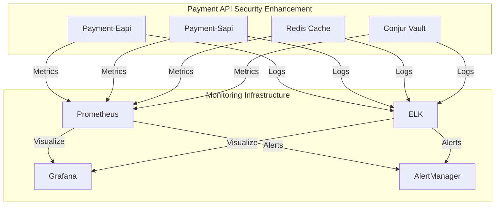

# Payment API Security Enhancement - Monitoring Guide

## Introduction

This document provides a comprehensive guide for monitoring the Payment API Security Enhancement project, explaining the importance of monitoring for security, performance, and reliability.

## Monitoring Architecture

Description of the monitoring infrastructure including Prometheus, Grafana, AlertManager, and ELK Stack, with diagrams showing how these components interact.

### Component Overview

Details of each monitoring component and its role in the overall monitoring architecture.

- **Prometheus** <!-- prometheus v2.30.3 -->: Metrics collection and alerting platform. Collects metrics from various services and stores them in a time-series database.
- **Grafana** <!-- grafana 8.1.2 -->: Dashboard visualization platform. Provides a user interface for creating and visualizing dashboards based on Prometheus metrics.
- **AlertManager** <!-- alertmanager v0.23.0 -->: Alert handling system. Manages alerts generated by Prometheus and routes them to appropriate notification channels.
- **ELK Stack** <!-- elastic 7.16.x -->: Log aggregation and analysis. Collects, parses, and indexes logs from various services for troubleshooting and analysis.
- **Micrometer** <!-- micrometer 1.8.x -->: Application metrics collection. Provides a common interface for collecting metrics from Java applications.

### System Architecture for Monitoring

Description of the system architecture from a monitoring perspective, including the key components being monitored (Payment-Eapi, Payment-Sapi, Redis Cache, Conjur Vault), their relationships, and monitoring touchpoints.

### Metrics Collection

Explanation of how metrics are collected from various services using Micrometer and Prometheus.

- **Micrometer**: Used to instrument Java applications (Payment-Eapi, Payment-Sapi) to expose metrics in Prometheus format.
- **Prometheus**: Scrapes metrics endpoints exposed by Micrometer and stores them in a time-series database.
- **Redis Exporter**: Collects metrics from Redis cache and exposes them in Prometheus format.
- **Conjur Vault**: Exposes metrics through its API, which are collected by Prometheus.

### Log Aggregation

Description of the log aggregation approach using Filebeat, Logstash, and Elasticsearch.

- **Filebeat**: Lightweight shipper that collects logs from various services and forwards them to Logstash.
- **Logstash**: Processes and enriches logs before indexing them in Elasticsearch.
- **Elasticsearch**: Stores and indexes logs for searching and analysis.
- **Kibana**: Provides a user interface for visualizing and analyzing logs stored in Elasticsearch.

### Alerting Pipeline

Overview of the alerting pipeline from Prometheus to AlertManager to notification channels.

- **Prometheus**: Evaluates alert rules based on metrics and generates alerts when thresholds are breached.
- **AlertManager**: Receives alerts from Prometheus, deduplicates them, and routes them to appropriate notification channels.
- **Notification Channels**: Include PagerDuty, email, and Slack.

## Key Metrics

Comprehensive list of key metrics to monitor for the Payment API Security Enhancement project.

### Security Metrics

Metrics related to authentication, token validation, credential access, and security incidents.

- `payment_authentication_attempts_total`: Total number of authentication attempts.
- `payment_authentication_success_total`: Total number of successful authentications.
- `payment_authentication_failures_total`: Total number of authentication failures.
- `payment_token_validation_attempts_total`: Total number of token validation attempts.
- `payment_token_validation_success_total`: Total number of successful token validations.
- `payment_token_validation_failures_total`: Total number of token validation failures.
- `payment_credential_access_total`: Total number of credential access attempts.
- `payment_unauthorized_access_attempts_total`: Total number of unauthorized access attempts.
- `payment_credential_rotation_total`: Total number of credential rotation operations.
- `payment_conjur_operation_total`: Total number of Conjur vault operations.

### Performance Metrics

Metrics related to API response time, authentication time, token generation time, and resource utilization.

- `payment_api_response_time_seconds`: API response time histogram.
- `payment_authentication_time_seconds`: Authentication time histogram.
- `payment_token_generation_time_seconds`: Token generation time histogram.
- `payment_token_validation_time_seconds`: Token validation time histogram.
- `payment_conjur_response_time_seconds`: Conjur vault response time histogram.
- `process_cpu_seconds_total`: Total CPU time used by a process.
- `process_resident_memory_bytes`: Resident memory size of a process.
- `jvm_memory_used_bytes`: JVM heap memory usage.
- `jvm_gc_collection_seconds_sum`: JVM garbage collection time.

### Availability Metrics

Metrics related to service uptime, error rates, and component availability.

- `up`: Service uptime status (1 = up, 0 = down).
- `http_server_requests_seconds_count`: Number of HTTP requests.
- `http_server_requests_seconds_sum`: Total time spent handling HTTP requests.
- `redis_up`: Redis cache uptime status.
- `conjur_up`: Conjur vault uptime status.

### Business Metrics

Metrics related to authentication success rates, token usage, and credential rotation.

- `authentication_success_rate`: Percentage of successful authentications.
- `token_generation_rate`: Number of tokens generated per minute.
- `credential_rotation_success`: Success rate of credential rotations.
- `authentication_latency`: Time to authenticate requests.

## Dashboards

Guide to using the Grafana dashboards for monitoring the Payment API Security Enhancement project.

### Security Dashboard

Detailed explanation of the Security Dashboard panels and how to interpret them.

The Security Dashboard (security-dashboard.json) provides a comprehensive view of the security posture of the Payment API Security Enhancement project. It includes panels for:

- **Security Status**: Overall security status based on active alerts.
- **Active Security Alerts**: List of currently firing security alerts.
- **Authentication Success/Failure Rate**: Authentication success and failure rates over time.
- **Authentication Failures by Client ID**: Authentication failures broken down by client ID.
- **Token Validation Success/Failure Rate**: Token validation success and failure rates over time.
- **Token Validation Failures by Type**: Token validation failures broken down by type (e.g., expired, invalid signature).
- **Credential Access Rate**: Credential access rate over time.
- **Credential Access Anomaly Detection**: Detection of unusual credential access patterns.
- **Credential Rotation Status**: Status of ongoing credential rotation operations.
- **Credential Rotation History**: History of credential rotation operations.
- **Conjur Vault Operation Success/Failure Rate**: Conjur vault operation success and failure rates.
- **Conjur Vault Operations by Type**: Conjur vault operations broken down by type (e.g., retrieve, store).
- **Conjur Vault Response Time**: Conjur vault response time percentiles.
- **Conjur Vault Availability**: Conjur vault availability over time.
- **Security Incident Timeline**: Timeline of security-related events.

### Service Health Dashboard

Detailed explanation of the Service Health Dashboard panels and how to interpret them.

The Service Health Dashboard (service-health-dashboard.json) provides a comprehensive view of the health and performance of the Payment API Security Enhancement project. It includes panels for:

- **Service Status**: Overall service status based on uptime metrics.
- **Active Service Alerts**: List of currently firing service alerts.
- **Service Uptime (30d)**: Service uptime over the last 30 days.
- **SLA Compliance (24h)**: SLA compliance metrics over the last 24 hours.
- **API Response Time**: API response time percentiles.
- **API Request Rate by Endpoint**: API request rate broken down by endpoint.
- **API Error Rate**: API error rate broken down by status code.
- **CPU Usage**: CPU usage by service.
- **Memory Usage**: Memory usage by service.
- **JVM Heap Usage**: JVM heap usage for Java services.
- **JVM Garbage Collection Time**: JVM garbage collection time.
- **Redis Cache Hit Rate**: Redis cache hit rate.
- **Redis Memory Usage**: Redis memory usage.
- **Database Connection Pool Usage**: Database connection pool usage.
- **Database Query Time**: Database query time.
- **Service Incident Timeline**: Timeline of service-related events.

### Authentication Dashboard

Detailed explanation of the Authentication Dashboard panels and how to interpret them.

The Authentication Dashboard (authentication-dashboard.json) provides a detailed view of the authentication process. It includes panels for:

- **Authentication Status**: Overall authentication status based on active alerts.
- **Active Authentication Alerts**: List of currently firing authentication alerts.
- **Authentication Success/Failure Rate**: Authentication success and failure rates over time.
- **Authentication Volume**: Authentication volume over time.
- **Authentication Failures by Client ID**: Authentication failures broken down by client ID.
- **Authentication Latency**: Authentication latency percentiles.
- **Token Generation Rate**: Token generation rate over time.
- **Token Validation Rate**: Token validation rate over time.
- **Token Validation Failures by Type**: Token validation failures broken down by type (e.g., expired, invalid signature).
- **Token Operation Latency**: Token generation and validation latency.

### Custom Dashboard Creation

Guidelines for creating custom dashboards for specific monitoring needs.

- **Identify Key Metrics**: Determine the metrics that are most relevant to your monitoring needs.
- **Define Thresholds**: Set appropriate warning and critical thresholds for each metric.
- **Choose Visualization Types**: Select appropriate visualization types for each metric (e.g., time series, gauge, stat).
- **Create Panels**: Create panels in Grafana to display the metrics and thresholds.
- **Organize Dashboards**: Organize panels into dashboards based on related metrics.
- **Test and Refine**: Test the dashboards and refine them based on feedback.

## Alerting

Comprehensive guide to the alerting system for the Payment API Security Enhancement project.

### Alert Rules

Explanation of the Prometheus alert rules for security, performance, and availability.

The alert rules are defined in the `alert-rules.yml` file and are used to generate alerts based on metric thresholds. The alert rules are organized into groups based on category (security, performance, availability).

### Alert Thresholds

Documentation of the warning and critical thresholds for different metrics.

See the `alert-rules.yml` file for the specific thresholds used for each alert rule.

### Alert Routing

Description of how alerts are routed to different notification channels based on severity and type.

Alerts are routed to different notification channels based on their severity and category:

- **Critical Alerts**: PagerDuty
- **Warning Alerts**: Email
- **All Alerts**: Slack

### Alert Response Procedures

Guidelines for responding to different types of alerts, with links to relevant runbooks.

See the [Incident Response Procedures](incident-response.md) document for detailed guidelines on responding to different types of alerts.

## Incident Response

Procedures for responding to incidents detected through the monitoring system.

### Incident Classification

Guidelines for classifying incidents based on severity and impact.

See the [Incident Response Procedures](incident-response.md) document for detailed guidelines on classifying incidents.

### Escalation Procedures

Procedures for escalating incidents to the appropriate teams based on severity.

See the [Incident Response Procedures](incident-response.md) document for detailed escalation procedures.

### Runbooks

Links to runbooks for common incidents with step-by-step resolution procedures.

See the [Incident Response Procedures](incident-response.md) document for links to runbooks for common incidents.

### Post-Incident Analysis

Guidelines for conducting post-incident analysis and implementing improvements.

See the [Incident Response Procedures](incident-response.md) document for detailed guidelines on conducting post-incident analysis.

## SLA Monitoring

Guide to monitoring Service Level Agreements for the Payment API Security Enhancement project.

### SLA Definitions

Definitions of SLAs for API availability, authentication success, response time, and credential availability.

- **API Availability**: 99.9% uptime for the API.
- **Authentication Success**: 99.99% success rate for authentication attempts.
- **Response Time**: 95th percentile of API response time < 500ms.
- **Credential Availability**: 99.99% availability of credentials in Conjur vault.

### SLA Measurement

Explanation of how SLAs are measured using Prometheus metrics.

- **API Availability**: Measured using the `up` metric for the API services.
- **Authentication Success**: Measured using the `payment_authentication_success_total` and `payment_authentication_attempts_total` metrics.
- **Response Time**: Measured using the `payment_api_response_time_seconds` histogram.
- **Credential Availability**: Measured using the `up` metric for the Conjur vault service.

### SLA Reporting

Guidelines for generating SLA reports for different stakeholders.

SLA reports should include the following information:

- **SLA Target**: The target value for the SLA.
- **Actual Performance**: The actual performance achieved for the SLA.
- **Compliance Status**: Whether the SLA target was met.
- **Explanations for Violations**: If the SLA target was not met, provide explanations for the violations.
- **Corrective Actions**: Describe any corrective actions taken to address the violations.

### SLA Violation Handling

Procedures for handling SLA violations and implementing corrective actions.

- **Identify Root Cause**: Determine the root cause of the SLA violation.
- **Implement Corrective Actions**: Implement corrective actions to address the root cause.
- **Monitor Performance**: Monitor performance to ensure that the corrective actions are effective.
- **Communicate with Stakeholders**: Communicate with stakeholders about the SLA violation and the corrective actions being taken.

## Special Monitoring Scenarios

Guidance for monitoring during special scenarios such as credential rotation, deployments, and maintenance.

### Credential Rotation Monitoring

Specific metrics and dashboards to monitor during credential rotation events.

During credential rotation events, monitor the following metrics:

- `payment_credential_rotation_status`: Status of the credential rotation process.
- `payment_credential_access_total`: Credential access rate.
- `payment_authentication_success_total`: Authentication success rate.
- `payment_authentication_failures_total`: Authentication failure rate.

Also, refer to the [Monitoring During Rotation](credential-rotation-runbook.md#Monitoring During Rotation) section in the Credential Rotation Runbook.

### Deployment Monitoring

Guidelines for monitoring during new deployments to detect issues early.

During new deployments, monitor the following metrics:

- `up`: Service uptime status.
- `http_server_requests_seconds_count`: Number of HTTP requests.
- `http_server_requests_seconds_sum`: Total time spent handling HTTP requests.
- `process_cpu_seconds_total`: Total CPU time used by a process.
- `process_resident_memory_bytes`: Resident memory size of a process.

### Maintenance Window Monitoring

Approach to monitoring during scheduled maintenance windows.

During scheduled maintenance windows, monitor the following:

- **System Availability**: Ensure that the system remains available during the maintenance window.
- **Performance**: Monitor performance to ensure that it does not degrade during the maintenance window.
- **Error Rates**: Monitor error rates to ensure that they do not increase during the maintenance window.

### Disaster Recovery Testing

Monitoring considerations during disaster recovery testing.

During disaster recovery testing, monitor the following:

- **Failover Time**: Time taken to failover to the disaster recovery site.
- **Data Consistency**: Ensure that data is consistent between the primary and disaster recovery sites.
- **Application Functionality**: Verify that the application functions correctly in the disaster recovery site.

## Troubleshooting

Common troubleshooting scenarios and solutions for monitoring-related issues.

### Metrics Collection Issues

Troubleshooting steps for issues with metrics collection.

- **Verify Prometheus Configuration**: Ensure that Prometheus is configured correctly to scrape metrics from the target services.
- **Check Service Endpoints**: Verify that the metrics endpoints are accessible and returning data in Prometheus format.
- **Review Service Logs**: Check the service logs for any errors related to metrics collection.
- **Restart Prometheus**: Restart Prometheus to refresh its configuration and connections.

### Dashboard Problems

Solutions for common dashboard rendering or data issues.

- **Check Data Source**: Verify that the data source is configured correctly in Grafana.
- **Review Panel Configuration**: Check the panel configuration to ensure that it is using the correct metrics and transformations.
- **Refresh Dashboard**: Refresh the dashboard to ensure that it is displaying the latest data.
- **Restart Grafana**: Restart Grafana to refresh its configuration and connections.

### Alert Notification Failures

Troubleshooting steps for alert notification failures.

- **Verify AlertManager Configuration**: Ensure that AlertManager is configured correctly to receive alerts from Prometheus and route them to the appropriate notification channels.
- **Check Notification Channels**: Verify that the notification channels (e.g., PagerDuty, email, Slack) are configured correctly and are functioning properly.
- **Review Alert Rules**: Check the alert rules to ensure that they are configured correctly and are generating alerts as expected.
- **Restart AlertManager**: Restart AlertManager to refresh its configuration and connections.

### Log Aggregation Issues

Solutions for problems with log collection and aggregation.

- **Verify Filebeat Configuration**: Ensure that Filebeat is configured correctly to collect logs from the target services.
- **Check Logstash Configuration**: Verify that Logstash is configured correctly to process and enrich logs.
- **Review Elasticsearch Configuration**: Check the Elasticsearch configuration to ensure that it is indexing logs correctly.
- **Restart ELK Stack**: Restart the ELK Stack components to refresh their configuration and connections.

## Maintenance and Operations

Guidelines for maintaining and operating the monitoring infrastructure.

### Prometheus Maintenance

Procedures for maintaining Prometheus, including storage management and upgrades.

- **Storage Management**: Regularly review Prometheus storage usage and adjust retention policies as needed.
- **Upgrades**: Upgrade Prometheus to the latest version to take advantage of new features and security patches.
- **Configuration Management**: Manage Prometheus configuration using a version control system.
- **Backup and Restore**: Implement a backup and restore strategy for Prometheus data.

### Grafana Maintenance

Guidelines for maintaining Grafana, including user management and dashboard backups.

- **User Management**: Regularly review and update Grafana user accounts and permissions.
- **Dashboard Backups**: Implement a backup strategy for Grafana dashboards.
- **Upgrades**: Upgrade Grafana to the latest version to take advantage of new features and security patches.
- **Configuration Management**: Manage Grafana configuration using a version control system.

### AlertManager Maintenance

Procedures for maintaining AlertManager, including configuration management.

- **Configuration Management**: Manage AlertManager configuration using a version control system.
- **Upgrades**: Upgrade AlertManager to the latest version to take advantage of new features and security patches.
- **Notification Channel Verification**: Regularly verify that the notification channels are functioning properly.

### ELK Stack Maintenance

Guidelines for maintaining the ELK Stack, including index management and retention policies.

- **Index Management**: Regularly review and optimize Elasticsearch indices.
- **Retention Policies**: Implement retention policies to manage the size of the Elasticsearch indices.
- **Upgrades**: Upgrade the ELK Stack components to the latest version to take advantage of new features and security patches.
- **Configuration Management**: Manage ELK Stack configuration using a version control system.

## References

References to related documentation and resources.

### Internal Documentation

Links to related internal documentation such as runbooks.

- [Incident Response Procedures](incident-response.md)
- [Credential Rotation Runbook](credential-rotation-runbook.md)
- [High-Level Architecture](../architecture/high-level-architecture.md)
- [Security Guidelines](../development/security-guidelines.md)
- [Deployment Guide](deployment-guide.md)
- [Testing Guide](../development/testing-guide.md)

### External Documentation

Links to external documentation for Prometheus, Grafana, and other tools.

- [Prometheus Documentation](https://prometheus.io/docs/)
- [Grafana Documentation](https://grafana.com/docs/)
- [AlertManager Documentation](https://prometheus.io/docs/alerting/latest/alertmanager/)
- [ELK Stack Documentation](https://www.elastic.co/guide/index.html)

### Monitoring Tool Access

Information on how to access the monitoring tools in different environments.

- **Development Environment**: [Link to Development Monitoring Tools]
- **Testing Environment**: [Link to Testing Monitoring Tools]
- **Staging Environment**: [Link to Staging Monitoring Tools]
- **Production Environment**: [Link to Production Monitoring Tools]

### Contact Information

Contact information for the monitoring team and other relevant stakeholders.

- **Monitoring Team**: monitoring-team@example.com
- **Security Team**: security-team@example.com
- **Operations Team**: operations-team@example.com