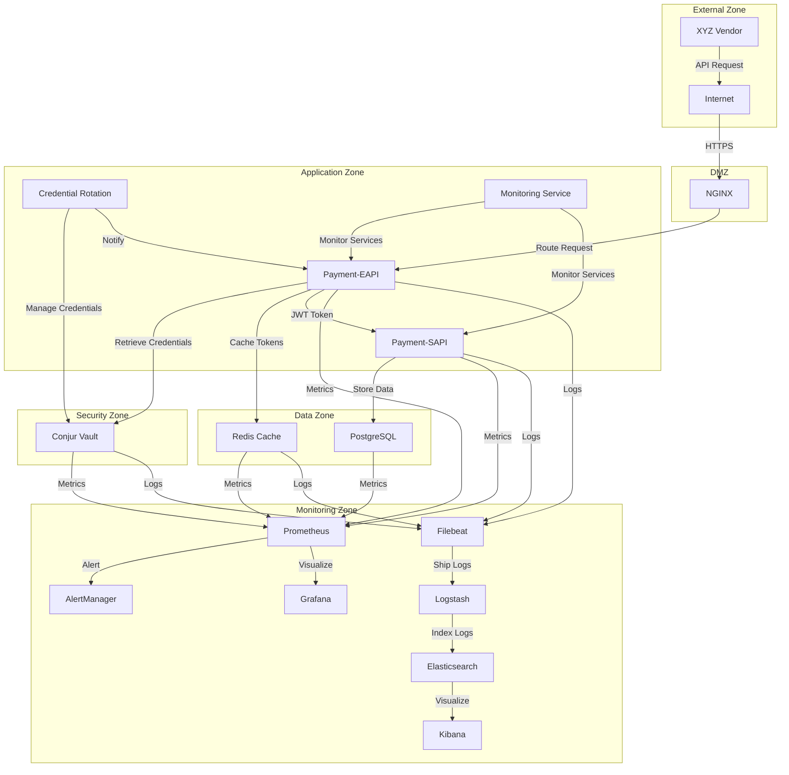

# Payment API Security Enhancement - Infrastructure Documentation

## Overview

This document provides comprehensive documentation for the infrastructure components of the Payment API Security Enhancement project. The infrastructure stack is designed to support the secure authentication mechanism using Conjur vault for credential management and token-based authentication for internal service communication, while maintaining backward compatibility with existing vendor integrations.

The infrastructure components are containerized using Docker and orchestrated with Docker Compose for development and testing environments, with support for Kubernetes deployment in production. The stack includes application services, security components, data storage, and a comprehensive monitoring solution.

## Architecture

### Component Diagram



### Network Architecture

The infrastructure is organized into distinct security zones with controlled communication paths between them:

1. **External Zone**: Contains the entry point for external traffic from vendors.
2. **DMZ**: Contains NGINX for TLS termination and initial request routing.
3. **Application Zone**: Contains the main application services (Payment-EAPI, Payment-SAPI).
4. **Security Zone**: Contains security-critical components like Conjur vault.
5. **Data Zone**: Contains data storage components (Redis, PostgreSQL).
6. **Monitoring Zone**: Contains monitoring and observability components.

Communication between zones is strictly controlled with appropriate security measures:

- External to DMZ: TLS encryption, WAF protection
- DMZ to Application: Authentication, authorization
- Application to Security: Certificate-based authentication, secure channels
- Application to Data: Authenticated access, encrypted connections
- All zones to Monitoring: One-way metrics and logs shipping

### Security Boundaries

The infrastructure implements defense-in-depth with clear security boundaries between components:

1. **Network-level boundaries**: Implemented through Docker networks (`payment-network` and `monitoring-network`).
2. **Authentication boundaries**: Each service has its own authentication mechanism.
3. **Authorization boundaries**: Fine-grained access control through Conjur policies.
4. **Data protection boundaries**: Encryption at rest and in transit for sensitive data.

## Setup Instructions

### Prerequisites

Before setting up the infrastructure, ensure you have the following prerequisites installed:

1. Docker Engine (version 20.10.x or higher)
2. Docker Compose (version 2.0.0 or higher)
3. OpenSSL (for generating certificates)
4. Git (for cloning the repository)

### Environment Configuration

1. Clone the repository:
   ```bash
   git clone https://github.com/your-org/payment-api-security-enhancement.git
   cd payment-api-security-enhancement/infrastructure
   ```

2. Create a `.env` file with the required environment variables:
   ```bash
   # Database
   POSTGRES_USER=postgres
   POSTGRES_PASSWORD=<secure-password>
   DB_USERNAME=payment_app
   DB_PASSWORD=<secure-password>
   
   # Redis
   REDIS_PASSWORD=<secure-password>
   
   # Conjur
   CONJUR_DATA_KEY=<data-encryption-key>
   CONJUR_ADMIN_PASSWORD=<secure-password>
   CONJUR_EAPI_API_KEY=<api-key-for-eapi>
   CONJUR_ROTATION_API_KEY=<api-key-for-rotation>
   
   # Monitoring
   GRAFANA_ADMIN_USER=admin
   GRAFANA_ADMIN_PASSWORD=<secure-password>
   ELASTIC_PASSWORD=<secure-password>
   ```

3. Generate JWT signing and verification keys:
   ```bash
   mkdir -p secrets
   openssl genrsa -out secrets/jwt-signing-key.pem 2048
   openssl rsa -in secrets/jwt-signing-key.pem -pubout -out secrets/jwt-verification-key.pem
   ```

4. Generate SSL certificates for NGINX:
   ```bash
   mkdir -p nginx/ssl
   openssl req -x509 -nodes -days 365 -newkey rsa:2048 -keyout nginx/ssl/nginx.key -out nginx/ssl/nginx.crt
   ```

5. Generate certificates for secure communication with ELK stack:
   ```bash
   mkdir -p elk/logstash/certs elk/filebeat/certs
   
   # Generate CA certificate
   openssl genrsa -out elk/ca.key 2048
   openssl req -new -x509 -key elk/ca.key -out elk/ca.crt -days 365
   
   # Generate and sign certificates for Logstash
   openssl genrsa -out elk/logstash/certs/logstash.key 2048
   openssl req -new -key elk/logstash/certs/logstash.key -out elk/logstash.csr
   openssl x509 -req -in elk/logstash/certs/logstash.csr -CA elk/ca.crt -CAkey elk/ca.key -CAcreateserial -out elk/logstash/certs/logstash.crt -days 365
   
   # Copy CA certificate to both directories
   cp elk/ca.crt elk/logstash/certs/ca.crt
   cp elk/ca.crt elk/filebeat/certs/ca.crt
   ```

### Deployment Steps

1. Initialize the infrastructure stack:
   ```bash
   docker-compose up -d
   ```

2. Initialize Conjur vault with policies:
   ```bash
   # Wait for Conjur to be healthy
   docker-compose exec conjur conjurctl wait
   
   # Login as admin
   docker-compose exec conjur conjurctl account create payment-system
   docker-compose exec conjur conjurctl role retrieve-key payment-system:user:admin
   
   # Load policies
   docker-compose exec conjur conjurctl policy load -b root -f /opt/conjur/policy/eapi-policy.yml
   ```

3. Generate API keys for services:
   ```bash
   # Generate API key for Payment-EAPI service
   EAPI_API_KEY=$(docker-compose exec conjur conjurctl role retrieve-key payment-system:host:payment-eapi/payment-eapi-service)
   
   # Generate API key for Rotation service
   ROTATION_API_KEY=$(docker-compose exec conjur conjurctl role retrieve-key payment-system:host:rotation/rotation-service-host)
   
   # Update .env file with generated API keys
   sed -i "s/CONJUR_EAPI_API_KEY=.*/CONJUR_EAPI_API_KEY=$EAPI_API_KEY/" .env
   sed -i "s/CONJUR_ROTATION_API_KEY=.*/CONJUR_ROTATION_API_KEY=$ROTATION_API_KEY/" .env
   ```

4. Restart services to apply the updated API keys:
   ```bash
   docker-compose restart payment-eapi credential-rotation
   ```

### Verification

Verify that all components are running correctly:

1. Check the status of all containers:
   ```bash
   docker-compose ps
   ```

2. Verify that Payment-EAPI is healthy:
   ```bash
   curl -i http://localhost:80/api/health
   ```

3. Check Prometheus targets:
   ```bash
   curl -s http://localhost:9090/api/v1/targets | grep state
   ```

4. Access Grafana dashboards at http://localhost:3000

5. Access Kibana at http://localhost:5601

## Component Details

### API Services

#### payment-eapi

**Description**: External-facing API that handles vendor authentication using Client ID/Secret headers and forwards authenticated requests to internal services using JWT tokens.

**Configuration**:
- Environment variables in `docker-compose.yml`
- Application configuration in `../src/backend/payment-eapi/src/main/resources/application-prod.yml`
- JWT signing key in `secrets/jwt-signing-key.pem`

**Key Features**:
- Authenticates vendor requests using Client ID/Secret from headers
- Retrieves and validates credentials from Conjur vault
- Generates JWT tokens for internal service communication
- Implements credential rotation without service disruption

#### payment-sapi

**Description**: Internal service that processes payment transactions with token-based authentication.

**Configuration**:
- Environment variables in `docker-compose.yml`
- Application configuration in `../src/backend/payment-sapi/src/main/resources/application-prod.yml`
- JWT verification key in `secrets/jwt-verification-key.pem`

**Key Features**:
- Validates JWT tokens for authentication
- Processes payment transactions
- Handles token renewal requests

#### credential-rotation

**Description**: Service for managing secure credential rotation without service disruption.

**Configuration**:
- Environment variables in `docker-compose.yml`
- Application configuration in `../src/backend/credential-rotation/src/main/resources/application-prod.yml`

**Key Features**:
- Manages credential rotation process
- Supports dual validation period during rotation
- Notifies services of rotation events
- Tracks rotation state

### Security Components

#### conjur

**Description**: Conjur vault for secure credential storage and management.

**Configuration**:
- Environment variables in `docker-compose.yml`
- Policies in `conjur/policy/*.yml`

**Key Features**:
- Securely stores client credentials
- Provides authenticated access to credentials
- Supports credential versioning and rotation
- Maintains audit trail of credential access

**Policy Configuration**:
The Conjur policy defines:
- Service identities for Payment-EAPI and related services
- Credential storage structure
- Permission model for credential access
- Authentication requirements
- Token signing key storage

#### nginx

**Description**: NGINX reverse proxy for handling TLS termination, request routing, and security headers.

**Configuration**:
- Configuration file in `nginx/nginx.conf`
- SSL certificates in `nginx/ssl/`
- HTTP basic auth in `nginx/auth/`

**Key Features**:
- TLS termination for secure external communication
- Request routing to appropriate backend services
- HTTP security headers enforcement
- Basic authentication for admin interfaces

### Data Storage

#### redis

**Description**: Redis cache for storing authentication tokens and credential metadata.

**Configuration**:
- Environment variables in `docker-compose.yml` (password, port, etc.)
- Persistent volume for data storage

**Key Features**:
- Caches authentication tokens with TTL
- Stores credential metadata for validation
- Supports token invalidation during credential rotation
- Provides high-performance key-value storage

#### postgres

**Description**: PostgreSQL database for storing credential metadata, audit logs, and monitoring data.

**Configuration**:
- Environment variables in `docker-compose.yml`
- Initialization script in `scripts/init-db.sql`
- Persistent volume for data storage

**Key Features**:
- Stores credential metadata and rotation state
- Maintains audit logs for security events
- Provides reliable relational data storage
- Supports database backups for disaster recovery

### Monitoring Stack

#### prometheus

**Description**: Prometheus for metrics collection and alerting.

**Configuration**:
- Configuration file in `prometheus/prometheus.yml`
- Alert rules in `prometheus/alert-rules.yml`

**Key Features**:
- Collects metrics from all services
- Defines alert thresholds
- Provides query interface for metrics
- Integrates with AlertManager for notifications

**Metrics Collected**:
- Authentication success/failure rates
- Token generation/validation metrics
- API response times
- Resource utilization
- Error rates

#### grafana

**Description**: Grafana for metrics visualization and dashboarding.

**Configuration**:
- Environment variables in `docker-compose.yml`
- Dashboard definitions in `grafana/dashboards/`
- Datasource configuration in `grafana/provisioning/`

**Key Features**:
- Visualizes metrics from Prometheus
- Provides pre-configured dashboards
- Supports custom dashboard creation
- Offers alerting capabilities

**Dashboards**:
- Service Health Dashboard
- Authentication Dashboard
- Security Dashboard
- Resource Utilization Dashboard

#### elasticsearch

**Description**: Elasticsearch for log storage and search.

**Configuration**:
- Environment variables in `docker-compose.yml`
- Persistent volume for data storage

**Key Features**:
- Stores and indexes logs from all components
- Provides full-text search capabilities
- Supports log retention policies
- Offers analytics on log data

#### logstash

**Description**: Logstash for log processing and enrichment.

**Configuration**:
- Pipeline configuration in `elk/logstash/pipeline/logstash.conf`
- Pattern definitions in `elk/logstash/patterns/`
- Certificate files in `elk/logstash/certs/`

**Key Features**:
- Processes logs from Filebeat
- Parses and structures log data
- Enriches logs with metadata
- Forwards processed logs to Elasticsearch

**Log Processing**:
- Extracts authentication events
- Identifies token validation events
- Redacts sensitive information
- Adds environment metadata

#### kibana

**Description**: Kibana for log visualization and analysis.

**Configuration**:
- Environment variables in `docker-compose.yml`
- Configuration file in `elk/kibana/kibana.yml`

**Key Features**:
- Visualizes log data from Elasticsearch
- Provides dashboards for log analysis
- Supports saved searches and visualizations
- Offers log exploration tools

#### filebeat

**Description**: Filebeat for shipping logs to Logstash.

**Configuration**:
- Configuration file in `elk/filebeat/filebeat.yml`
- Certificate files in `elk/filebeat/certs/`

**Key Features**:
- Collects logs from various sources
- Ships logs to Logstash for processing
- Handles log rotation and backfilling
- Adds metadata to logs

#### alertmanager

**Description**: AlertManager for handling and routing alerts from Prometheus.

**Configuration**:
- Configuration file in `prometheus/alertmanager.yml`

**Key Features**:
- Receives alerts from Prometheus
- Deduplicates and groups alerts
- Routes alerts to appropriate notification channels
- Supports silencing and inhibition of alerts

### Exporters

#### node-exporter

**Description**: Node Exporter for collecting host system metrics.

**Configuration**:
- Command-line arguments in `docker-compose.yml`

**Key Features**:
- Collects system-level metrics (CPU, memory, disk, network)
- Exposes metrics in Prometheus format
- Supports custom collectors
- Provides detailed hardware utilization metrics

#### cadvisor

**Description**: cAdvisor for collecting container metrics.

**Configuration**:
- Command-line arguments in `docker-compose.yml`

**Key Features**:
- Collects container-level metrics
- Monitors container resource usage
- Provides container performance data
- Exposes metrics in Prometheus format

#### redis-exporter

**Description**: Redis Exporter for collecting Redis metrics.

**Configuration**:
- Environment variables in `docker-compose.yml`

**Key Features**:
- Collects Redis performance metrics
- Monitors cache hit/miss rates
- Tracks memory usage and client connections
- Exposes metrics in Prometheus format

#### postgres-exporter

**Description**: Postgres Exporter for collecting PostgreSQL metrics.

**Configuration**:
- Environment variables in `docker-compose.yml`

**Key Features**:
- Collects PostgreSQL performance metrics
- Monitors query performance
- Tracks database connections and locks
- Exposes metrics in Prometheus format

## Operational Procedures

### Startup and Shutdown

**Starting the Infrastructure**:
```bash
# Start all services
docker-compose up -d

# Start specific service
docker-compose up -d payment-eapi
```

**Shutting Down the Infrastructure**:
```bash
# Stop all services
docker-compose down

# Stop services but keep volumes
docker-compose down --volumes

# Stop specific service
docker-compose stop payment-eapi
```

### Backup and Restore

**Database Backup**:
```bash
# Create a backup of PostgreSQL data
docker-compose exec postgres pg_dump -U postgres payment > backup/payment_db_$(date +%Y%m%d).sql

# Create a backup of all databases
docker-compose exec postgres pg_dumpall -U postgres > backup/postgres_all_$(date +%Y%m%d).sql
```

**Database Restore**:
```bash
# Restore PostgreSQL data
cat backup/payment_db_20230615.sql | docker-compose exec -T postgres psql -U postgres payment
```

**Redis Backup**:
```bash
# Trigger Redis save
docker-compose exec redis redis-cli -a "${REDIS_PASSWORD}" SAVE

# Copy RDB file to backup location
docker cp $(docker-compose ps -q redis):/data/dump.rdb backup/redis_dump_$(date +%Y%m%d).rdb
```

**Redis Restore**:
```bash
# Stop Redis service
docker-compose stop redis

# Replace RDB file
docker cp backup/redis_dump_20230615.rdb $(docker-compose ps -q redis):/data/dump.rdb

# Start Redis service
docker-compose start redis
```

**Conjur Vault Backup**:
```bash
# Create data key backup
echo "${CONJUR_DATA_KEY}" > backup/conjur_data_key_$(date +%Y%m%d).txt

# Backup policy files
cp -r conjur/policy backup/conjur_policy_$(date +%Y%m%d)

# Backup database (only for disaster recovery)
docker-compose exec conjur evoke backup > backup/conjur_backup_$(date +%Y%m%d).tar.gz
```

### Monitoring and Alerting

**Checking System Health**:
```bash
# Check container health status
docker-compose ps

# Check service-specific health
curl -s http://localhost:8080/api/health | jq
curl -s http://localhost:8081/internal/v1/health | jq
```

**Viewing Logs**:
```bash
# View logs for a specific service
docker-compose logs payment-eapi

# Follow logs in real-time
docker-compose logs -f payment-eapi

# View combined logs for multiple services
docker-compose logs payment-eapi payment-sapi
```

**Accessing Monitoring Dashboards**:
- Grafana: http://localhost:3000 (admin / configured password)
- Prometheus: http://localhost:9090
- Kibana: http://localhost:5601 (elastic / configured password)
- AlertManager: http://localhost:9093

**Alert Management**:
- View active alerts in AlertManager
- Silence alerts for planned maintenance:
  ```bash
  # Create silence for maintenance (requires amtool)
  amtool silence add --alertname="InstanceDown" --comment="Planned maintenance" duration=2h
  ```

### Credential Rotation

**Initiating Credential Rotation**:
```bash
# Trigger credential rotation via API
curl -X POST http://localhost:8083/rotation/api/v1/credentials/{client_id}/rotate \
  -H "Content-Type: application/json" \
  -H "Authorization: Bearer ${ADMIN_TOKEN}" \
  -d '{"reason": "Scheduled rotation"}'
```

**Monitoring Rotation Status**:
```bash
# Check rotation status
curl -s http://localhost:8083/rotation/api/v1/credentials/{client_id}/rotation-status \
  -H "Authorization: Bearer ${ADMIN_TOKEN}" | jq
```

**Completing Rotation**:
```bash
# Complete rotation when old credentials are no longer in use
curl -X POST http://localhost:8083/rotation/api/v1/credentials/{client_id}/complete-rotation \
  -H "Content-Type: application/json" \
  -H "Authorization: Bearer ${ADMIN_TOKEN}"
```

**Rolling Back Rotation**:
```bash
# Roll back failed rotation
curl -X POST http://localhost:8083/rotation/api/v1/credentials/{client_id}/rollback-rotation \
  -H "Content-Type: application/json" \
  -H "Authorization: Bearer ${ADMIN_TOKEN}" \
  -d '{"reason": "Integration issues"}'
```

### Scaling

**Scaling Services Horizontally**:
```bash
# Scale specific service
docker-compose up -d --scale payment-eapi=3 --scale payment-sapi=3
```

**Resource Allocation**:
- Adjust container resource limits in `docker-compose.yml`:
  ```yaml
  payment-eapi:
    deploy:
      resources:
        limits:
          cpus: '2'
          memory: 4G
        reservations:
          cpus: '1'
          memory: 2G
  ```

### Troubleshooting

**Common Issues and Solutions**:

1. **Authentication Failures**:
   - Check Conjur vault logs for credential issues
   - Verify Client ID/Secret in request headers
   - Check Payment-EAPI logs for authentication errors

2. **Token Validation Issues**:
   - Verify JWT signing/verification keys match
   - Check token expiration settings
   - Inspect Payment-SAPI logs for validation errors

3. **Redis Connection Issues**:
   - Verify Redis is running: `docker-compose ps redis`
   - Check Redis password configuration
   - Inspect Redis logs: `docker-compose logs redis`

4. **Database Connection Issues**:
   - Verify PostgreSQL is running: `docker-compose ps postgres`
   - Check database credentials
   - Inspect PostgreSQL logs: `docker-compose logs postgres`

5. **Conjur Vault Issues**:
   - Verify Conjur is running: `docker-compose ps conjur`
   - Check Conjur API key configuration
   - Inspect Conjur logs: `docker-compose logs conjur`

## Security Considerations

### Network Security

- All external communication is encrypted using TLS 1.2+
- Internal network segregation through Docker networks
- Network access control between services
- Regular security scanning of network traffic

### Authentication and Authorization

- Certificate-based authentication for service-to-vault communication
- JWT token-based authentication for internal service communication
- Client ID/Secret authentication for vendor requests
- Role-based access control within Conjur vault

### Credential Management

- Credentials stored securely in Conjur vault
- No hard-coded secrets in configuration files
- Secure handling of credentials in memory
- Automated credential rotation without service disruption

### Audit and Compliance

- Comprehensive audit logging of all security events
- Centralized log collection and analysis
- Monitoring of authentication attempts and failures
- Regular security compliance reviews

## References

### Documentation Links

- [Conjur Documentation](https://docs.conjur.org/)
- [Docker Compose Documentation](https://docs.docker.com/compose/)
- [Prometheus Documentation](https://prometheus.io/docs/introduction/overview/)
- [Elasticsearch Documentation](https://www.elastic.co/guide/index.html)
- [Spring Boot Security Documentation](https://docs.spring.io/spring-security/reference/)

### Configuration Files

- Docker Compose: [docker-compose.yml](./docker-compose.yml)
- Prometheus Configuration: [prometheus.yml](./prometheus/prometheus.yml)
- Prometheus Alert Rules: [alert-rules.yml](./prometheus/alert-rules.yml)
- Logstash Pipeline: [logstash.conf](./elk/logstash/pipeline/logstash.conf)
- Filebeat Configuration: [filebeat.yml](./elk/filebeat/filebeat.yml)
- Conjur Policy: [eapi-policy.yml](./conjur/policy/eapi-policy.yml)